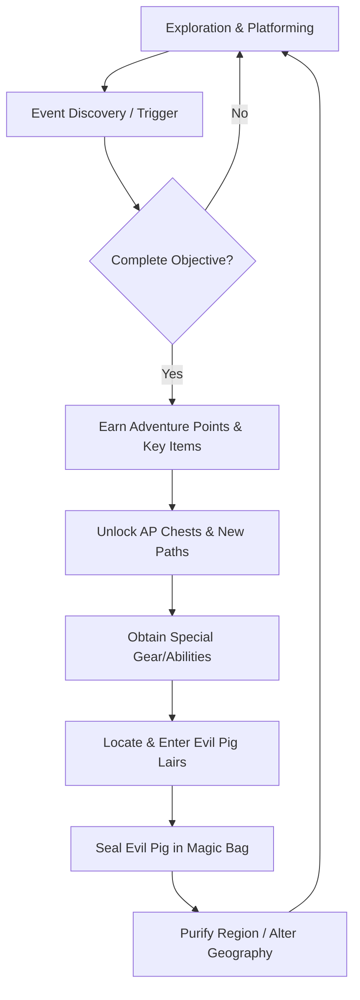

# The Legacy of Tomba & the Evil Pigs' Curse
## Master Game Design Document (GDD) & Technical Specification Suite

---


---

## 1. Project Overview

*The Legacy of Tomba and the Evil Pigs' Curse* is a technical and design blueprint for a modern, high-fidelity reimagining of the classic 2.5D action-platformer / Metroidvania formula. 

Players navigate a non-linear archipelago corrupted by the dark gold alchemy of the Evil Pigs. Progress relies on dynamic 2.5D spatial navigation, physical combat interactions (Biting, Grabbing, and Throwing), and a massive event-driven quest web containing over 130 interconnected milestones.

---

## 2. Core Game Loop Architecture

The gameplay experience balances non-linear exploration, event resolution, character progression, and regional purification:



---

## 3. Visual & Character Cast

Below are the production-ready concept layouts defining the primary actors of the adventure:

### The Savior (Tomba)
The spiky, pink-haired feral savior utilizes athletic agility, powerful jaw-grips, and dynamic momentum transfers to navigate vertical cliffs and combat enemies.


### The Koma Pig Minions
The primary enemy forces, driven by gold greed, patrol platform structures and alert nearby squads if the Savior enters their visual cone.


---

## 4. Repository Directory Structure

The project workspace is organized using a clean, modular layout compatible with modern game engines and automated build pipelines:

```
.
├── Assets/                          # Production-ready visual assets (2D art & UI)
│   ├── art/
│   │   ├── characters/              # Character model sheets and animation rigs
│   │   ├── enemies/                 # Enemy sprites and physical bounds
│   │   ├── environments/            # Parallax layers and biome backgrounds
│   │   ├── key_art/                 # Title screen backgrounds and promotional art
│   │   └── ui/                      # HUD elements, icons, and menus
└── docs/                            # Game Design Documents (GDD)
    ├── phase_1_conceptualization/   # Phase 1: High Concept and Systems Overview
    └── phase_2_detailed_design/     # Phase 2: Granular Production Blueprints
```

---

## 5. Master Interactive Documentation Index

Click on any of the specifications below to navigate directly to its detailed production blueprint:

### Phase 1: Conceptualization & Core Foundations
* **Vision & Core Pillars**: [high_concept_document.md](docs/phase_1_conceptualization/high_concept_document.md)
* **Character Controls**: [character_and_movement_design.md](docs/phase_1_conceptualization/character_and_movement_design.md)
* **Event Architecture**: [event_and_progression_system.md](docs/phase_1_conceptualization/event_and_progression_system.md)
* **Weapons & Relics**: [equipment_and_items_database.md](docs/phase_1_conceptualization/equipment_and_items_database.md)
* **Ecology & Level Maps**: [world_ecology_and_level_design.md](docs/phase_1_conceptualization/world_ecology_and_level_design.md)
* **AI & Boss Sealing**: [bestiary_and_pig_hierarchy.md](docs/phase_1_conceptualization/bestiary_and_pig_hierarchy.md)
* **Art & Prompt bibles**: [art_direction_and_prompts_bible.md](docs/phase_1_conceptualization/art_direction_and_prompts_bible.md)
* **Interface Specification**: [ui_and_hud_specification.md](docs/phase_1_conceptualization/ui_and_hud_specification.md)

### Phase 2: Detailed Production Specifications

#### A. Level Blueprints & World Layouts
* **Level Design - Part 1 (Beginnings & Dwarf Forest)**: [level_design_part_1.md](docs/phase_2_detailed_design/level_design_part_1.md)
* **Level Design - Part 2 (Mansion & Water Temple)**: [level_design_part_2.md](docs/phase_2_detailed_design/level_design_part_2.md)
* **Level Design - Part 3 (Coal Town & Wailing Forest)**: [level_design_part_3.md](docs/phase_2_detailed_design/level_design_part_3.md)
* **Level Design - Part 4 (Mirrors & Wise Man Hill)**: [level_design_part_4.md](docs/phase_2_detailed_design/level_design_part_4.md)
* **Grids & Level Prefabs**: [tileset_construction_and_level_prefabs.md](docs/phase_2_detailed_design/tileset_construction_and_level_prefabs.md)
* **World State Persistence**: [level_state_persistence.md](docs/phase_2_detailed_design/level_state_persistence.md)
* **Secret Passages & Backtracking Gates**: [secret_passages_and_backtracking_gating.md](docs/phase_2_detailed_design/secret_passages_and_backtracking_gating.md)

#### B. Gameplay & Interface Systems
* **Control Schemes & Accessibility**: [control_schemes_and_accessibility.md](docs/phase_2_detailed_design/control_schemes_and_accessibility.md)
* **PC Input Mapping & Remapping**: [keyboard_bindings_and_remapping.md](docs/phase_2_detailed_design/keyboard_bindings_and_remapping.md)
* **Main Menu & UX Flow**: [menus_and_ux_navigation_flow.md](docs/phase_2_detailed_design/menus_and_ux_navigation_flow.md)
* **Dialogue Textbox Design**: [dialogue_ui_and_textbox_design.md](docs/phase_2_detailed_design/dialogue_ui_and_textbox_design.md)
* **Event Tracker & Clear Banner**: [quest_log_and_event_tracker_ui.md](docs/phase_2_detailed_design/quest_log_and_event_tracker_ui.md)
* **Weapon Select Radial Wheel**: [inventory_and_quick_select_wheel.md](docs/phase_2_detailed_design/inventory_and_quick_select_wheel.md)
* **Interactive Map Pins System**: [map_navigation_and_pins_system.md](docs/phase_2_detailed_design/map_navigation_and_pins_system.md)

#### C. Graphics, Rendering & Visual FX
* **Environmental Purification Shaders**: [rendering_lighting_and_purifying_shaders.md](docs/phase_2_detailed_design/rendering_lighting_and_purifying_shaders.md)
* **Volume Profiles & Post-Processing**: [post_processing_and_lighting_profiles.md](docs/phase_2_detailed_design/post_processing_and_lighting_profiles.md)
* **Camera Shake & Combat Feedback**: [combat_vfx_and_screen_feedback.md](docs/phase_2_detailed_design/combat_vfx_and_screen_feedback.md)
* **Particle FX & Magic Emitters**: [particle_fx_and_elemental_spells.md](docs/phase_2_detailed_design/particle_fx_and_elemental_spells.md)

#### D. Physical & Auditory Systems
* **Buoyancy & Fluid Mechanics**: [water_physics_and_fluid_mechanics.md](docs/phase_2_detailed_design/water_physics_and_fluid_mechanics.md)
* **Acid Corrosion & Lava Recoil**: [liquid_hazards_and_corrosion_physics.md](docs/phase_2_detailed_design/liquid_hazards_and_corrosion_physics.md)
* **Swinging Ropes & Collapsible Bridges**: [environmental_physics_and_hazards.md](docs/phase_2_detailed_design/environmental_physics_and_hazards.md)
* **Weather Layers & Particle Caps**: [environmental_weather_and_particles_spec.md](docs/phase_2_detailed_design/environmental_weather_and_particles_spec.md)
* **Music Crossfades & Vocal Grunts**: [audio_systems_and_sound_design.md](docs/phase_2_detailed_design/audio_systems_and_sound_design.md)
* **Logarithmic Attenuation & Occlusion**: [spatial_audio_and_acoustics.md](docs/phase_2_detailed_design/spatial_audio_and_acoustics.md)
* **Audio Mixer Channels & Ducking**: [audio_mixer_and_bus_routing.md](docs/phase_2_detailed_design/audio_mixer_and_bus_routing.md)
* **Dual-Motor Rumble Envelopes**: [haptic_feedback_and_rumble.md](docs/phase_2_detailed_design/haptic_feedback_and_rumble.md)

#### E. Technical Backend, AI & Deployment
* **GitFlow & Repository Setup**: [project_structure_and_repository_setup.md](docs/phase_2_detailed_design/project_structure_and_repository_setup.md)
* **Engine Performance & RAM Budgets**: [engine_and_technical_specifications.md](docs/phase_2_detailed_design/engine_and_technical_specifications.md)
* **Code Conventions & Class Hierarchy**: [coding_standards_and_architecture.md](docs/phase_2_detailed_design/coding_standards_and_architecture.md)
* ** quiksave & Serialization Schema**: [save_systems_and_serialization.md](docs/phase_2_detailed_design/save_systems_and_serialization.md)
* **XOR Security & Checksum Audits**: [save_file_integrity_and_anticheat.md](docs/phase_2_detailed_design/save_file_integrity_and_anticheat.md)
* **Dialogue Tag Interpreter**: [dialogue_node_parser_spec.md](docs/phase_2_detailed_design/dialogue_node_parser_spec.md)
* **Three-Language Script Sheet**: [expanded_localization_and_dialogue_database.md](docs/phase_2_detailed_design/expanded_localization_and_dialogue_database.md)
* **Koma Pig AI Patrol & Sight**: [koma_pig_ai_and_patrol_mechanics.md](docs/phase_2_detailed_design/koma_pig_ai_and_patrol_mechanics.md)
* **Flying Predators Sine-Wave AI**: [flying_predators_ai_specification.md](docs/phase_2_detailed_design/flying_predators_ai_specification.md)
* **Jungle Tribes Interaction AI**: [jungle_tribes_ai_specification.md](docs/phase_2_detailed_design/jungle_tribes_ai_specification.md)
* **Commanders, Shamans & Squad AI**: [elite_enemy_ai_specification.md](docs/phase_2_detailed_design/elite_enemy_ai_specification.md)
* **Lair Portals & Vacuum Physics**: [pig_capturing_and_portal_mechanics.md](docs/phase_2_detailed_design/pig_capturing_and_portal_mechanics.md)
* **Shop Economics & Barter Checklists**: [shop_economics_and_barter_system.md](docs/phase_2_detailed_design/shop_economics_and_barter_system.md)
* **Ledge Checking & Climbing Interpolation**: [climbing_and_ledge_navigation.md](docs/phase_2_detailed_design/climbing_and_ledge_navigation.md)
* **Fracture Debris & Weighted RNG**: [breakable_items_and_drop_probability.md](docs/phase_2_detailed_design/breakable_items_and_drop_probability.md)
* **Minimap Grid & Teleportation**: [minimap_and_fast_travel_system.md](docs/phase_2_detailed_design/minimap_and_fast_travel_system.md)
* **Console Certification Compliance**: [platform_certification_and_deployment.md](docs/phase_2_detailed_design/platform_certification_and_deployment.md)
* **QA Test Matrices & Automation**: [qa_testing_and_build_automation.md](docs/phase_2_detailed_design/qa_testing_and_build_automation.md)
* **Gantt Timeline & Roadmaps**: [production_roadmap_and_milestones.md](docs/phase_2_detailed_design/production_roadmap_and_milestones.md)
* **Credits Scroll & NG+ Scaling**: [game_ending_and_new_game_plus.md](docs/phase_2_detailed_design/game_ending_and_new_game_plus.md)

---

## 6. License

This project is licensed under the MIT License - see the [LICENSE](LICENSE) file for details.