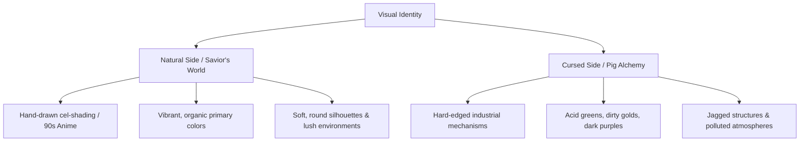

# Art Direction & AI Image Prompts Bible
## Project: The Legacy of Tomba & the Evil Pigs' Curse

---

## 1. Visual Identity & Art Style Guidelines

The visual signature of *The Legacy of Tomba and the Evil Pigs' Curse* is defined as **"Vibrant Cel-Shaded Hand-Drawn Fantasy"** with a clear aesthetic contrast between natural ecosystems and dark, industrial pig machinery.

### 1.1 Aesthetic Rules
* **No Photorealism**: All assets must maintain a stylized, illustrated appearance.
* **Linework**: Clean, defined black or colored ink lines to preserve the hand-drawn retro feel (reminiscent of golden-era Japanese video games).
* **Lighting**: High-contrast, dynamic color keys. Cursed areas should feature ominous volumetric lights, while purified areas use warm, natural sunlight.

---

## 2. Dynamic AI Prompts Catalog & Asset Directory

This database contains structured, production-ready prompts designed for high-end AI image generators (optimized for Midjourney v6 / DALL-E 3). Use these exact formulas to generate the visual assets for the project.

### 2.1 Key Art & Marketing Assets

#### Asset 1: Main Key Art (Cover & Title Screen Background)
* **Target Path**: `docs/assets/art/key_art/main_cover.png`
* **Prompt**:
  > A vibrant 90s anime key art for a fantasy action video game. In the center, a wild, athletic young hero with spiky pink hair, determined expression, wearing bright green shorts, wielding a spiked metal flail. In the background, a split landscape: the left side shows a lush green forest under bright sunlight, the right side shows a dark, corrupted mountain with purple lightning and factories with chimneys shaped like angry cartoon pig faces. Clean linework, cel-shaded, colorful, high contrast, retro game cover aesthetic, 2D vector art, hand-drawn look --ar 16:9 --style raw

---

### 2.2 Character & Enemy Concept Art

#### Asset 2: The Savior (Tomba) Concept Sheet
* **Target Path**: `docs/assets/art/characters/savior_concept.png`
* **Prompt**:
  > Character concept design sheet of a wild, feral fantasy boy. Spiky bright pink hair, big expressive anime eyes, athletic and muscular build, running on all fours, wearing only bright green shorts. Multiple poses: one standing holding a wooden boomerang, one running in a sprint, and one preparing to jump. Clean white background, model sheet, 2D hand-drawn cel-shaded animation style, clear linework, vibrant primary colors --ar 4:3

#### Asset 3: Koma Pig Minion (Basic Enemy)
* **Target Path**: `docs/assets/art/enemies/koma_pig_basic.png`
* **Prompt**:
  > Concept art of a small, round, angry cartoon pig soldier. It has a dynamic, comical expression, standing on two legs, wearing a small leather helmet and holding a simple wooden spear. Stylized 2D video game design, clean lines, vibrant pink skin, dark leather accents, white background, retro anime style, cel-shaded, character sprite sheet style --ar 1:1

---

### 2.3 Environmental & Biome Art

#### Asset 4: Dwarf Forest (Cursed State with Fog)
* **Target Path**: `docs/assets/art/environments/dwarf_forest_cursed.png`
* **Prompt**:
  > A 2.5D side-scroller video game background of a deep, ancient fantasy forest. The scene is covered in a dense, glowing purple-gray magical fog, making giant twisted trees look like shadows. Strange neon blue mushrooms grow on rotten wood. Mysterious, moody, colorful but dangerous atmosphere, hand-drawn digital illustration, 90s anime visual style, layered background design, high-quality parallax layers --ar 16:9

#### Asset 5: Dwarf Forest (Purified State)
* **Target Path**: `docs/assets/art/environments/dwarf_forest_purified.png`
* **Prompt**:
  > A 2.5D side-scroller video game background of a beautiful, clean fantasy forest. Bright golden sunlight filtering through giant green tree leaves, crystal clear small waterfalls, colorful flowers blooming everywhere, cute wooden dwarf houses built into hollow tree trunks. Vibrant colors, clean atmosphere, happy and natural, hand-drawn illustration style, high parallax layer separation --ar 16:9

#### Asset 6: The Haunted Mansion (Gravity Flip Hallway)
* **Target Path**: `docs/assets/art/environments/haunted_mansion_hallway.png`
* **Prompt**:
  > Inside a grand, decaying fantasy mansion, 2.5D side-scroller game level design. The room is visually twisted: candelabras are floating upside down, carpets run along both the floor and the ceiling, and broken, glowing magical mirrors are embedded in the walls. Dark blue and gold color scheme, mysterious magical lighting, gothic anime style, highly detailed interior illustration, clean linework --ar 16:9

#### Asset 7: Water Temple Submerged Ruins
* **Target Path**: `docs/assets/art/environments/water_temple_depths.png`
* **Prompt**:
  > Deep underwater fantasy temple background for a 2.5D platformer game. Ancient stone pillars carved with water patterns, glowing turquoise light beams filtering from the surface, schools of colorful tropical fish swimming through underwater ruins. Sunken statues, clean water, high-contrast lighting, hand-drawn cel-shaded animation background, atmospheric depth --ar 16:9

---

### 2.4 UI, HUD & Key Items

#### Asset 8: Magic Pig Bags Set (UI Icons)
* **Target Path**: `docs/assets/art/ui/magic_pig_bags.png`
* **Prompt**:
  > Game UI asset set of five distinct magical drawstring pouches, isolated on a black background. Each pouch has a different vibrant color (Blue, Red, Purple, Green, Yellow) and is embroidered with a funny, stylized evil pig snout symbol in gold thread. Glowing elemental aura surrounds each bag. Clean 2D icon design, vector illustration, mobile game item style, clean lines, high-contrast colors --ar 16:9

#### Asset 9: Sealed AP Chest
* **Target Path**: `docs/assets/art/ui/ap_chest.png`
* **Prompt**:
  > An ancient, ornate stone treasure chest, isolated on a white background. The chest is locked with a glowing magical seal that displays the numbers "100,000 AP" in bright golden energy runes. Highly detailed stone texture with moss growing on the corners, gold and copper metallic accents. 2D game asset design, isometric view, cel-shaded illustration --ar 1:1