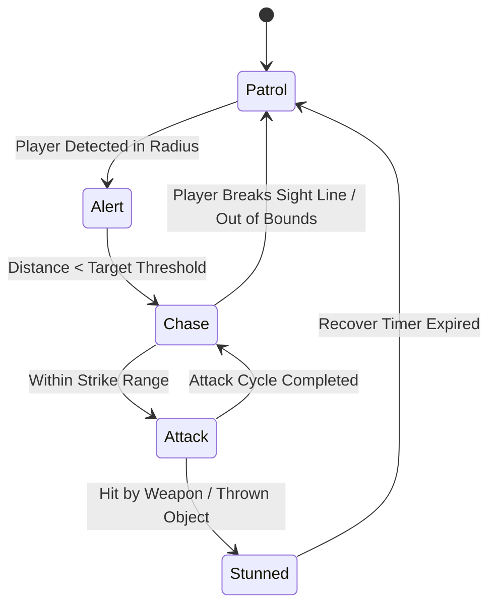
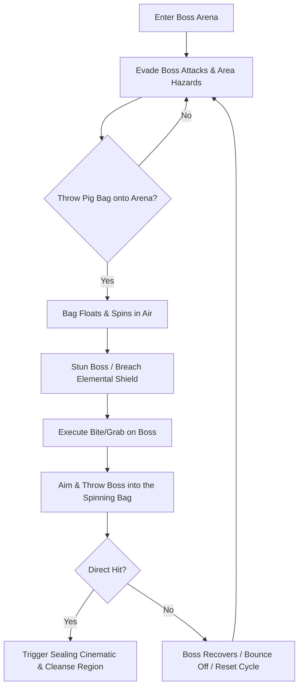

# Bestiary, Pig Hierarchy & AI Specifications
## Project: The Legacy of Tomba & the Evil Pigs' Curse

---

## 1. Enemy AI Behavior Model

Standard enemies (minions) follow a simplified utility-based AI state machine designed to interact dynamically with the physics environment and the Savior’s grab mechanics.

### 1.1 Hitbox and State Vulnerability
Every enemy has two primary collision boxes:
* **Damage Hitbox**: Causes immediate depletion of the Savior's vitality upon contact.
* **Grab Box (Upper Bounding Box)**: Situated on the enemy’s head/back. When the Savior lands on this specific box, it suspends the enemy’s AI loop and transitions them into the `Carried/Grabbed` state.

---

## 2. Standard Minion Catalog

### 2.1 Koma Pigs (Basic Infantry)
The basic forces of the Evil Pigs. They are driven by gold greed and physical violence.
* **Basic Koma Pig**: Patrols back and forth on a single platform. If alerted, it runs toward the player at $5.0 \, \text{m/s}$ to deal contact damage.
* **Armed Koma Pig**: Carries a wooden spear. This spear extends its forward attack range by $1.5 \, \text{meters}$. The Savior must jump behind them or use a weapon to disarm them before attempting a grab.
* **Winged Koma Pig**: Hovers on a fixed vertical axis. It periodically drops heavy stone weights. The Savior must use a high-jump or weapon to strike and knock them to the ground.

### 2.2 Environmental Threats
* **Mushroom Sprout**: A stationary plant-like entity that emits gas clouds of *Weeping* or *Laughing* spores every $4.0 \, \text{seconds}$.
* **Carnivorous Plant (Snap-Jaw)**: Lies dormant inside soil pockets. If the Savior walks over it without jumping, it snaps shut, inflicting $2$ bars of direct damage and trapping the player in a struggle animation.

---

## 3. The Seven Evil Pigs (Regional Boss Lieutenants)

The Seven Evil Pigs do not have traditional health bars. To defeat them, the player must locate their corresponding **Pig Bag** hidden in the environment, enter their lair, and throw the boss into the bag.

### 3.1 Profiles of Key Lieutenants

#### A. The Blue Pig (The Forest Swindler)
* **Associated Bag**: Blue Pig Bag (found in the Dwarf Forest depths).
* **Arena Mechanics**: The arena is perpetually shifting in mist, with platforms disappearing. The Blue Pig teleports across three distinct stone columns.
* **Combat Pattern**: Casts leaf-blades that spiral outward. The player must dodge the blades, wait for the teleportation cooldown, jump onto his back, and throw him into the Blue Bag hovering in the center.

#### B. The Fire Pig (The Volcanic Tyrant)
* **Associated Bag**: Red Pig Bag (found in Phoenix Mountain’s magma core).
* **Arena Mechanics**: Rising lava tides. The Savior must jump between sinking obsidian platforms.
* **Combat Pattern**: Spits fireballs that create lingering lava puddels. Requires the Savior to wear the *Red Fire Pants* to survive contact and utilize the *Water Jewel* to cool down the boss's elemental armor before grabbing.

#### C. The Water Pig (The Aquatic Siphon)
* **Associated Bag**: Navy Pig Bag (found in the Water Temple depths).
* **Arena Mechanics**: Submerged arena with deep water currents that push the Savior toward spike traps.
* **Combat Pattern**: Creates vortexes that pull the Savior in. The Savior must swim behind the Water Pig using *Blue Deep Pants*, grab him underwater, and throw him with adjusted liquid physics calculations into the bag.

---

## 4. The Supreme Real Evil Pig (Final Confrontation)

The final boss rules from a temporal rift outside the normal map boundaries.

* **The Arena**: A fractured dimension where background and foreground layers shift dynamically every $10.0 \, \text{seconds}$.
* **Temporal Freeze Ability**: The Real Evil Pig can temporarily freeze the Savior's movement for $1.5 \, \text{seconds}$. The player must wiggle the controller stick to break free before a dimensional strike hits.
* **The Sealing Climax**: The final sealing requires the Savior to throw the Real Evil Pig through a sequence of three different magic bags consecutively as they rotate in 3D space, representing the ultimate validation of the player's throw timing and projectile alignment.