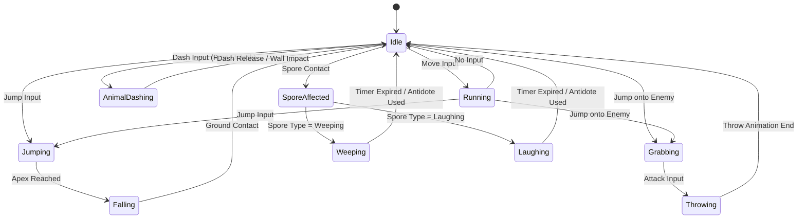
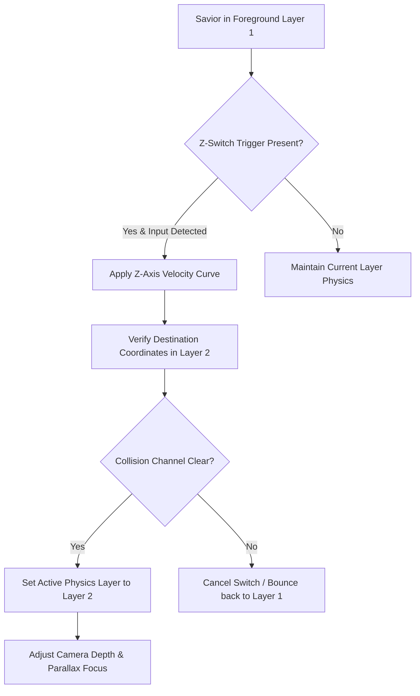
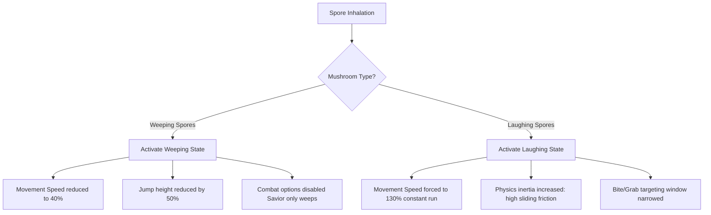

# Character Controller & Movement Systems Design
## Project: The Legacy of Tomba & the Evil Pigs' Curse

---

## 1. Character Overview & Physics Model

The player character (The Savior) operates on a highly kinetic physics model that prioritizes momentum preservation, rapid acceleration, and physical elasticity. Unlike rigid tile-bound platformers, the Savior interacts with the world as a dynamic physics body.

### 1.1 RigidBody & Kinematic Configurations

| Parameter | Value | Description |
| :--- | :--- | :--- |
| **Default Gravity** | $32.0 \, \text{m/s}^2$ | Fast descent to ensure platforming feel is responsive. |
| **Max Run Speed** | $8.5 \, \text{m/s}$ | Standard top speed on flat terrain. |
| **Acceleration Time** | $0.15 \, \text{s}$ | Time to reach Max Run Speed from a stationary state. |
| **Deceleration Time** | $0.10 \, \text{s}$ | Time to come to a complete stop when input is released. |
| **Jump Force** | $14.0 \, \text{m/s}$ | Instant upward velocity applied on jump trigger. |
| **Air Control Modifier** | $0.75$ | Multiplier applied to lateral acceleration while airborne. |
| **Terminal Velocity** | $24.0 \, \text{m/s}$ | Maximum fall velocity to prevent clipping issues. |

---

## 2. Character State Machine

The Savior's logic is governed by a hierarchical State Machine. Transitions are triggered by player inputs, environmental collisions, or external status effects (such as magical spores).

---

## 3. The 2.5D Depth Navigation System (Plane Switching)

The world consists of distinct physical layers (typically a Foreground Layer and a Background Layer). Players navigate between these layers at specific nodal points or environmental triggers.

### 3.1 Depth Switching Mechanics
1. **Z-Triggers**: Environmental objects like ladders, fences, hanging vines, or path intersections act as Z-Triggers.
2. **Input Activation**: Pressing `Up` (on background-facing triggers) or `Down` (on foreground-facing triggers) initiates a plane transition.
3. **Transition Leap**: The Savior performs an automated leap along the Z-axis. During this transition, the Savior is invulnerable to standard physical hazards on either plane.

### 3.2 Dynamic Layer Collision Resolution

### 3.3 Camera Behavior during Plane Switches
* **Focus Interpolation**: The camera smoothly interpolates its Z-depth position and focal length using a dampening factor of $0.12 \, \text{s}$.
* **Orthographic Scale**: Minor scale adjustments are applied to maintain visual balance, making background elements appear smaller yet highly legible.
* **Layer Culling**: The non-active layer receives a minor desaturation filter ($15\%$ reduction) and a subtle depth-of-field blur to guide player focus.

---

## 4. Grab & Throw Mechanics

The primary combat loop centers on physical displacement rather than direct weapon slashing.

### 4.1 Latching Phase (The Bite/Grab)
* **Trigger Conditions**: The Savior must jump and land his collision box directly on the upper bounding box of a valid target (an enemy or a throwable object).
* **Attachment**: Upon successful contact, the Savior's state changes to `Grabbing`. He rides on the target's back. The target's movement speed is reduced by $100\%$, and its AI routing is suspended.

### 4.2 Throw Trajectory & Damage Vectors
* **The Launch**: Pressing the Action key while in the `Grabbing` state initiates a throw.
* **Directional Control**: The throw trajectory is dictated by the directional input held at the moment of release.
  * *Neutral/Forward Throw*: The target is thrown in a straight horizontal line.
  * *Downward/Slam Throw*: The Savior slams the target directly into the ground beneath him, causing an area-of-effect shockwave.
* **Impact Physics**: Thrown targets act as active projectiles. They deal equivalent physical damage to any other enemies they collide with along their flight path and can break destructible environmental walls.

---

## 5. Evolutionary Abilities & Traversal Upgrade Systems

As the Savior recovers the sacred relics, his traversal mechanics undergo permanent evolutions.

### 5.1 Animal Dash
* **Unlock Trigger**: Sourced after completing the Dwarf Forest main event chain.
* **Mechanics**: Holding the Dash key transitions the Savior into a quadrupedal sprint. 
* **Physics Modification**:
  * Max Run Speed increases to $16.0 \, \text{m/s}$.
  * Gravity modifier drops to $0.80$ during jumps initiated while dashing, allowing the Savior to clear wide gaps.
  * Impact with weak barriers (such as rotten wood doors or cracked earth) instantly triggers barrier destruction without losing momentum.

### 5.2 Grapple Hook & Swing Kinematics
* **Unlock Trigger**: Discovered in the canopy of the Wailing & Laughing Forest.
* **Angle of Swing**: When hooked onto a target point, the Savior acts as a pendulum. Swing physics are calculated using tension forces:
$$\text{Tension} = m \cdot g \cdot \cos(\theta) + \frac{m \cdot v^2}{r}$$
  Where:
  * $m$ = mass of Savior
  * $g$ = gravitational constant
  * $\theta$ = angle from vertical line
  * $v$ = velocity
  * $r$ = length of the grapple line
* **Release Momentum**: Releasing the hook at the lowest point of the swing transfers maximum kinetic energy to horizontal travel speed, allowing for specialized speed runs and secret area access.

---

## 6. Vitality & Environmental Status Afflictions

### 6.1 Vitality Bar System
The HUD represents health via a series of segmented Yellow Vitality Bars.
* **Standard Damage**: Contact with a regular enemy or hazard removes exactly $1$ bar.
* **Spike/Hard Damage**: Falling into deep chasms or industrial hazard zones removes $2$ bars and respawns the Savior at the last stable ground position.
* **Sacred Fruits**: Consuming regional fruits instantly restores health:
  * *Blueberry Fruit*: Restores $1$ bar.
  * *Golden Peach*: Restores all bars and increases maximum health by $1$ container permanently (up to a system cap of $16$ bars).

### 6.2 Psychoactive Spore Mechanics (Mushroom Afflictions)
The Wailing & Laughing Mushrooms emit environmental spores that alter the Savior's physical capabilities if inhaled:

These mental afflictions persist for $12.0 \, \text{s}$ unless cleansed by using a specialized herbal potion or by receiving a blessing from one of the regional Wise Men.