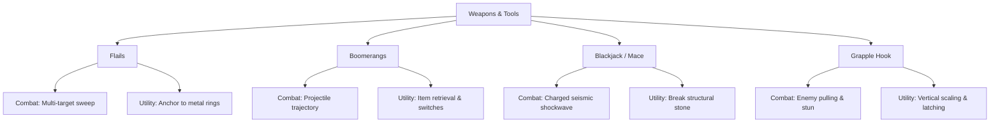
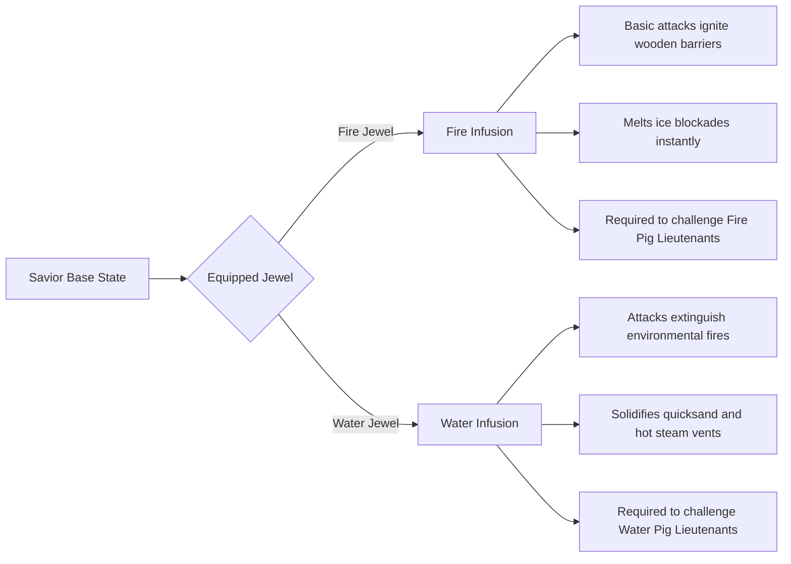

# Equipment, Weapons & Relics Database
## Project: The Legacy of Tomba & the Evil Pigs' Curse

---

## 1. Systemic Weapons Database

Weapons in this universe double as utility tools to solve environmental puzzles. Combat design focuses on impact feel, reach, and kinetic interaction.

### 1.1 Technical Weapon Profiles

#### A. Flails (Chain-Linked Spiked Balls)
* **Base Damage**: $1.5 \times$ Base Punch
* **Attack Speed**: Moderate ($0.45 \, \text{s}$ swing animation)
* **Hitbox Geometry**: $180^\circ$ forward arc extending up to $3.5 \, \text{meters}$.
* **Environmental Interaction**: The metallic spike head can automatically wrap around copper and iron ring pins. When anchored, the Savior can execute a $360^\circ$ physical swing to cross gaps.

#### B. Boomerangs (Wood & Alloy Variants)
* **Base Damage**: $1.0 \times$ Base Punch (deals damage on release and return)
* **Range**: Linear path up to $6.0 \, \text{meters}$ before returning along a modified bezier curve.
* **Environmental Interaction**: Cuts through dangling ropes, activates distant electrical/mechanical pressure switches, and pulls light collectible items (such as standard fruits or keys) back to the Savior’s hands.

#### C. Blackjack (Charged Wooden Porra)
* **Base Damage (Uncharged)**: $2.0 \times$ Base Punch
* **Base Damage (Fully Charged)**: $4.5 \times$ Base Punch
* **Charge Duration**: $1.2 \, \text{s}$ hold time.
* **Physics Knockback**: Applies a $12.0 \, \text{m/s}$ velocity vector to any unshielded enemy.
* **Environmental Interaction**: Striking the ground with a charged slam triggers a local seismic wave within a $3.0 \, \text{meter}$ radius. This collapses structurally weak ceilings, triggers ground buttons, and temporarily stuns subterranean or armored enemies.

#### D. Grapple Hook
* **Base Damage**: $0.5 \times$ Base Punch (primarily a utility weapon)
* **Range**: Directed upward-diagonal raycast extending $8.0 \, \text{meters}$.
* **Environmental Interaction**: Latches securely onto wooden platforms, tree bark, and specialized grapple grates. Allows direct vertical climbing and acts as a dynamic rope pivot point.

---

## 2. Vestments & Adaptive Suits

Indumentary directly modifies the Savior's core physics model, changing variables like jump coefficients, friction scales, and damage mitigation.

### 2.1 Power Pants Matrix

The Savior's agility is tied to the magical weave of his pants.

| Gear Name | Physical Modifications | Primary Environmental Utility |
| :--- | :--- | :--- |
| **Standard Wild Pants** | Baseline values (Run: $8.5 \, \text{m/s}$, Jump: $14.0 \, \text{m/s}$) | Standard movement through initial zones. |
| **Green Forest Pants** | Run Speed $+15\%$, Jump Height $+10\%$, Ground Friction $-20\%$ | Easier navigation through dense mud and slippery moss surfaces. |
| **Red Fire Pants** | Heat Mitigation (Nullifies environmental burn status), Jump Height $+25\%$ | Permits survival on high-temperature volcanic surfaces and deep magma caverns. |
| **Blue Deep Pants** | Water Drag Coefficient reduced by $60\%$, Oxygen Depletion Rate $-50\%$ | Crucial for underwater exploration and precise platforming inside high-current temples. |

### 2.2 Specialized Traversal Suits
* **Flying Squirrel Suit**:
  * *Activation*: Press and hold the Jump key while airborne.
  * *Aerodynamic Changes*: Drops vertical gravity acceleration to $2.2 \, \text{m/s}^2$ and enables a horizontal velocity glide factor of $6.0 \, \text{m/s}$.
  * *Combat Restraints*: The Savior cannot deploy weapons or execute grabs while gliding; colliding with an enemy in this state breaks the glide and inflicts normal hit damage.

---

## 3. Elemental Jewels (Magical Infusions)

These ancient crystals imbue the Savior's essence with active elemental magic, changing his physical attacks and allowing him to override regional pig defenses.

---

## 4. Utility Relics

Relics do not offer direct combat or movement buffs but provide systemic, quality-of-life, and narrative progression assistance.

### 4.1 Wings of Charity
* **Type**: Consumable or cooldown-based navigational item.
* **Function**: Triggers a full UI map overlay, allowing the Savior to instantly teleport to any unlocked Rest Area (e.g., mailboxes, wise men sanctuaries) previously visited.
* **Restrictions**: Cannot be activated while in a combat state, inside boss arenas, or under the influence of psychoactive mushroom spores.

### 4.2 Bells of the Wise Men
* **Type**: Infinite-use key item.
* **Function**: Ringing the bell establishes an immediate telepathic link with the nearest active Wise Man projection.
* **Gameplay Integration**:
  * Provides environmental context hints if the player is stuck on a puzzle.
  * Highlights incomplete event dependencies in the active zone (e.g., "There is a lost soul crying in the caverns below...").