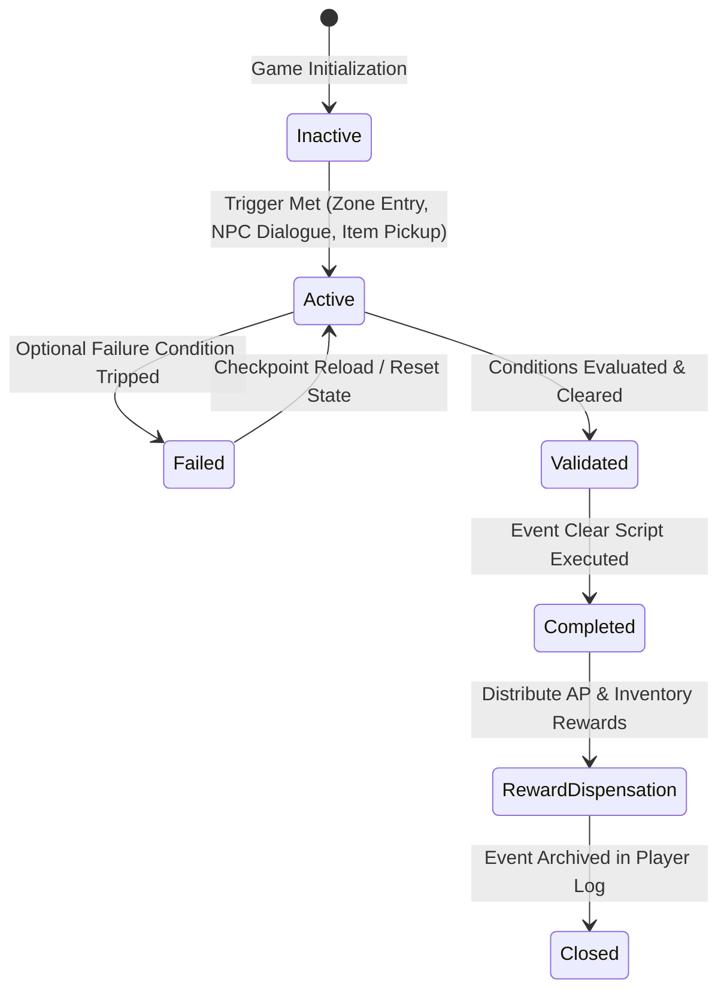
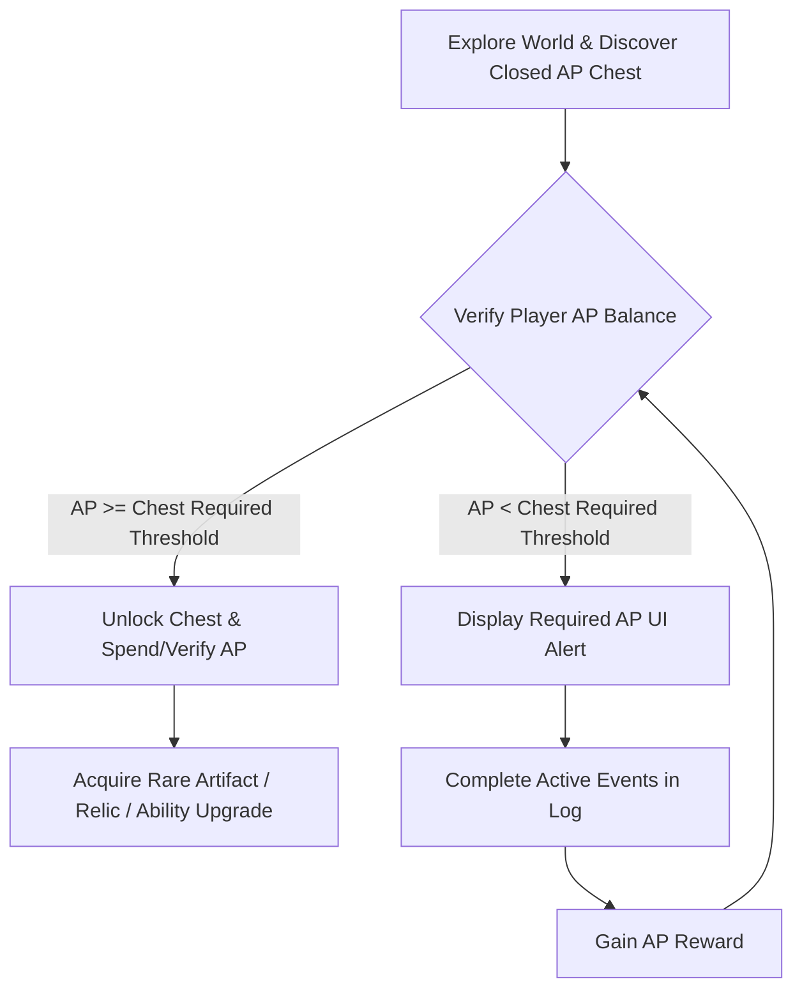

# Event & Progression System Design (Quest Engine & AP)
## Project: The Legacy of Tomba & the Evil Pigs' Curse

---

## 1. Architectural Overview of the Event Engine

The progression of *The Legacy of Tomba and the Evil Pigs' Curse* relies entirely on an event-driven design. Rather than following a linear series of levels, the game operates as a unified state machine tracking up to 130 distinct event hashes in the first era, and 137 in the second. 

Every action—such as talking to an NPC, picking up a lost item, entering a new zone, or hitting an environmental trigger—can initialize, progress, or resolve an event.

---

## 2. Event Lifecycle State Machine

Events transition through several operational states. The system monitors these states globally to dynamically alter level geometries, spawn NPC behaviors, and control world-gating mechanisms.



### 2.1 State Specifications
* **Inactive**: The event exists in the database but the player has not met the requirements to discover it.
* **Active**: The event is visible in the player’s logbook. The tracking parameters (e.g., target coordinates, item quantities, or enemy status) are actively updated by the game loop.
* **Failed**: Temporary state if an event-specific objective is missed (e.g., failing to protect an NPC). Resets upon room exit or checkpoint reload.
* **Validated**: The system confirms all prerequisites are met, suspending character movement briefly to initiate the event completion cinematic.
* **Completed / Closed**: The event is permanently cleared. It cannot be re-triggered. Global state variables are updated to reflect the resolution (e.g., a dried riverbed fills with water).

---

## 3. Technical Structure of an Event (Data Schema)

To ensure modularity and ease of implementation, events are defined via JSON objects. Below is a structural template for an event definition:

```json
{
  "event_id": "EV_DF_012",
  "era": 1,
  "title": "The Dwarf Elder's Lost Key",
  "origin_zone": "Dwarf_Forest",
  "adventure_points_reward": 5000,
  "prerequisites": {
    "events_completed": ["EV_DF_001"],
    "required_items": []
  },
  "triggers": {
    "type": "NPC_Dialogue",
    "target_id": "NPC_DWARF_ELDER",
    "activation_radius": 2.5
  },
  "objectives": [
    {
      "type": "Item_Retrieval",
      "item_id": "IT_DF_ELDER_KEY",
      "quantity": 1,
      "current_count": 0
    }
  ],
  "rewards": {
    "items": ["IT_DF_DWARF_MEDAL"],
    "unlocked_zones": ["Dwarf_Underground_Passage"]
  },
  "world_state_changes": {
    "set_boolean_flags": {
      "is_dwarf_gate_open": true
    }
  }
}
```

---

## 4. The Adventure Points (AP) Economy

Adventure Points (AP) represent the spiritual resonance and heroic prestige of the Savior within the archipelago. AP is not a currency used to buy items from shops; instead, it is a metabolic gating system.



### 4.1 AP Accumulation Vectors
* **Minor Actions**: Defeating standard enemies, destroying environmental hazards, or finding hidden caches yields between $50$ to $200 \, \text{AP}$.
* **Standard Event Completion**: Resolving normal quests rewards between $1,000$ to $5,000 \, \text{AP}$.
* **Major Milestones**: Sealing an Evil Pig or restoring a major geographical zone rewards between $10,000$ to $50,000 \, \text{AP}$.

### 4.2 AP Chest Gating & Mechanics
Throughout the archipelago, ancient chests sealed with numerical runes are embedded in the terrain. Each chest requires a specific lifetime accumulation or current balance of AP to open (e.g., "100,000 AP Chest").
* **Gated Content**: These chests house critical upgrades, such as high-grade *Power Pants*, essential elementally-imbued *Jewels*, or keys to late-game sub-areas.
* **Non-Linear Backtracking**: Players will frequently encounter high-tier AP chests early in exploration, establishing a loop where they must note the location, explore other branches to earn AP, and return later to claim their reward.

---

## 5. Non-Linear Progression & Backtracking Mechanics

The game design avoids artificial physical walls in favor of systemic gating. Progression is restricted by abilities, environment states, and event resolutions rather than invisible blockades.

### 5.1 Metroidvania Ability Gates

| Ability / Tool | Gate / Barrier Type | Unlocked Area Access |
| :--- | :--- | :--- |
| **Blue Pig Bag** | Magical Pig Portal | Unlocks access to the pocket dimension of the Blue Evil Pig |
| **Portable Tornado** | Dense Magical Fog | Clears the path to the inner sanctum of the Dwarf Forest |
| **Grapple Hook** | High Canopy Ledges | Allows ascension through the vertical pathways of the Wailing & Laughing Forest |
| **Abyssal Diving** | Deep Water Bodies | Opens sub-aquatic ruins inside the Templo del Agua |

### 5.2 Dynamic Environmental Transformation
When an Evil Pig is captured in its corresponding bag, its regional curse is instantly broken. This triggers a structural change in the map layout:
* **Fog Dissipation**: Improves visibility and shifts NPC spawn lists (e.g., hostile monsters are replaced by peaceful native inhabitants).
* **Gravitational Normalization**: Inside the Haunted Mansion, clearing the curse returns gravity to standard vectors, allowing the player to safely walk on floors that were previously out of reach or inverted.
* **Water Cleansing**: Purifies contaminated acid or mud, turning them into swimmable water zones, unlocking new underwater horizontal pathways.