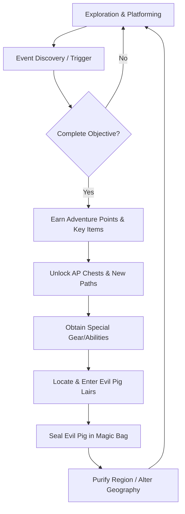
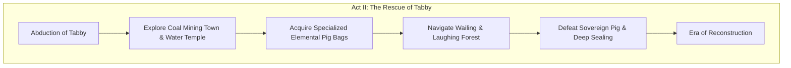

# High Concept Document (HCD)
## Project: The Legacy of Tomba & the Evil Pigs' Curse

---

## 1. Executive Summary

### 1.1 Project Vision
*The Legacy of Tomba and the Evil Pigs' Curse* is a modern reimagining of the classic action-platformer / Metroidvania formula. Players assume the role of a pink-haired, wild savior navigating a non-linear archipelago corrupted by the magical greed of the Evil Pigs. The game blends high-speed physical platforming, a deep multi-planar 2.5D environment system, and an organic, event-driven progression model.

### 1.2 Core Specifications
* **Genre**: 2.5D Action-Platformer / Metroidvania / Action RPG
* **Target Audience**: Fans of classic retro platformers, modern Metroidvania enthusiasts, and players seeking high-agency non-linear exploration.
* **Art Style**: Hand-drawn traditional animation blended with vibrant, atmospheric 2.5D environments (Colorful yet Dangerous aesthetic).
* **Core Philosophy**: Freedom of exploration, physical interaction with enemies and the environment, and a world that dynamically changes its state based on player actions (Pig Bag Alchemy).

---

## 2. Core Gameplay Pillars

### I. 2.5D Plane Navigation & Spatial Interaction
The world is not experienced as a flat scrolling plane. The Savior perceives depth, allowing him to jump between the foreground and background, scale curved surfaces, swing on branches, and climb vertical structures that exist on separate physical layers.

### II. Physical Combat & Kinematics (Grab & Throw)
Combat relies on inertia and gravity. The Savior uses a powerful jaw-grip to latch onto enemies, swing them around, and throw them in linear vectors to break structures, activate triggers, or destroy other enemies.

### III. The Alchemy of Sealing (The Pig Bags)
Rather than simple health pools, bosses (the Evil Pigs) must be captured using magical, elementally tuned containers known as Pig Bags. These bags are hidden throughout the world and must be aligned with the respective Pig's magic to cleanse the corrupted regions.

### IV. Non-Linear Event Web
Progression is dictated by a massive matrix of interconnected tasks (130 Events in the first era, 137 in the second). Discovering a location, talking to an inhabitant, or finding an item triggers an event, allowing the player to naturally forge their own path without traditional rigid level boundaries.

---

## 3. High-Level Architecture & Game Loop

The core game loop balances exploration, event completion, mechanical progression, and regional purification.



---

## 4. Narrative & Mythological Framework

The world consists of an uncharted archipelago cursed by the Pig Alchemy. The pigs convert hoarded gold into dark magical stigmas, distorting the climate, emotions, and physical laws of each region.

### 4.1 Act I: The Quest for the Golden Bracelet
The narrative begins with a desecration. The Savior's ancestral resting place is raided by the Koma Pigs, who steal the Golden Bracelet—his only physical link to his grandfather. Under the guidance of the Wise Men, the Savior must locate the seven regional Pig Bags to seal the lieutenants and confront the Supreme Real Evil Pig.


### 4.2 Act II: The Rescue of Tabby
Peace is broken when Tabby, the Savior's close companion, is abducted by a resurrected pig faction. This new threat operates with industrial and environmental malice, forcing the Savior to explore high-tech mines and sacred temples while dealing with unstable emotional environments.



---

## 5. Hero Anatomy, Kinematics & Vitality

### 5.1 Physical Attributes & Movements
* **Feral Physiology**: High agility, low friction running, and structural climbing.
* **The Bite/Grab**: Pressing the jump key near an enemy attaches the Savior to their back. From there, the player can perform a directional throw.
* **Animal Dash**: An unlockable high-velocity sprint capable of breaking barriers, launching off ramps, and crossing wide gaps.
* **Abyssal Diving**: Essential for navigating submerged regions such as the Water Temple.

### 5.2 Vitality System
* **Stamina Bars**: Displayed as yellow bars in the HUD.
* **Damage Vectors**: Contact with hazards, cursed objects, or enemy attacks depletes these bars.
* **Restoration**: Consuming the Sacred Fruits scattered across the archipelago heals the Savior and can temporarily buff his attributes.

---

## 6. Systems & Mechanics Database

### 6.1 Equipment & Tool Arsenal

| Weapon / Tool | Class | Primary Function | Environmental Utility |
| :--- | :--- | :--- | :--- |
| **Flails** | Offense / Mid-Range | Spiked chain sweep to attack from a safer distance | Can swing from metallic hooks and posts |
| **Boomerangs** | Utility / Projectile | Curved trajectory strike | Activates distant switches and retrieves items |
| **Blackjack (Mace)**| Heavy Offense | Slow, high-impact ground pound | Cracks stone barriers and triggers seismic switches |
| **Grapple Hook** | Traversal | Direct line suspension | Essential for climbing the Wailing & Laughing Forest |

### 6.2 Specialized Garb & Relics
* **Power Pants**: Modulates gravity and kinetic friction. Enables higher jumping arcs and faster acceleration.
* **Flying Squirrel Suit**: Allows the player to glide across deep ravines by using air currents.
* **Elemental Power Jewels**: Fire and Water gems that grant passive resistances and offensive spells required to counter specific regional curses.
* **Charity Wings**: Single-use or recharge-based teleportation feathers to return instantly to unlocked resting points.
* **Wise Men Bells**: Auditory beacons that call upon the projection of the Wise Men for lore hints and event validation.

---

## 7. World Geography & Pig Alchemy

The environment acts as a living system transformed by dark magic. When a region is cursed, its rules change. When purified, hidden areas become accessible.

```mermaid
map-legend
    {"Pig Alchemy" : "Corrupts region, alters physical laws", "Purification" : "Restores natural state, unlocks new paths"}
```

* **Dwarf Forest**: Cursed with a dense, magical fog that distorts navigation.
  * *Resolution*: The Savior must locate and deploy a Portable Tornado to clear the atmosphere and uncover the Blue Pig's portal.
* **Haunted Mansion**: Under the influence of gravity distortion and fractured physical space.
  * *Resolution*: Rebuilding shattered mirror gateways to navigate the domain of the 1,000-Year Wise Man.
* **Phoenix Mountain**: Plagued by perpetual hurricanes and high-altitude storms.
  * *Resolution*: Cleansing the nest of the sacred Phoenix to secure fast travel across the archipelago.
* **Wailing & Laughing Forest**: Infested with psychoactive flora (Weeping and Laughing Mushrooms) causing uncontrollable emotional shifts.
  * *Resolution*: Sourcing antidote formulas and navigating the vertical canopy using the Grapple Hook.

---

## 8. State Alterations & Mental Mechanics

### 8.1 Mushroom Poisoning (Weeping & Laughing States)
Ingesting or touching spores from the Weeping and Laughing Mushrooms forces the Savior into extreme emotional states:
* **Weeping State**: The Savior loses his offensive capabilities, moving slowly and sobbing, making him vulnerable to incoming attacks.
* **Laughing State**: Wild, uncontrolled movements that increase velocity but make precise platforming difficult.
* **Antidotes**: Must be harvested from specific herbs or acquired from the Dwarf Elder to return to a neutral state.

### 8.2 The Hierarchy of Wisdom
The Wise Men serve as anchor points for the world’s metaphysics:
* **100-Year Wise Man**: Teaches the fundamental nature of the Pig Bags and initiates the first sealing quest.
* **1,000-Year Wise Man**: Custodian of secrets inside the Haunted Mansion; guides the player through gravitational and temporal anomalies.
* **1,000,000-Year Wise Man**: The ultimate anchor of the world's chronology. He reveals the location of the hidden 8th chamber where the Real Evil Pig resides.