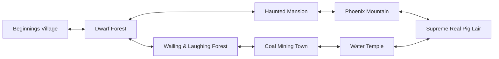
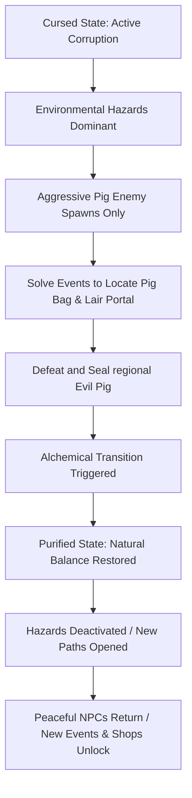

# World Ecology, Level Design & Sacred Geography
## Project: The Legacy of Tomba & the Evil Pigs' Curse

---

## 1. Global Archipelago Connectivity Model

The geography of the archipelago is structured as a non-linear, interconnected network of specialized biomes. Rather than using isolated levels, zones merge into one another through physical transitions, caves, and depth-swapping layers.

---

## 2. The Alchemical State Loop (Corruption vs. Purification)

Each major region exists in one of two physical states: **Cursed (Pig Alchemy Active)** or **Purified (Natural Balance Restored)**. The transition between these states completely reconfigures the regional map, its collisions, hazard sets, and NPC routines.

---

## 3. Detailed Biome Specifications & Level Mechanics

### 3.1 The Dwarf Forest
* **Narrative Importance**: Home of the Dwarf Tribe and the Dwarf Elder.
* **Cursed State Properties**:
  * *The Perpetual Mist*: A dense environmental fog filter that reduces the player’s visual viewport by $60\%$. Navigation is highly dangerous as hazard pits are hidden from direct view.
  * *Navigation Impediment*: Falling into fog-shrouded chasms deals structural damage and resets the Savior at the entrance of the current screen.
* **Key Item Mechanic**: **The Portable Tornado**. This item must be deployed in specific wind-vents. When activated, it clears the local fog density permanently, establishing clean collisions and revealing the hidden cave node that houses the Blue Pig Lair Portal.
* **Purified State Properties**: The fog is replaced by clear, vibrant forest light. Hidden platforms become visible, and the Dwarf Tribe returns to establish trade and offer side quests.

### 3.2 The Haunted Mansion
* **Narrative Importance**: The domain of the 1,000-Year Wise Man.
* **Cursed State Properties**:
  * *Inverted Gravity Fields*: Specific rooms feature gravity vectors tilted at $180^\circ$, requiring players to run along the ceiling.
  * *The Shattered Mirror Nexus*: Doors are blocked by empty mirror frames. The physical mirrors have been shattered into shards.
* **Key Puzzle Mechanic**: The Savior must gather and carry Mirror Shards using his grab-mechanic, throwing them into the frames to reconstruct the glass. Reconstructing a mirror aligns the spatial planes, turning the glass into a portal to alternative dimensional rooms.
* **Purified State Properties**: Gravity normalizes to $9.8 \, \text{m/s}^2$ globally. The ghostly apparitions vanish, and the 1,000-Year Wise Man offers path upgrades.

### 3.3 Phoenix Mountain
* **Narrative Importance**: High-altitude pathway to the sky domains.
* **Cursed State Properties**:
  * *Volatile Wind Gusts*: Lateral forces of up to $15.0 \, \text{N}$ are applied periodically, pushing the Savior backward or accelerating him into wall spikes.
  * *Cursed Nest*: The nest of the sacred Phoenix is covered in dark, magical vines that damage the Savior on contact.
* **Key Traversal Mechanic**: Players must calculate jump timings during the wind-gust lulls. The Red Fire Pants are required to traverse volcanic vents at the base of the mountain without suffering heat damage.
* **Purified State Properties**: The winds calm into predictable thermal draft currents that can be navigated safely using the *Flying Squirrel Suit*. The Phoenix heals, offering instant sky-travel to other purified peaks.

### 3.4 The Wailing & Laughing Forest
* **Narrative Importance**: Organic canopy biome where the Grapple Hook is acquired.
* **Cursed State Properties**:
  * *Bipolar Flora*: Plants are highly sensitive to emotional magic. Touching red mushrooms triggers the *Laughing State*; touching blue mushrooms triggers the *Weeping State*.
  * *Unstable Ground*: Rotting log bridges collapse if walked on while running normally, requiring calculated pacing.
* **Key Traversal Mechanic**: Extensive usage of the Grapple Hook to climb canopy branches and swing across wide gaps without making contact with the toxic forest floor.
* **Purified State Properties**: The toxic mushrooms lose their spore clouds, turning into safe bouncy platforms that help the Savior reach high branches easily.

### 3.5 Coal Mining Town & Water Temple
* **Narrative Importance**: Industrialized urban area and sacred reservoir.
* **Cursed State Properties**:
  * *Acid Flooding*: Industrial pig waste has turned the Water Temple’s reservoir into acidic sludge that instantly drains the Savior's vitality on contact.
  * *Steam Pipe Barriers*: Pressurized steam jets block narrow tunnels in the Coal Mine.
* **Key Traversal Mechanic**: Shutting down steam valves inside the mines and utilizing the *Water Jewel* to solidify acid flows. Once purified, the Savior must dive into deep flooded shafts to open sluice gates.
* **Purified State Properties**: Acid turns into pristine water. The Savior can safely use his diving mechanics to access submerged rooms, find rare AP chests, and meet aquatic NPCs.