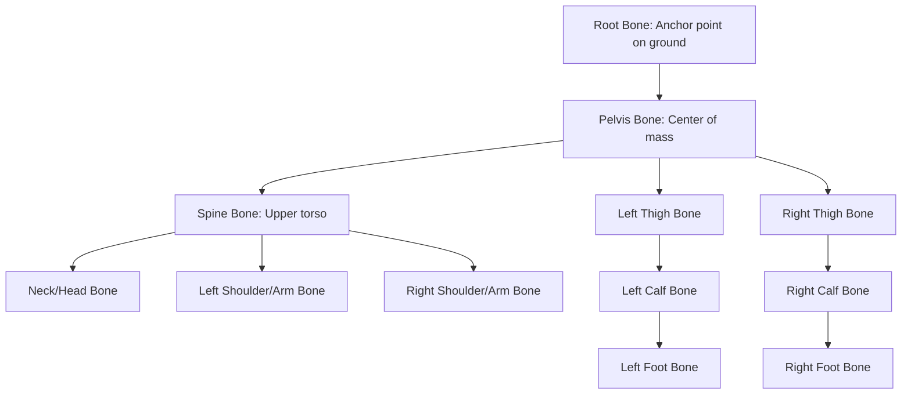
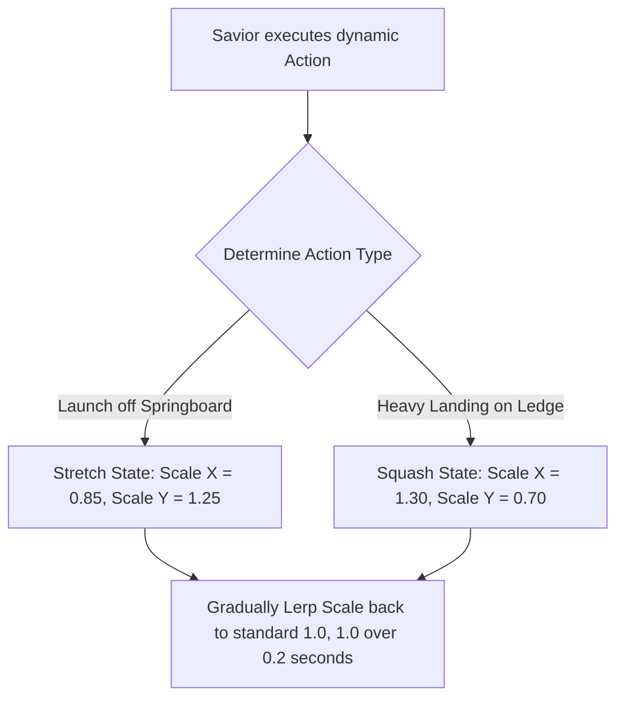
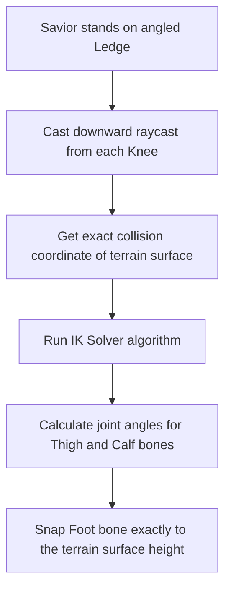

# 2D Skeletal Animation & Deformers Specification
## Project: The Legacy of Tomba & the Evil Pigs' Curse

---

## 1. Introduction to 2D Skeletal Animation (The Rigging Concept)

In traditional animation, to make a character walk, an artist must draw $12$ or $24$ individual pictures for every second of movement. 
* **The Problem**: In modern games, drawing thousands of unique sprites for dozens of different weapons and clothing items consumes massive amounts of RAM and requires months of manual labor.
* **The Solution**: The game implements **2D Skeletal Animation (Rigging)**. An artist draws a character once, splits the body into independent parts (head, arms, torso, legs), and constructs a digital skeleton of virtual **Bones** inside the flat drawings. 
* **The Advantage**: By moving the digital bones, the computer automatically deforms and rotates the drawing smoothly. This allows incredibly fluid, liquid-smooth animations at $60 \, \text{fps}$ while using $90\%$ less memory than standard frame-by-frame sheets.

---

## 2. Savior Bone Rig Hierarchy

The Savior's digital skeleton is structured hierarchically. Moving a parent bone (such as the Pelvis) automatically moves all child bones connected to it.

### 2.1 Mesh Vertex Weighting
To prevent the drawing from looking like a disjointed paper doll at joint bends (elbows and knees), the sprite is mapped to a **Deformable Mesh Grid**. 
* **Skinning**: Vertices around the joints are assigned **Weights** divided between two adjacent bones. When the arm bends, the mesh vertices interpolate smoothly, stretching the elbow skin naturally like real muscle and fabric.

---

## 3. Squash and Stretch Mechanics (Cartoon Physics)

To capture the vibrant, expressive "colorida pero peligrosa" retro-anime visual style, the skeleton uses automated elastic deformations called **Squash & Stretch**.

This mathematical scaling of the mesh's width and height on impacts reinforces the physical force and momentum of the platforming without requiring custom hand-drawn sprites for every crash.

---

## 4. Inverse Kinematics (IK) for Ground Placement

When standing on an angled hill or uneven stairs, standard character animations cause the feet to float in the air or clip inside the dirt. The engine solves this using **Inverse Kinematics (IK)**.

### 4.1 IK Mathematical Solver
The IK engine calculates joint bend angles using the cosine rule based on the distance between the hip and the target ground coordinate. This ensures that the Savior's legs bend naturally to match the floor slope, presenting a polished, heavy physical presence inside the 2.5D world coordinates.