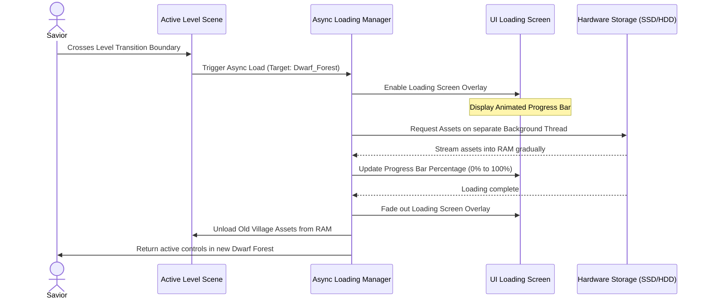
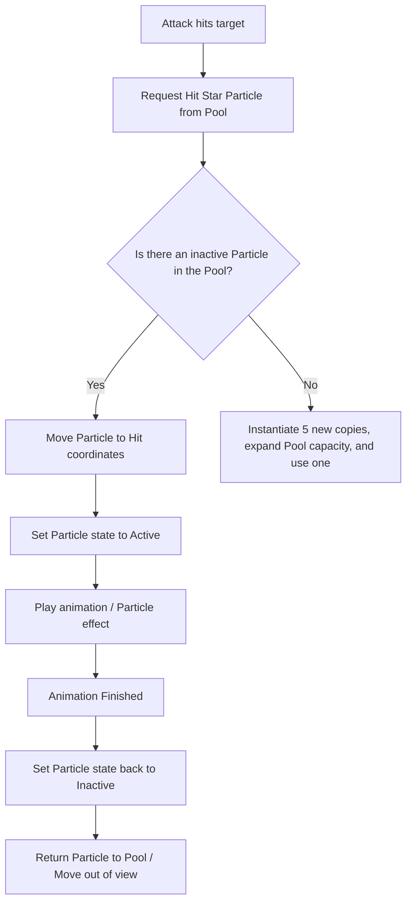

# Asset Loading & Resource Management Specification
## Project: The Legacy of Tomba & the Evil Pigs' Curse

---

## 1. Introduction to Game Memory Management (The Core Problem)

When running a detailed video game, the computer or console hardware has a limited amount of active physical memory (RAM). If a game tries to load too many high-resolution graphics (sprites), environment textures, or high-fidelity audio files simultaneously:
1. **Memory Crash (Out of Memory)**: The game running device runs out of RAM, causing the application to crash instantly.
2. **Stuttering (Micro-Freezes)**: If the engine loads a heavy asset (like a boss character model) instantly on the main execution thread, the game loop pauses for several frames, creating a jarring, unplayable lag spike.

To solve this, our game engine implements two advanced structural systems: **Asynchronous Loading** and **Object Pooling**.

---

## 2. Asynchronous Loading (Background Loading Screens)

When transitioning between major geographic regions (e.g., leaving the *Beginnings Village* and entering the *Dwarf Forest*), the game does not freeze while copying files to RAM. Instead, it runs an **Asynchronous (Async) Loading Thread**.

### 2.1 Technical Async Parameters
* **Non-Blocking Execution**: The loading thread runs separated from the main rendering loop. The frame rate of the loading screen animation (e.g., a rotating golden coin) remains locked at $60 \, \text{fps}$ without stuttering.
* **Progress Bar Linear Mapping**: The loading progress bar tracks the actual float value ($0.0$ to $1.0$) of the asset loading stream, smoothing the bar expansion using a interpolation factor to avoid sudden visual jumps.

---

## 3. Object Pooling (Anti-Lag Recycling System)

During combat, the player frequently spawns standard objects (such as *Hit Star Particles*, *Dust Clouds*, *Thrown Boomerangs*, or *Koma Pig Minions*). 
* **The Problem (Without Pooling)**: Creating (*Instantiating*) and deleting (*Destroying*) objects on the fly forces the game engine to continuously request and release memory blocks. This triggers the engine's **Garbage Collector (GC)**, causing sudden frame-rate drops.
* **The Solution (Object Pooling)**: Instead of deleting objects, the engine creates a hidden storage container (a Pool) at level start containing pre-instantiated, inactive copies of these objects.

### 3.1 Object Pool Definitions
* **Initial Pool Capacity**: The engine instantiates a default set of objects at scene start (e.g., $30 \times$ Hit Star particles, $10 \times$ Dust Clouds).
* **Pool Expansion**: If all pooled objects are active at once, the system dynamically instantiates $5$ more copies to expand the pool, preventing gameplay limits.

---

## 4. Addressables & Dynamic Level Streaming

To keep the memory footprint low, the game uses **Dynamic Addressable Streaming**. The world is divided into spatial regions called "Chunks".

* **Trigger Distances**: As the Savior walks, the engine measures his distance to the adjacent level chunks.
* **Streaming Thresholds**:
  * *Distance $< 30 \, \text{meters}$*: The engine asynchronously begins streaming the adjacent chunk's textures into RAM.
  * *Distance $> 60 \, \text{meters}$*: The engine immediately releases and unloads the textures of the distant, passed chunks, freeing up RAM for upcoming environments.