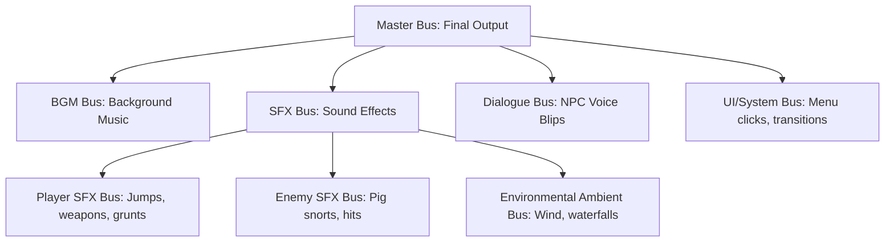
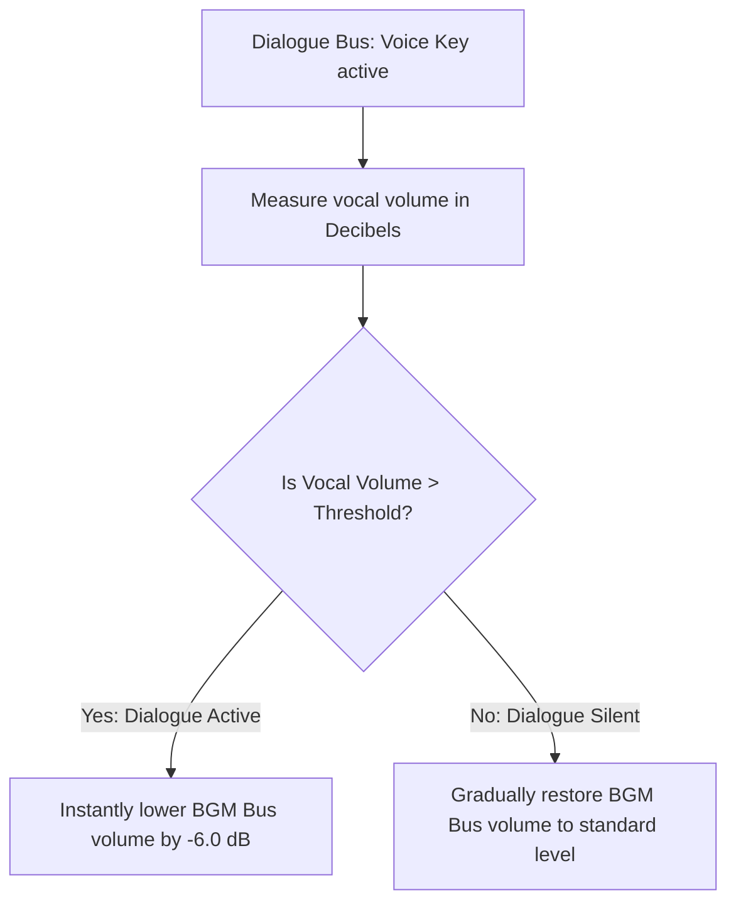

# Audio Mixer & Bus Routing Specification
## Project: The Legacy of Tomba & the Evil Pigs' Curse

---

## 1. Introduction to Audio Mixing (The Soundboard Concept)

Playing sounds inside a video game is not as simple as clicking "Play" on an audio file. If a game has music, character voices, and combat explosions all playing together at $100\%$ volume:
* **The Problem**: The sounds will clash and overlap, creating a muddy, noisy wall of sound where players cannot hear dialogue clearly and the music drowns out subtle platforming sound cues.
* **The Solution**: The game implements a **Digital Audio Mixer**. Like a physical DJ soundboard, every sound is routed through specialized virtual channels called **Buses**. We can adjust the volume, pitch, and apply digital filters to entire categories of sounds at once, ensuring a balanced, professional mix.

---

## 2. Global Audio Bus Routing Hierarchy

Every audio emitter component (`AudioSource`) in the game is assigned to a specific destination bus within the master hierarchy.

---

## 3. Dynamic Volume Sidechaining (Audio Ducking)

To guarantee that key narrative dialogue and high-impact combat grunts are perfectly legible over loud background music, the mixer implements a **Sidechain Compressor**.

### 3.1 Compression Envelope Parameters
* **Trigger Source**: `Dialogue Bus`.
* **Target Destination**: `BGM Bus` (Background Music).
* **Threshold**: $-24 \, \text{dB}$.
* **Ducking Amount (Ratio)**: Reduces music volume by exactly $-6 \, \text{dB}$ when an NPC speaks.
* **Attack Time**: $0.05 \, \text{seconds}$ (The music ducks almost instantly when speech begins).
* **Release Time**: $1.2 \, \text{seconds}$ (Once the speech ends, the music volume fades back up slowly and naturally).

---

## 4. Environmental Reverb Zones (Acoustic Spaces)

To make spaces like the *Haunted Mansion* or *Dwarf Forest Caves* feel physically closed and deep, the mixer applies a **Reverb Filter** based on the Savior's active coordinates.

| Reverb Preset Name | Decay Time (Reverb Time) | Wet/Dry Mix | Target Environmental Application |
| :--- | :--- | :--- | :--- |
| **Dwarf Forest Caves** | $2.2 \, \text{seconds}$ | $30\%$ Wet / $70\%$ Dry | Medium stone chambers. Adds echo to jumps and rock breaks. |
| **Mansion Grand Hall** | $4.5 \, \text{seconds}$ | $50\%$ Wet / $50\%$ Dry | Vast, empty gothic hall. Creates a spacious, haunting echo. |
| **Submerged Ruins** | $1.8 \, \text{seconds}$ | $75\%$ Wet / $25\%$ Dry | Submerged under water. High damping, low-pitched fluid echoes. |

* **Wet/Dry Mix Explained**:
  * *Dry*: The raw, unaffected clean sound effect.
  * *Wet*: The processed, echoing reverb effect. Inside a deep water ruin, the mix is mostly *Wet*, creating a heavily muffled, aquatic echo sensation.