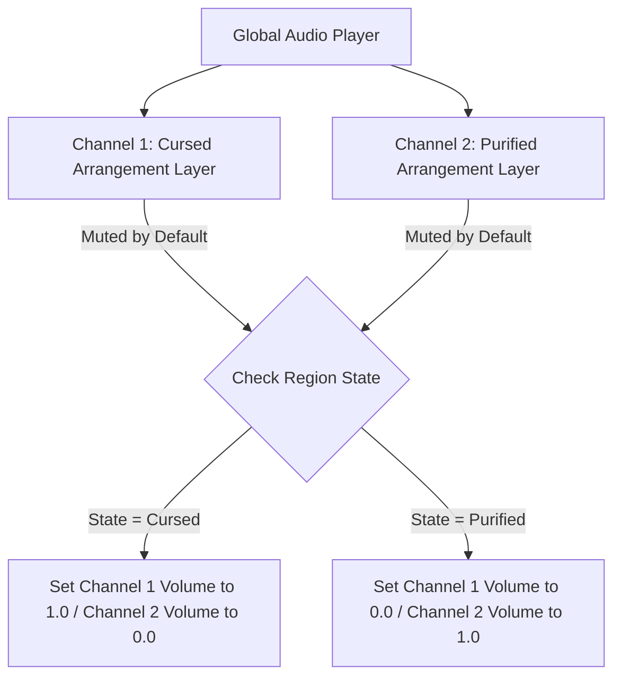
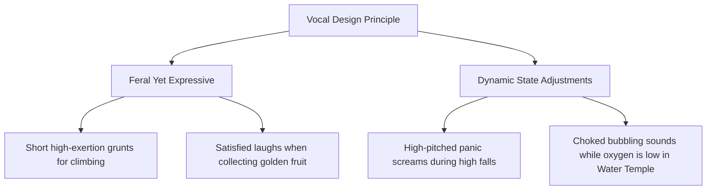

# Audio Systems, Sound Design & Adaptive Music
## Project: The Legacy of Tomba & the Evil Pigs' Curse

---

## 1. Audio System Philosophy

The audio identity of *The Legacy of Tomba and the Evil Pigs' Curse* is defined by high-impact, cartoonish physical sound effects layered over an adaptive, high-energy instrumental soundtrack. The soundscape must provide immediate sensory feedback, emphasizing the weight of the physical platforming and the emotional status of the environment.

---

## 2. Dynamic & Adaptive Music Engine

The game utilizes a multi-track, horizontal-mixing audio engine. Each region has a single unified theme composed in two distinct arrangements: **Cursed Arrangement** and **Purified Arrangement**. Both files must share the exact same Tempo (BPM), Time Signature, and Bar Length to ensure seamless transition sync.

### 2.1 Transition Mechanics (Dynamic Crossfading)
When the Savior seals an Evil Pig, the engine triggers an instant but smooth volume transition:
* **Fade Duration**: $2.0 \, \text{seconds}$.
* **Interpolation**: Linear volume curve to prevent abrupt audio cuts or volume spikes.
* **Low-Pass Filter (LPF)**: When the Savior enters a pause menu or falls underwater, a dynamic low-pass filter ($800 \, \text{Hz}$ cutoff frequency) is applied to the active music channel to create a muffled, atmospheric depth sensation.

### 2.2 Regional Music Specifications

| Region | Tempo (BPM) | Cursed Instrumentation | Purified Instrumentation |
| :--- | :--- | :--- | :--- |
| **Dwarf Forest** | $128$ | Heavy percussion, discordant synth bass, industrial metallic clocks. | Wooden flutes, acoustic guitars, upbeat light brass, natural bird chirps. |
| **Haunted Mansion**| $95$ | Minor key organ, dark violin solos, distorted wind whispers. | Harpsichords, playful pizzicato strings, marimba, cheerful bells. |
| **Water Temple** | $110$ | Slow, heavy tuba, deep echo synths, dripping metallic pipes. | Crystal chime bells, fluid harp glissandos, flute melodies. |

---

## 3. Sound Effects (SFX) Master Registry

To prevent player fatigue from highly repetitive sounds (like jumping and grabbing), the engine applies a **Dynamic Pitch Modulation** of $\pm 8\%$ on every trigger. This creates minor natural variations in each sound effect.

### 3.1 Player Character Sound Actions

| Action Trigger | File ID | Target Sound Profile | Max Attenuation Radius |
| :--- | :--- | :--- | :--- |
| **Standard Jump** | `SFX_PL_JUMP` | High-pitched spring compression, playful and quick. | Stereo Local Only |
| **Ledge Catch** | `SFX_PL_GRAB` | Physical leather rustle and heavy grunt. | Stereo Local Only |
| **Bite / Latch** | `SFX_PL_BITE` | Crisp cartoonish chomp / snap sound. | $5.0 \, \text{meters}$ |
| **Impact Slam** | `SFX_PL_SLAM` | Heavy wood-on-dirt explosion, seismic rumble. | $15.0 \, \text{meters}$ |
| **Water Splash** | `SFX_PL_SPLASH`| Fluid burst, high-frequency bubble rustle. | $8.0 \, \text{meters}$ |

### 3.2 Spore Affliction Audio Filters
When under the influence of regional spores, the soundscape shifts to align with the Savior's emotional state:
* **Weeping State**: Active background music track volume is attenuated by $40\%$. A continuous, low-frequency sobbing sound is layered onto the audio mix.
* **Laughing State**: The active music track pitch is increased by $+10\%$, creating a rushed, hyperactive atmosphere. The Savior’s physical jump sounds are replaced by high-pitched, manic giggles.

---

## 4. Voice & Vocalization Guidelines

The Savior does not speak in fully formed linguistic lines outside of specific text dialogue boxes. His active gameplay interactions rely entirely on physical grunts, expressive yells, and exertion sounds.

These raw vocal tracks must be mixed with a high-fidelity compressor to stand out clearly over the background instruments and environmental ambient noise tracks (such as running water or rustling leaves).