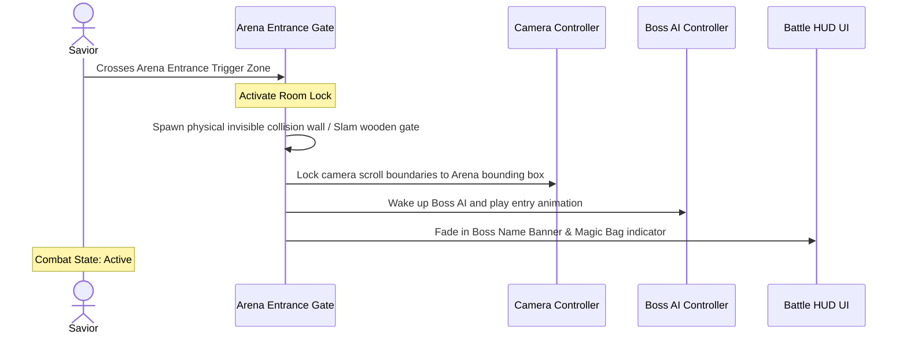
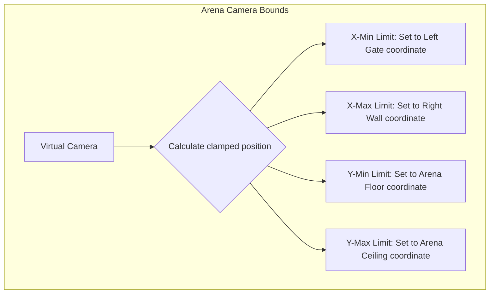

# Boss Arena Camera & Room Locking Specification
## Project: The Legacy of Tomba & the Evil Pigs' Curse

---

## 1. Introduction to Room Locking (The Arena Concept)

When entering a battle against an Evil Pig Lieutenant, the gameplay experience shifts from exploration to a high-stakes duel. 
* **The Problem**: If the player could simply run backward out of the screen during a boss fight, it would break the combat challenges and allow easy exploits.
* **The Solution**: The game implements a **Room Lock System**. Upon crossing a specific entrance boundary, physical gates slam shut behind the Savior, the camera freezes its scroll behavior to lock the arena within a single, uncluttered viewport frame, and the boss battle logic activates.

---

## 2. Boss Arena Trigger Sequence

The transition from standard exploration to active boss combat operates along a strict, automated event sequence.

---

## 3. Camera Clamping & Boundary Mathematics

During standard exploration, the camera follows the Savior dynamically. Inside the boss arena, the camera’s horizontal ($X$) and vertical ($Y$) coordinates are clamped to a static bounding box to keep the action perfectly framed.

### 3.1 Clamping Equations
The camera's internal position controller overrides its tracking target, restricting coordinate updates to the following boundaries:

$$\text{Cam}_x = \text{Clamp}(\text{Target}_x, \text{ArenaMin}_x, \text{ArenaMax}_x)$$
$$\text{Cam}_y = \text{Clamp}(\text{Target}_y, \text{ArenaMin}_y, \text{ArenaMax}_y)$$

This mathematical clamp guarantees that even if the Savior performs high-altitude jumps or is thrown upward by a boss, the camera viewport remains completely static, preventing the screen from shaking or exposing undeveloped areas outside the arena mesh.

---

## 4. Defeat & Arena Reset Logic

If the Savior’s Vitality Bars reach $0$ during a boss battle, the system executes a clean reset sequence to restore the level state and prevent bugs.

### 4.1 Step-by-Step Reset Protocol
1. **Death State**: Savior input is completely blocked; death animation plays.
2. **Screen Transition**: Viewport fades to black over $1.5 \, \text{seconds}$.
3. **Actor Reset**:
   * The Savior's coordinates are moved to the nearest active Mailbox Checkpoint.
   * Savior's Vitality Bars are restored to $100\%$ capacity.
4. **Arena Reset**:
   * The Boss’s coordinates are reset to their default idle spawn point.
   * Any active boss projectile sprites or hazard particles are destroyed.
   * The entrance gates are unlocked and opened, allowing the player to safely prepare and enter the arena again when ready.