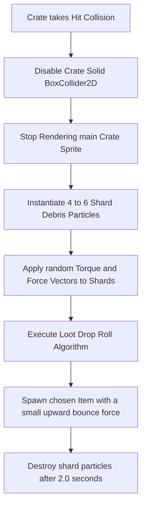

# Breakable Items & Drop Probability Specification
## Project: The Legacy of Tomba & the Evil Pigs' Curse

---

## 1. Introduction to Breakable Caches (The Loot Container Concept)

In platforming adventure games, players need direct rewards for exploring corners, breaking obstacles, and defeating challenges. This is achieved by placing **Breakable Caches** (such as wooden crates, clay pots, or floating barrels) along the path.
* **How they are broken**: The Savior can break these containers using primary weapons (such as hitting them with a Flail or Blackjack mace), or by physically grabbing a Koma Pig and throwing it directly into the container.
* **The Reward**: Upon breaking, the container fractures into small physical debris pieces and drops a random item (like a healing Blueberry or an Adventure Point coin).
* **The Math**: To keep exploration exciting, the item dropped is not always the same. The game engine uses an **RNG (Random Number Generator)** and a **Weighted Loot Table** to calculate drop probabilities mathematically.

---

## 2. Physics of Fracturing (The Break Sequence)

When a breakable container takes a hit exceeding its threshold limit, the physics engine runs a destruction sequence to create a visual explosion of splinters.



### 2.1 Kinetic Shard Properties
* **Shard Debris (`PART_WOOD_SHARD`)**: Debris pieces are assigned a circle collider and physical weight.
* **Explosive Vector**: Each shard is launched outward from the impact origin coordinate using a randomized force range:

$$\vec{F}_{\text{shard}} = (\text{RandomForce} \times 4.0 \, \text{m/s}) + (\text{SpinTorque} \times 360^\circ/\text{sec})$$

---

## 3. Weighted Random Loot Table System

A **Weighted Random** algorithm works like a spinning wheel of fortune, where each item (Loot Option) takes up a different slice of the wheel based on its weight.

```mermaid
grid-layout
    {"title": "Visualizing Loot Probability Splits (Normal Crate)", "cols": 4, "rows": 1}
    ["Nothing (40%)", "Blueberry Fruit (35%)", "AP Silver Coin (20%)", "Golden Peach (5%)"]
```

### 3.1 Crate Drop Probability Matrix

| Item Loot ID | Item Class | Weight (Normal Crate) | Weight (Golden Crate) | Probability Percentage (Normal) |
| :--- | :--- | :--- | :--- | :--- |
| **`IT_NONE`** | Empty | $40$ | $0$ | $40.0\%$ (No drop) |
| **`IT_FRUIT_BLUEBERRY`**| Healing Fruit | $35$ | $30$ | $35.0\%$ (Common) |
| **`IT_COIN_AP_SILVER`**| AP Currency ($500 \, \text{AP}$)| $20$ | $50$ | $20.0\%$ (Uncommon) |
| **`IT_SACRED_PEACH`**  | Rare Health Upgrade | $5$ | $20$ | $5.0\%$ (Rare) |
| **Total Weight Sum** | **-** | **100** | **100** | **100%** |

---

## 4. Loot Drop Allocation Logic (The Algorithm)

To select an item dynamically, the engine executes a three-step processing algorithm during container destruction:

1. **Calculate Total Weight**: Sum all weights inside the target container's loot table (e.g., $40 + 35 + 20 + 5 = 100$).
2. **Roll Random Number**: The RNG generates a random floating-point number ($R$) between $0.0$ and the Total Weight (e.g., $R = 65.4$).
3. **Iterate and Subtract**: The algorithm loops through the loot items, subtracting each item's weight from $R$ until $R \le 0.0$.

```
Iteration Step 1:
  Remaining R = 65.4
  Subtract Empty Weight (40): 65.4 - 40 = 25.4 (Remaining R > 0, move to next item)

Iteration Step 2:
  Remaining R = 25.4
  Subtract Blueberry Weight (35): 25.4 - 35 = -9.6 (Remaining R <= 0! Match Found!)
  RESULT: Spawn Blueberry Fruit!
```