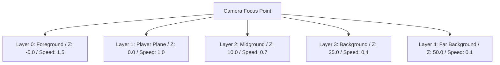
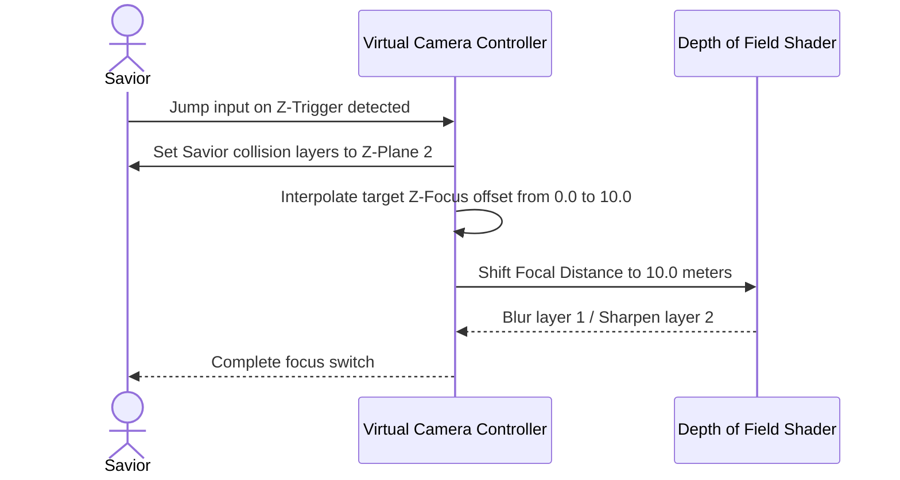

# Camera Systems & Parallax Specification (2.5D Engine)
## Project: The Legacy of Tomba & the Evil Pigs' Curse

---

## 1. Camera Controller Architecture

The game utilizes a specialized 2.5D orthographic-perspective hybrid camera system. While the physics calculations and movement constraints operate on a flat 2D coordinate plane ($X, Y$), the camera and background elements utilize a $Z$-depth layer stack to create an illusion of depth and atmosphere.

### 1.1 Virtual Camera Properties

| Parameter | Value | Technical Description |
| :--- | :--- | :--- |
| **Field of View (FOV)** | $45^\circ$ | Angle of the camera's viewing frustum (used to render 3D backgrounds). |
| **Orthographic Size** | $6.5$ | Height unit value for 2D sprites. Determines overall character-to-world scale. |
| **Horizontal Dead Zone** | $2.0 \, \text{meters}$ | Safe boundary on the horizontal axis before camera tracking begins. |
| **Vertical Dead Zone** | $1.5 \, \text{meters}$ | Safe boundary on the vertical axis before camera tracking begins. |
| **Lookahead Offset** | $1.2 \, \text{meters}$ | Distance the camera moves ahead of the Savior in his moving direction. |
| **Camera Damping (Damp)** | $0.15 \, \text{seconds}$ | Speed smoothing factor to prevent rapid, nauseating camera shakes. |

---

## 2. Parallax Layers & Depth Hierarchy

To simulate depth, environmental assets are distributed across five distinct $Z$-depth planes. Each plane is assigned a unique tracking speed modifier (the Parallax Factor).

### 2.1 Parallax Calculations
The physical offset of an asset on Layer $N$ along the X-axis is calculated using the camera's absolute position:

$$\text{Asset}_x = \text{Anchor}_x + (\text{Camera}_x \times (1 - \text{Parallax Factor}))$$

Where:
* $\text{Anchor}_x$ is the asset's default position in the level design editor.
* $\text{Camera}_x$ is the horizontal position of the camera.
* $\text{Parallax Factor}$ is the multiplier corresponding to the target layer.

---

## 3. Z-Axis Plane Transition (Depth Leaping)

When the Savior activates a Z-Trigger to jump from Foreground Layer 1 to Background Layer 2, the camera executes a synchronized focal shift.

### 3.1 Lerp Transition Properties
* **Focal Distance Interpolation**: Linear interpolation (Lerp) over $0.45 \, \text{seconds}$.
* **Orthographic Shift**: The camera slightly narrows its orthographic size by $8\%$ during background transitions to keep the Savior’s sprite clear and prominent inside the smaller background frames.

---

## 4. Camera Boundaries & Screen-Locking (Sectors)

To prevent the player from seeing beyond the mapped boundaries of a level (e.g., viewing black voids behind skybox textures), the camera utilizes a bounding box system.

### 4.1 Bounding Box Mechanics
* **Sectors**: Level designers define closed rectangular collision borders known as **Camera Colliders**.
* **Transition Locks**: When the Savior enters a room, the camera’s coordinates are clamped so they cannot cross the active sector's boundaries:

$$\text{Camera}_x = \text{Clamp}(\text{Target}_x, \text{Min}_x + \text{HalfWidth}, \text{Max}_x - \text{HalfWidth})$$
$$\text{Camera}_y = \text{Clamp}(\text{Target}_y, \text{Min}_y + \text{HalfHeight}, \text{Max}_y - \text{HalfHeight})$$

* **Room Transitions**: Crossing a threshold between two sectors triggers a classic side-scroller screen transition, smoothly sliding the camera viewport from the old sector to the new one over $0.80 \, \text{seconds}$.