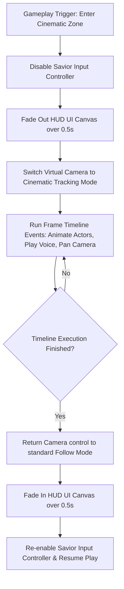
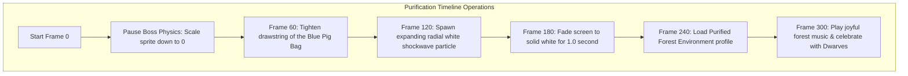

# Cinematic Sequences & Real-Time Storyboards
## Project: The Legacy of Tomba & the Evil Pigs' Curse

---

## 1. Introduction to Real-Time Cinematics (The Narrative Concept)

In modern adventure games, story moments are no longer presented using separate, pre-recorded video files (CGI). Instead, the game engine uses **Real-Time Cinematics**.
* **How it works**: The characters and levels used in active gameplay are controlled dynamically by a master timeline script. When a story sequence triggers, the game suspends the player's movement controls, fades out the HUD meters, and moves the virtual camera along a precise path to focus on the talking characters.
* **Why it matters**: Real-time cinematics are highly seamless. They keep the player immersed because there are no jarring loading screens or resolution changes between playing the game and watching a cutscene.

---

## 2. Cinematic Sequence Controller Lifecycle

The engine's cinematic manager (`CinematicTimelinePlayer.cs`) coordinates camera keyframes, character animation states, and audio channels along a unified, frame-locked timeline.



---

## 3. Case Study 1: The Theft of the Golden Bracelet (Opening Cutscene)

This timeline details the first narrative sequence of the game, occurring immediately after the Savior enters the ancestral grave trigger zone.

### 3.1 Timeline Framework (Duration: 12.0 Seconds / 720 Frames)

```
Time (s)  0s-------1.5s----------4.0s----------------8.5s------------12.0s
Cam Track [Pan to Grave]----->[Focus on Koma Pigs]----->[Tracking Savior]
Audio     [Peaceful Music]-->[SFX_PIG_LAUGH (Surprise)]->[Tension Theme]
Actors    [Savior Idle]------>[Pigs jump in / Tease]-->[Savior Angry / Pigs escape]
```

* **0.0 - 1.5s (The Peace)**: Camera pans slowly from the Savior’s coordinates to focus on the grandfather's grave monument. Background wind whispers play.
* **1.5 - 4.0s (The Intrusion)**: Three Koma Pigs bounce onto the screen from the upper background layers, landing with a heavy physical thud. The center pig waves the stolen **Golden Bracelet**. Portrait changes to `[mood=angry]`.
* **4.0 - 8.5s (The Dialogue)**: Subtitle text prints character-by-character on the dialogue canvas (using localization key `TXT_BEG_ELDER_01`). Sound blips play in sync.
* **8.5 - 12.0s (The Escape)**: The Koma Pigs run to the right, jumping over the village fence. The camera pans back to the Savior, who enters his active gameplay state with a furious battle growl animation.

---

## 4. Case Study 2: Forest Purification Shockwave

This sequence triggers immediately upon successfully throwing the Blue Evil Pig into the floating magic bag at the climax of the boss battle.



* **The Camera Action**: During the whiteout transition, the camera performs a fast, low-amplitude vibration rumble (`Amplitude: 0.5m`, `Frequency: 30Hz`) to simulate the world's physical reality restoring its balance under the explosive purification wave.