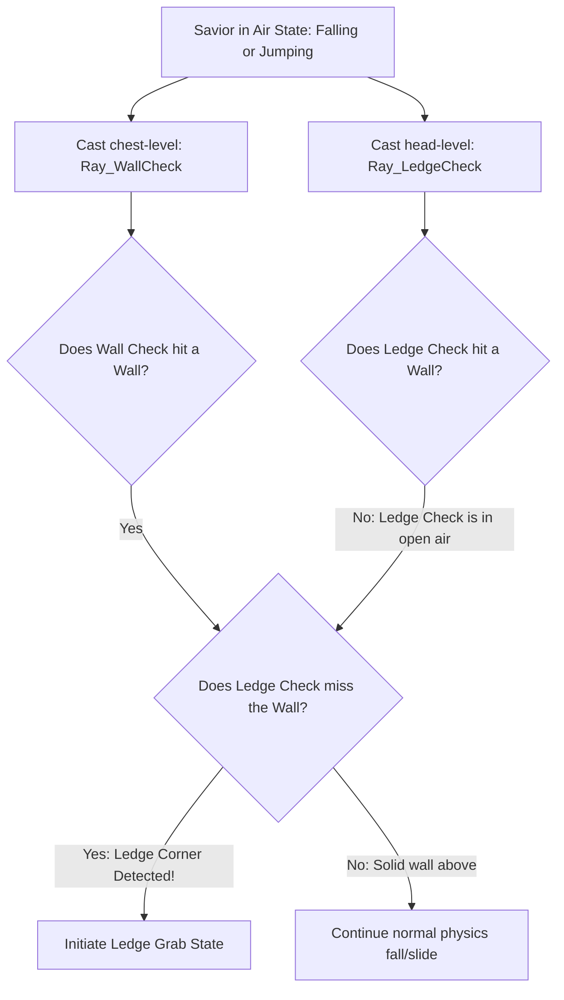
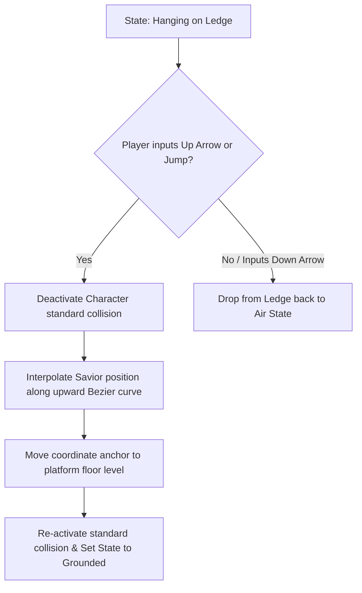

# Climbing & Ledge Navigation Specification
## Project: The Legacy of Tomba & the Evil Pigs' Curse

---

## 1. Introduction to Vertical Navigation (The Climbing Concept)

In standard, simple platforming games, walls are rigid blocks that players simply bounce off of. 
* **The Concept**: To create an adventurous, wild world, the Savior has feral movement capabilities. He can catch onto the edge of high cliffs, hang from tree branches, and scale vertical chains, vines, or ladders.
* **The Challenge**: For this to feel natural and responsive, the computer needs to know exactly when the Savior's hands touch the corner of a cliff. If the detection is slightly off, the character will appear to float in mid-air or clip inside the solid stone wall. We solve this using a double-raycast mathematical check: **Wall Checking** and **Ledge Checking**.

---

## 2. Ledge Detection Mathematics (Angle & Corner Detection)

To detect the exact corner of a cliff, the physics controller casts two parallel horizontal raycasts from the Savior's head and chest coordinates toward the facing wall.

### 2.1 Raycast Trigger Positions
* **Chest Raycast (`Ray_WallCheck`)**:
  * *Height Position*: $1.2 \, \text{meters}$ above pivot feet.
  * *Length*: $0.6 \, \text{meters}$ forward.
  * *Logic*: Verifies there is a solid surface to hang onto.
* **Head Raycast (`Ray_LedgeCheck`)**:
  * *Height Position*: $1.8 \, \text{meters}$ above pivot feet.
  * *Length*: $0.6 \, \text{meters}$ forward.
  * *Logic*: Must return `False` (meaning it passes above the platform floor into open air). This confirms the Savior's head has cleared the platform corner, allowing a grab.

---

## 3. Ledge Hang to Ledge Climb State Transition

Once the `Ledge Grab` state is validated, gravity is set to $0.0$, the player's horizontal velocity is paused, and the Savior enters the hanging loop.

### 3.1 Transition Coordinates Interpolation (The Climb Up)
When climbing up, the character cannot simply warp to the top of the platform. The engine moves the Savior’s transform coordinates smoothly along a quadratic Bezier curve over $0.35 \, \text{seconds}$, playing the "Climb Up" animation frames in sync to maintain visual fluid movement.

---

## 4. Climbing Structures (Chains, Ropes, and Vines)

Vertical ropes, chains, and lianas are mapped as specific interactive line segments (`COL_CLIMBABLE`).

* **Mounting the Rope**: Pressing the *Up* directional key while overlapping a climbable collider transitions the Savior to the `Climbing` state. The character snaps horizontally to the exact center of the rope line.
* **Climbing Controls**:
  * *Up/Down keys*: Move vertically along the rope at a locked speed of $3.5 \, \text{m/s}$.
  * *Left/Right keys*: Swings the Savior left and right, shifting the rope asset’s physics simulation pendulum angle.
  * *Jump Button*: Launches the Savior off the climbable structure in the facing direction, transferring the pendulum's centrifugal momentum to his jump velocity.