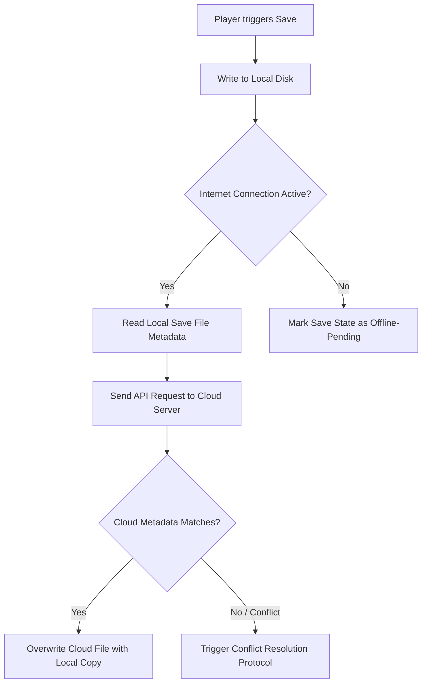
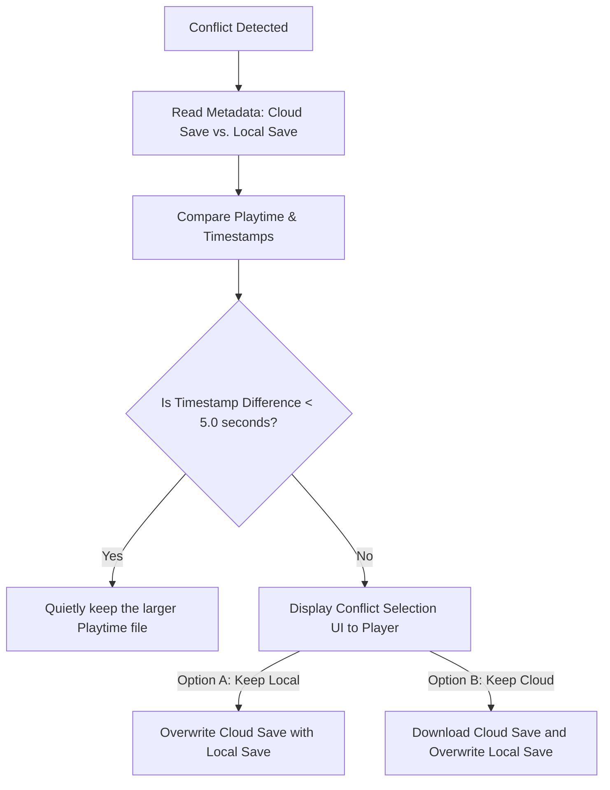

# Cloud Save Synchronization & Conflict Resolution Specification
## Project: The Legacy of Tomba & the Evil Pigs' Curse

---

## 1. Cloud Synchronization Workflow

To allow seamless transition across platforms, the save system interfaces with cloud APIs (such as Steam Cloud, Xbox Connected Storage, or PlayStation Plus Cloud Storage). Every save transaction writes to local disk first, then initiates an asynchronous sync routine to the active platform's cloud server.

---

## 2. Save Conflict Resolution Protocol

A conflict arises when the game is played offline on one device (e.g., a Steam Deck), and later opened on a second device (e.g., a Desktop PC) before the offline save could be synchronized to the cloud.

### 2.1 The Conflict UI Specifications
When a non-resolvable conflict occurs, gameplay is paused before entering the Title Screen. The UI displays a clear comparison overlay presenting the details of each save file:

* **Header**: *"Save Data Mismatch: Choose which file to keep."*
* **Left Option (Local File)**: Displays creation timestamp, current era, player AP balance, and total playtime.
* **Right Option (Cloud File)**: Displays equivalent metadata parsed from the server.
* **Warning Label**: *"Warning: The unselected file will be permanently overwritten."*

---

## 3. Offline Caching & Synchronization Recovery

The game is fully playable without an active internet connection. The save engine tracks offline changes using metadata flags to ensure zero data loss.

### 3.1 Offline Caching Parameters
* **`is_sync_pending` Flag**: When a save is written to disk while offline, the engine sets this boolean variable inside the system registry metadata to `True`.
* **Network Status Poll**: The game’s network client polls internet reachability every $60.0 \, \text{seconds}$ in the background.
* **Delayed Upload**: Once a stable connection is detected, the engine executes the sync sequence in the background, uploading the locally cached save files and changing the `is_sync_pending` flag back to `False`.