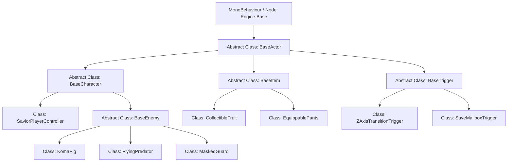
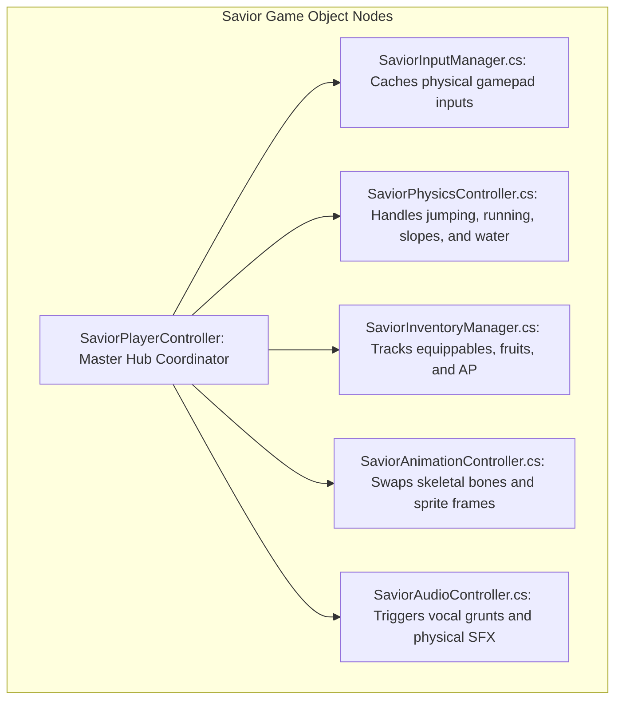

# Coding Standards & Architecture Specification
## Project: The Legacy of Tomba & the Evil Pigs' Curse

---

## 1. Introduction to Software Architecture (The Clean Code Concept)

A modern video game can contain hundreds of thousands of lines of programming code. 
* **The Problem (Spaghetti Code)**: If every script is written randomly without rules, programmers will quickly write duplicate code, break existing systems when adding new features, and make it nearly impossible to find and fix bugs.
* **The Solution**: The project implements **Object-Oriented Programming (OOP)** and strict **Coding Standards**. By creating parent classes (like `BaseEnemy`) that handle standard things like health and physics, we can write the code once and inherit it cleanly across all specific enemies (like `KomaPig` or `FlyingPredator`), saving time and preventing programming errors.

---

## 2. Coding Standards & Naming Conventions

The development team must adhere to the following clean-code guidelines (using C# / Unity as the primary reference language):

| Code Element | Naming Convention | Example | Application Rules |
| :--- | :--- | :--- | :--- |
| **Classes & Structs**| **PascalCase** | `public class SaviorController` | First letter of every word is capitalized. |
| **Methods/Functions**| **PascalCase** | `public void ExecuteGrab()` | Action verbs representing operations. |
| **Private Variables**| **camelCase** with prefix | `private float _movementSpeed;` | Starts with lowercase, subsequent words capitalized, prefixed with an underscore. |
| **Public Variables** | **PascalCase** | `public float GravityScale;` | Capitalized, exposed inside the level editor. |
| **Constants** | **UPPERCASE_SNAKE**| `public const int MAX_VITALITY = 16;`| All capitals separated by underscores. |

---

## 3. Hierarchical Class Inheritance Structure (The OOP Blueprint)

To maintain a highly organized, modular codebase, all game scripts inherit from core base classes.

### 3.1 Class Responsibility Definitions
* **`BaseActor`**: The foundational parent. Handles position registration, rendering sorting layers, and basic visual visibility updates.
* **`BaseCharacter`**: Extends `BaseActor`. Adds physical velocity, collision handling, and damage/vitality registration.
* **`BaseEnemy`**: Extends `BaseCharacter`. Contains the core state machine, player proximity detection, and automatic patrol logic.

---

## 4. The Savior Component Architecture (Modular Design)

To prevent the Savior’s master script (`SaviorPlayerController.cs`) from becoming a massive, unreadable file, his functionalities are split into independent **Components** attached to his character game object.

* **The Communication Rule**: Components do not operate in isolation. They communicate through the Master Hub Coordinator (`SaviorPlayerController.cs`), which processes physics velocity changes and updates animation and sound states in sync, keeping the system clean and modular.