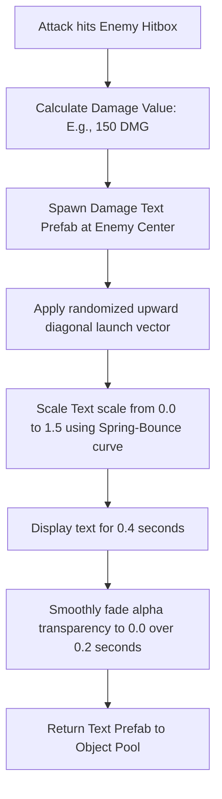
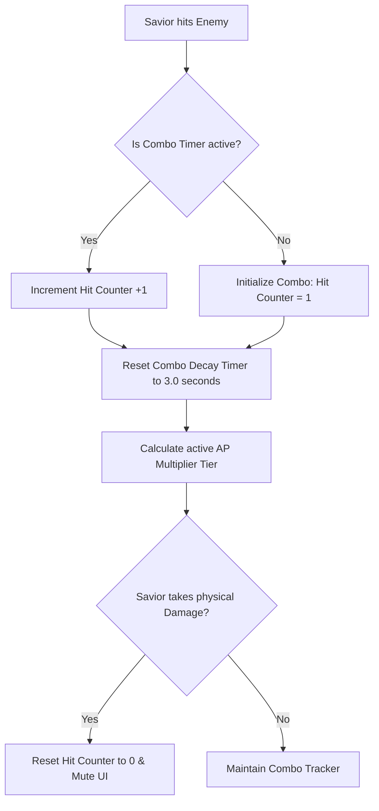

# Combat Damage Numbers & Combo System Specification
## Project: The Legacy of Tomba & the Evil Pigs' Curse

---

## 1. Introduction to Combat Feedback (The Visual Combat Concept)

In action-adventure video games, hitting an enemy must feel instantly informative. 
* **The Problem**: If a player strikes a monster and nothing happens on screen besides a minor flash, it is hard to tell how much damage was dealt, if the attack was a critical strike, or if they are playing efficiently.
* **The Solution**: The game implements two primary visual systems:
  1. **Floating Damage Numbers**: Comical, bouncy numbers that pop out of struck enemies, visually representing the numerical value of the impact.
  2. **The Combo Multiplier**: An on-screen HUD counter that tracks consecutive hits. Encadenando golpes successfully without taking damage multiplies the Adventure Points (AP) earned, keeping players highly engaged and focused on high-skill combat execution.

---

## 2. Floating Damage Numbers (The Easing Bounce Vector)

When an enemy takes damage, the engine spawns a dynamic text prefab (`PRE_DAMAGE_TEXT`) inside the $2.5\text{D}$ world coordinate space directly above the enemy's hitbox.

### 2.1 Physics & Formatting Presets
To make numbers look clean and highly readable, their visual presentation shifts based on the damage source:

| Damage Category | Text Color | Font Scale | Animation Curve | Application Context |
| :--- | :--- | :--- | :--- | :--- |
| **Standard Strike** | Yellow (`#FFFF00`) | $1.0 \times$ | **Soft Arc**: Glides gently upward and to the right. | Simple weapon strikes. |
| **Critical Slam** | Orange-Red (`#FF4500`)| $1.6 \times$ | **Explosive Bounce**: Scales up violently and wiggles. | Throwing an enemy into a wall. |
| **Elemental Burn** | Crimson (`#DC143C`) | $1.2 \times$ | **Flame Sizzle**: Drifts straight upward like hot smoke. | Striking with Fire Pants active. |

---

## 3. The Combo Multiplier Engine

The combo system tracks player performance inside a continuous $3.0 \, \text{second}$ decay window.

### 3.1 Combo Tier Specifications
As the hit counter rises, the active AP multiplier increases, encouraging continuous offensive momentum:

* **Tier 1 (1 to 4 Hits)**: Multiplier is $1.0 \times$ (Standard AP gains).
* **Tier 2 (5 to 9 Hits)**: Multiplier increases to $1.5 \times$ AP. UI displays: **"GOOD COMBO!"** in bronze letters.
* **Tier 3 (10 to 19 Hits)**: Multiplier increases to $2.0 \times$ AP. UI displays: **"GREAT COMBO!"** in silver letters.
* **Tier 4 (20+ Hits)**: Multiplier increases to $3.0 \times$ AP. UI displays: **"FERAL UNLEASHED!"** in flashing golden letters.

---

## 4. UI HUD Multiplier Pop-ups

The combo counter is rendered on the left margin of the screen, just beneath the Savior's Vitality Bars.

* **Decay Bar Feedback**: The text counter (e.g., `12 HITS!`) is accompanied by a thin, horizontal progress bar that empties gradually over the $3.0 \, \text{second}$ decay window.
* **Visual Juice**: Every time the player increments the counter, the text scale pops up by $20\%$ and snaps back, visually simulating a heart-beat pulse in sync with the physical impacts of the combat.