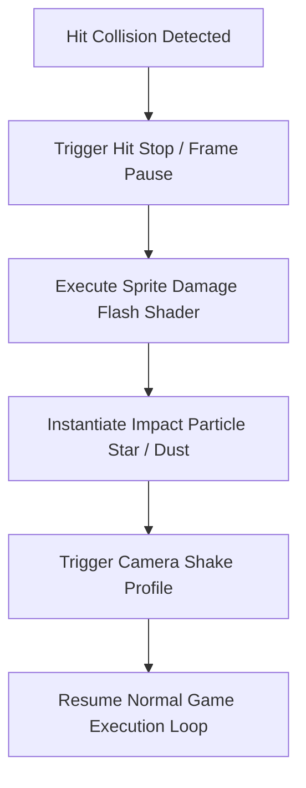
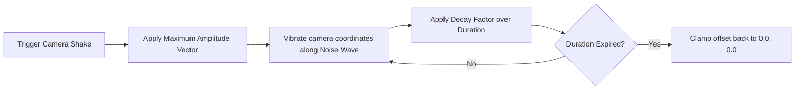
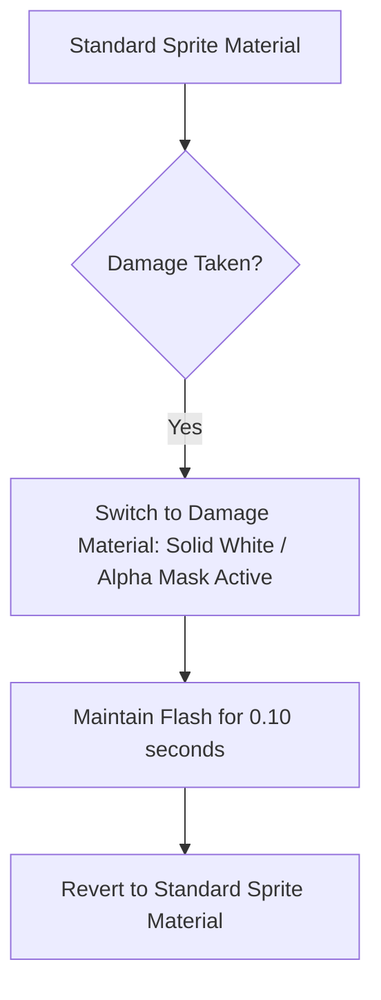

# Combat Hit VFX & Screen Feedback Specification
## Project: The Legacy of Tomba & the Evil Pigs' Curse

---

## 1. The Anatomy of Impact ("Game Juice")

To make interactions in combat feel heavy, kinetic, and satisfying, every hit event executes a series of synchronized visual and temporal events. Combat "juice" prevents the action from feeling flat or unresponsive.



---

## 2. Hit Stop (Frame Freeze) Mechanics

Hit Stop momentarily pauses the animation and physics update loops for a few milliseconds upon a successful hit, emphasizing the resistance of physical collision.

### 2.1 Freeze Frame Parameters

| Attack Class | Hit Stop Duration | Application Context |
| :--- | :--- | :--- |
| **Standard Punch** | $0.05 \, \text{seconds}$ ($3 \, \text{frames}$) | Standard basic attack contact. |
| **Bomerang / Flail Hit** | $0.08 \, \text{seconds}$ ($5 \, \text{frames}$) | Mid-range projectile contact. |
| **Blackjack / Heavy Slam** | $0.18 \, \text{seconds}$ ($11 \, \text{frames}$) | Ground impact shockwaves. |
| **Savior Takes Damage** | $0.12 \, \text{seconds}$ ($7 \, \text{frames}$) | Emphasizes vulnerability and threat weight. |

* **Execution Code Logic**: During Hit Stop, `Time.timeScale` is set to $0.0$, while independent menu and UI render updates continue utilizing unscaled time controllers to prevent screen locks.

---

## 3. Dynamic Camera Shake Profiles

Camera shake is calculated using a decaying multi-frequency noise signal (such as Perlin Noise) applied to the virtual camera’s positional offset.



### 3.1 Shake Parameter Database

```
Camera Positional Shift = RandomNoise(Frequency) * Amplitude * (1.0 - DecayPercentage)
```

* **Minor Buzz (Standard Hits)**:
  * *Amplitude*: $0.15 \, \text{meters}$
  * *Frequency*: $25 \, \text{Hz}$
  * *Duration*: $0.15 \, \text{seconds}$
* **Seismic Rumble (Charged Blackjack Ground Slam)**:
  * *Amplitude*: $0.65 \, \text{meters}$
  * *Frequency*: $12 \, \text{Hz}$
  * *Duration*: $0.50 \, \text{seconds}$
* **Savior Defeat (Death Blast)**:
  * *Amplitude*: $0.90 \, \text{meters}$
  * *Frequency*: $8 \, \text{Hz}$
  * *Duration*: $0.80 \, \text{seconds}$

---

## 4. Damage Flash Shader

When any character (Savior, Koma Pig, or Boss) takes damage, their standard sprite renderer material swaps instantly to a solid, high-exposure silhouette shader.



* **Properties**: The shader ignores the RGB texture channels of the sprite, outputting a pure solid white color ($100\%$ Red, Green, and Blue exposure) while preserving the active alpha channel mapping to retain the character’s hand-drawn silhouette outline.

---

## 5. Particle Dust & Spark Feedback

* **Ledge Landing Dust**: Falling onto a platform from heights over $5.0 \, \text{meters}$ spawns two horizontal dust clouds (`PART_DUST_PUFF`) shooting out from beneath the Savior’s feet.
* **Impact Stars**: Attacking a target instantiates a cartoon-style burst of $5$ sharp yellow star particles (`PART_HIT_STAR`) flying out radially from the collision point, reinforcing the classic action-arcade look.