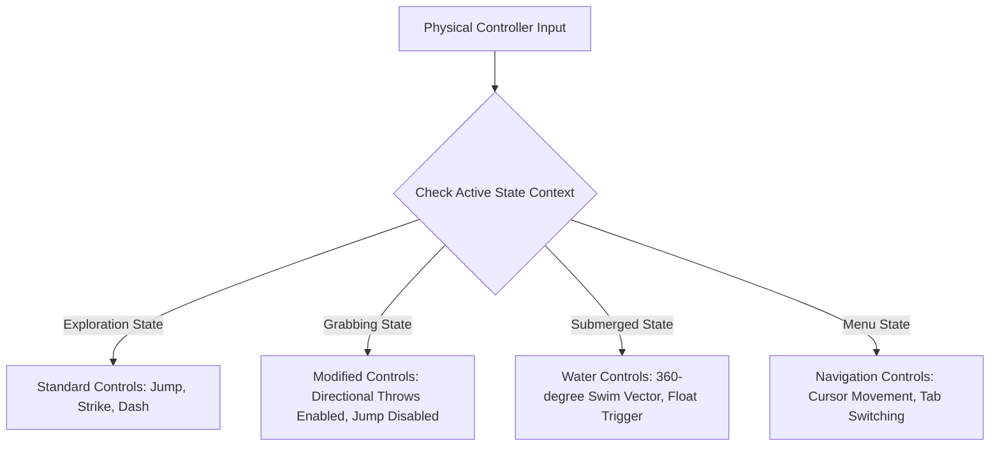

# Control Schemes, Input Buffering & Accessibility
## Project: The Legacy of Tomba & the Evil Pigs' Curse

---

## 1. Input Mapping Architecture

The game translates physical controller and keyboard inputs into state machine triggers. Due to the high-speed platforming and physical throwing requirements, inputs must feel instantaneous and highly responsive.

### 1.1 Gamepad Mapping (PlayStation / Xbox Standard)

| Physical Button (PS) | Physical Button (Xbox) | Game State: Exploration | Game State: Menus |
| :--- | :--- | :--- | :--- |
| **D-Pad / Left Stick** | D-Pad / Left Stick | Horizontal movement / Climb Z-axis triggers | Navigate options |
| **Cross (X)** | A | Jump / Initiate Grab / Confirm | Confirm selection |
| **Square** | X | Use Primary Weapon (Flail/Boomerang) | Cancel / Back |
| **Circle** | B | Execute Throw (while holding enemy) / Cancel | Cancel / Back |
| **Triangle** | Y | Toggle Map Overlay | Change inventory tabs |
| **Right Trigger (R2)**| RT | Hold for Animal Dash (post-unlock) | Scroll down list |
| **Left Trigger (L2)** | LT | Toggle Quick-Select Weapon Wheel | Scroll up list |
| **Options / Start** | Menu | Open Pause Menu / Inventory | Close Menu |

---

## 2. Dynamic Input State Switching

The engine dynamically overrides input mapping depending on the active physics environment (State Context). This prevents overlapping commands and ensures intuitive play.



---

## 3. Game Feel Mechanics (Invisible Helpers)

To prevent the controls from feeling stiff or unresponsive, the input system implements two mathematical buffer zones. These are critical for casual players to feel in complete control.

```mermaid
graph TD
    subgraph Coyote Time Window (100ms)
        A[Savior leaves ledge edge] --> B{Jump button pressed?}
        B -->|Within 100ms| C[Execute Air Jump as if on Ground]
        B -->|After 100ms| D[Execute Standard Fall / Air-Jump Disallowed]
    end
```

### 3.1 Coyote Time (Ledge Jump Tolerance)
* **Definition**: A grace period allowing players to jump even if their character has physically slid off the edge of a platform.
* **Value**: $100 \, \text{milliseconds}$ ($6 \, \text{frames}$ at $60 \, \text{fps}$).
* **Implementation**: The engine continues to treat the Savior’s state as `Grounded` for $100 \, \text{ms}$ after losing ground contact, unless a downward vertical force is already manually applied by the player.

### 3.2 Input Buffering
* **Definition**: The engine registers and queues an action command pressed shortly before the current state transition finishes.
* **Value**: $150 \, \text{milliseconds}$ ($9 \, \text{frames}$ at $60 \, \text{fps}$).
* **Implementation Example**: If the player presses the Jump button $120 \, \text{ms}$ before physically landing on the ground, the system caches the input and triggers the jump immediately on the frame the Savior touches the ground collider. This prevents "dead presses".

---

## 4. Accessibility Specifications

To ensure the game is playable by a wide audience, the engine must accommodate diverse physical and sensory needs.

### 4.1 Colorblindness Compensation Mode
The game relies heavily on color-coded items (specifically the **Magic Pig Bags** and **Mushroom Spore Clouds**).
* **High Contrast Symbols**: Each color-coded element must feature a unique geometric shape or symbol inside its sprite silhouette. For example, the Blue Pig Bag must display a prominent golden water wave rune, while the Red Pig Bag features a flame crest.
* **Color Correction Shaders**: The visual settings menu must include three global color correction filters:
  * *Protanopia* (Red-Weakness)
  * *Deuteranopia* (Green-Weakness)
  * *Tritanopia* (Blue-Weakness)

### 4.2 Dynamic Screen Shake Control
* **Problem**: Intense screenshake during heavy attacks (e.g., Blackjack slams) can cause motion sickness.
* **Solution**: A slider in the Options Menu allowing the user to reduce screenshake intensity from $100\%$ (default physical feedback) down to $0\%$ (completely deactivated).

### 4.3 Text and UI Scaling
* **Subtitles**: Subtitle sizes must be adjustable from $18 \, \text{pt}$ up to $36 \, \text{pt}$.
* **Background Opacity**: Subtitle text boxes must feature a customizable dark background backing strip (adjustable opacity from $0\%$ transparent to $100\%$ solid black) to guarantee high legibility against the colorful background artwork.