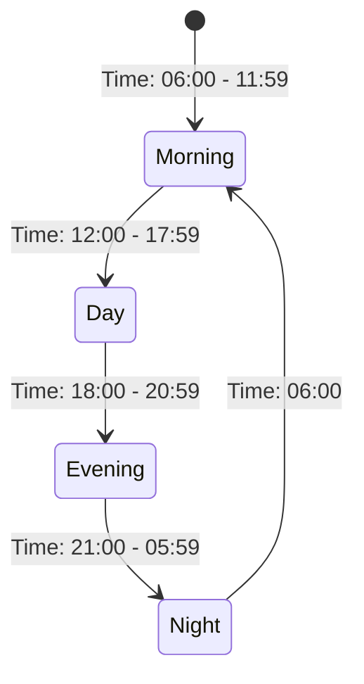
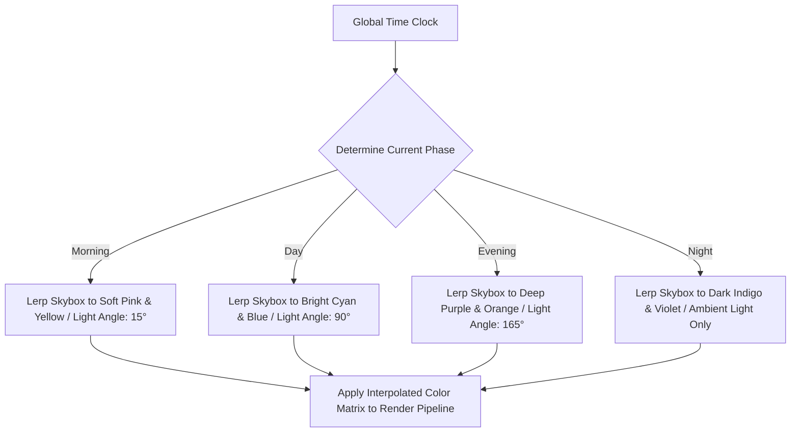

# Dynamic Day/Night Cycle Specification
## Project: The Legacy of Tomba & the Evil Pigs' Curse

---

## 1. Time System Architecture

The game world features a continuous, systemic Time Loop Engine. The progression of time changes the visual lighting, background music layers, and the active behaviors of NPCs and enemies across the archipelago.

### 1.1 Time Conversion Scale
To prevent exploration from becoming tedious, the in-game clock runs at an accelerated rate compared to real-world time.

* **1 In-Game Day (24 Hours)** = $24 \, \text{Real Minutes}$.
* **1 In-Game Hour** = $1 \, \text{Real Minute}$ ($60 \, \text{seconds}$).
* **Freeze State**: The time clock is automatically paused during dialog sequences, cutscenes, shop interactions, and boss battles to prevent event disruptions.

---

## 2. Dynamic Lighting & Skybox Gradation

The global lighting engine interpolates colors across a color gradient to simulate realistic transitions.

### 2.1 Post-Processing Volume Gradation
The global Post-Processing Profile smoothly shifts color temperatures:
* **Day State**: High saturation ($+10\%$), neutral color temperature.
* **Night State**: Cold color temperature ($-30\%$), low contrast to simulate night-adapted vision, and a subtle blue ambient tint to illuminate the platforms without losing the midnight feeling.

---

## 3. Gameplay & Ecological Shifts

The environment adapts actively to the clock. Exploring a zone during the Day presents completely different challenges than exploring it at Night.

### 3.1 Ecological Shift Matrix

| Game System | Day State (06:00 - 20:59) | Night State (21:00 - 05:59) |
| :--- | :--- | :--- |
| **Koma Pigs Behavior** | Awake, patrolling active platforms at standard speed. | Dormant/Sleeping. Savior can walk slowly to bypass them. If awoken by noise, they enter an enraged state ($+50\%$ attack power). |
| **Flora States** | Standard platforms, sunflower springboards open. | Poisonous night-lilies open, emitting toxic sleep gases. |
| **Town/Village Security**| Gates and shops are open; normal dwarf interactions. | Dwarf guards close village main gates. Shopkeepers retire, but dark market merchants spawn in hidden alleys. |

### 3.2 Time-Locked Event Case Study (`EV_DF_045`)
* **Event Name**: The Secret of the Forest Spirit.
* **Trigger Window**: Active *only* between the hours of `22:00` and `03:00`.
* **Behavior**: If the Savior visits the sacred oak tree in the Dwarf Forest during the day, the zone is empty. If visited within the night window, a translucent spirit NPC spawns, triggering a unique quest line that rewards the player with a hidden AP key relic.