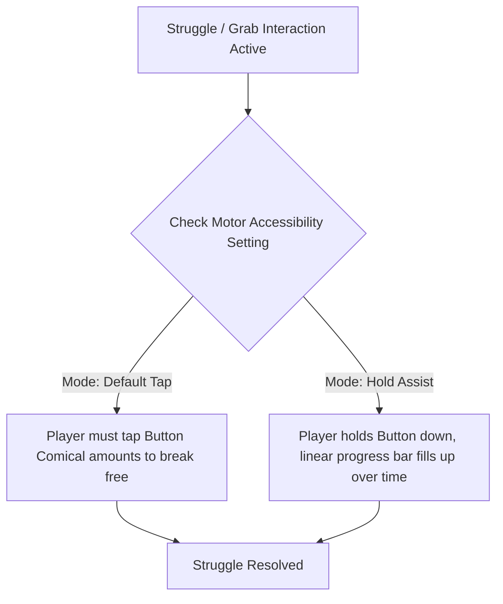
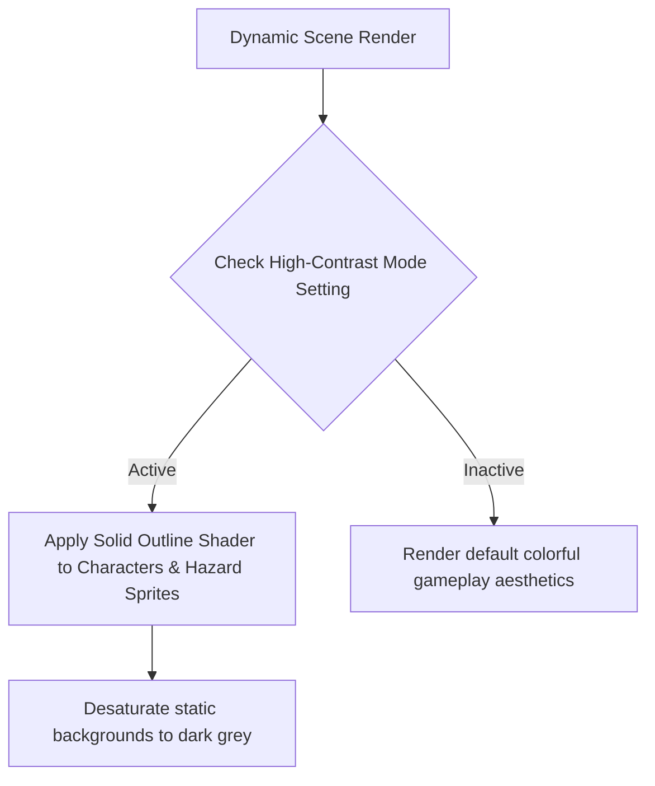
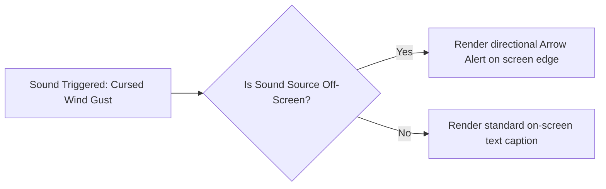

# Detailed Accessibility Specification (UX & Interaction Design)
## Project: The Legacy of Tomba & the Evil Pigs' Curse

---

## 1. Motor & Input Accommodations

To support players with limited motor dexterity or repetitive strain injuries, the physical controller engine must offer options to minimize rapid button-press sequences.

### 1.1 Command Conversion Matrix

| Standard Gameplay Input | Accessible Override Toggle | Technical Implementation |
| :--- | :--- | :--- |
| **Button Mashing Struggles** | **Hold Assist Toggle** | Converts rapid tapping requirements (e.g., escaping a snap-jaw plant) into a steady $1.5 \, \text{second}$ single button hold. |
| **Animal Dash Holding** | **Toggle Sprint** | Replaces holding the Right Trigger (`RT`/`R2`) with a single click to enter/exit the quadrupedal run state. |
| **Diagonal Aiming** | **Directional Snapping** | When using boomerangs, inputs snap automatically to $45^\circ$ angles, easing precise targeting. |

---

## 2. Visual & Sensory Accommodations

For players with low vision, visual fatigue, or cognitive processing differences, the rendering engine supports deep UI and graphical filters.

### 2.1 High-Contrast Mode Specifications
* **Sprite Outlining**: Active actors (Savior, enemies, interactive objects) are rendered with a highly visible, solid $4 \, \text{pixel}$ colored outline (Yellow for Savior, Red for Enemies, Green for Quest Items).
* **Background Suppression**: Static platform layers and distant parallax background graphics are desaturated by $80\%$ and darkened by $40\%$ to increase active-layer separation.

---

## 3. Audio Accommodations (Deaf & Hard of Hearing)

To ensure players who cannot hear the game's audio cues do not suffer from gameplay disadvantages, the UI provides visual feedback for spatial noises.

### 3.1 Closed Captioning & Alerta Framework
* **Visual Directional Indicators**: If an off-screen hazard triggers a sound effect (such as a Koma Pig snorting behind a wall, or a volcanic rock launching from above), a small semi-translucent red warning wedge appears on the screen bezel pointing in the absolute direction of the sound source.
* **Environmental Text Captions**: Under-caption scripts display description indicators for contextual sound elements:
  * *Example*: `"[Wind howling intensely from the left]"` or `"[Water rushing below]"`.