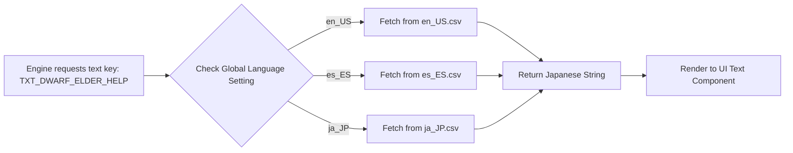
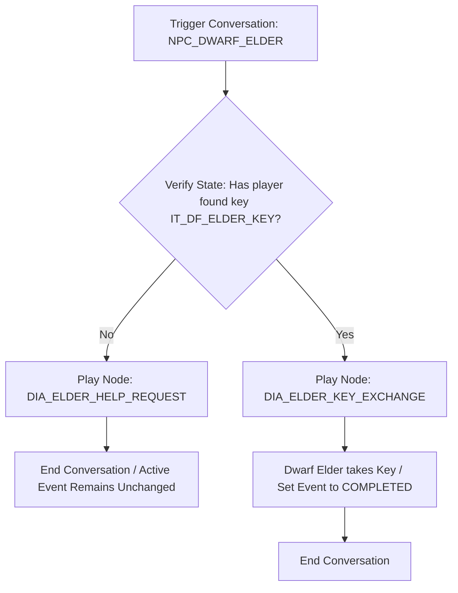

# Dialogue & Localization Database Specification
## Project: The Legacy of Tomba & the Evil Pigs' Curse

---

## 1. Dialogue & Localization Pipeline

To prevent hardcoding text strings into the source code, the game uses a dynamic localization engine. The source engine loads key-value pairs from unified localized databases based on the active language setting.



---

## 2. Localization Database Format (CSV Spec)

Text assets are stored in standard spreadsheets containing language columns aligned to unique ID keys.

| Key ID | Category | Context | English (en_US) | Spanish (es_ES) | Japanese (ja_JP) |
| :--- | :--- | :--- | :--- | :--- | :--- |
| `TXT_SYS_START` | UI / Menu | Title Screen | Start Game | Iniciar Juego | ゲーム開始 |
| `TXT_EV_NEW` | UI / HUD | Event Alert | New Event Activated: | Nuevo Evento Activado: | 新イベント発生： |
| `TXT_DWARF_ELDER_01` | Dialogue | Dwarf Forest | Look, wild savior! A dark fog has covered our village... | ¡Mira, salvador salvaje! Una niebla oscura cubre nuestra aldea... | 見ろ、野生の救世主よ！黒い霧が村を覆ってしまった… |
| `TXT_ITEM_PEACH_DESC`| Inventory| Item Description| A sacred golden peach. Fully restores vitality. | Un melocotón dorado sagrado. Restaura la vitalidad por completo. | 聖なる金の桃。体力を全回復する。 |

---

## 3. Conversational Branching (Dialogue Trees)

For advanced interactions where the Savior has conversational choices or state dependencies (e.g., requesting a quest item), the game evaluates conditional dialogue nodes.



### 3.1 Node Structure Schema (JSON representation)
Dialogue files are scripted in a node-based architecture. Here is an example of an exchange node inside the database:

```json
{
  "node_id": "DIA_ELDER_KEY_EXCHANGE",
  "actor": "NPC_DWARF_ELDER",
  "text_key": "TXT_DWARF_ELDER_EXCHANGE_MSG",
  "camera_target": "NPC_DWARF_ELDER",
  "animation_trigger": "ANIM_GIVE_JOYFUL",
  "choices": [
    {
      "text_key": "TXT_CHOICE_GIVE_KEY",
      "next_node_id": "DIA_ELDER_COMPLETED_SUCCESS"
    },
    {
      "text_key": "TXT_CHOICE_KEEP_KEY",
      "next_node_id": "DIA_ELDER_KEEP_FOR_NOW"
    }
  ]
}
```

---

## 4. Text Formatting & Rich Text Markup

The UI rendering engine parses dynamic rich-text markup tags inside the localized strings to highlight important keywords, stats, or button indicators automatically.

### 4.1 Rich Text Tag Guidelines

| Tag Syntax | Visual Result | Application |
| :--- | :--- | :--- |
| `<color=gold>text</color>` | <span style="color: gold; font-weight: bold;">text</span> | Highlight Event names or Key Quest Items. |
| `<color=yellow>text</color>` | <span style="color: yellow; font-weight: bold;">text</span> | Highlight Adventure Points (AP) counters or rewards. |
| `<sprite=btn_cross>` | Graphic icon of the Jump button | Inline gamepad tutorials inside dialogues. |

### 4.2 Formatting Example
* **Source Localization String**:
  > `"Take this <color=gold>Blue Pig Bag</color> and hunt the beast. It will earn you <color=yellow>5,000 AP</color>."`
* **UI Output**:
  > "Take this **Blue Pig Bag** and hunt the beast. It will earn you **5,000 AP**." (with corresponding highlight colors).