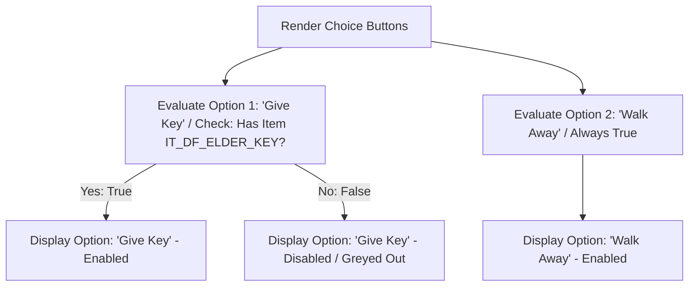

# Dialogue Node Parser & Event Trigger Specification
## Project: The Legacy of Tomba & the Evil Pigs' Curse

---

## 1. Introduction to Dialogue Parsers (The Core Concept)

In modern role-playing and adventure video games, characters do not just talk; their conversations actively change the game world. 
* **The Problem**: Writing manual code scripts for every single conversation is incredibly slow and highly prone to bugs.
* **The Solution**: The game implements a **Dialogue Node Parser**. This is a software interpreter that reads text files written in a structured format. As it displays the letters on screen, it scans the text for **Action Tags** (hidden command codes). If it finds a tag like `[give_item=IT_DF_ELDER_KEY]`, it automatically inserts the item into the player’s inventory without requiring any custom programming.

---

## 2. Dialogue Parser Execution Flow

The parsing engine reads the dialogue strings character by character, searching for instruction tokens before rendering the clean text to the UI.

```mermaid
graph TD
    A[Start Node Dialogue Script] --> B[Read Next Character]
    B --> C{Is Character a Bracket '['?}
    C -->|Yes: Action Tag| D[Parse Tag and Extract Command]
    D --> E[Execute Game Sub-routine: Give Item, Play SFX, Shake Screen]
    E --> B
    C -->|No: Standard Text| F[Send Character to Typewriter Output Buffer]
    F --> G{Is End of String Reached?}
    G -->|No| B
    G -->|Yes| H[Wait for Player Input / Render Choice Nodes]
```

---

## 3. Standard Action Tag Database

The parser interprets several built-in commands embedded inside localized strings:

| Action Tag Syntax | Engine Operation Executed | Gameplay Application |
| :--- | :--- | :--- |
| `[give_item=ITEM_ID]` | Instantly triggers inventory collection script. | Granting keys, medals, or weapons after completing dialogues. |
| `[take_item=ITEM_ID]` | Removes the specified key item from player storage. | Exchanging items (e.g., trading the Dwarf Elder his Key). |
| `[complete_event=EV_ID]`| Signals the global Quest Log to set event status to `Completed`. | Completing quests directly via conversational resolutions. |
| `[play_sfx=SFX_ID]` | Plays a sound effect via the Global Audio Mixer. | Syncing comical expressions (gasps, laughs) with text. |
| `[shake_camera=FORCE]` | Sends a force vector value to the virtual camera controller. | Creating physical impact sensations during dramatic dialogues. |

### 3.1 Tag Execution Example
* **Raw Localization String**:
  > `"[play_sfx=SFX_PL_LAUGH][mood=happy]Thank you, Savior! Here, take this [give_item=IT_DF_ELDER_KEY]<color=gold>Elder Key</color>.[shake_camera=0.1] Use it wisely!"`
* **Parser Action Output**:
  1. Plays the Savior laughing sound effect.
  2. Animates the character portrait to a happy emotion.
  3. Gives the player the physical item `IT_DF_ELDER_KEY`.
  4. Triggers a minor camera shake on the final word.
  5. Displays a clean, beautifully formatted text overlay to the user.

---

## 4. Choice Branch Evaluation

When a conversation presents the player with multiple-choice buttons, the parser evaluates dynamic conditional checks to enable or disable selections.



These checks ensure that the player cannot cheat or skip quest requirements by selecting choices for items they have not yet discovered in the world, maintaining the integrity of the progression loop.