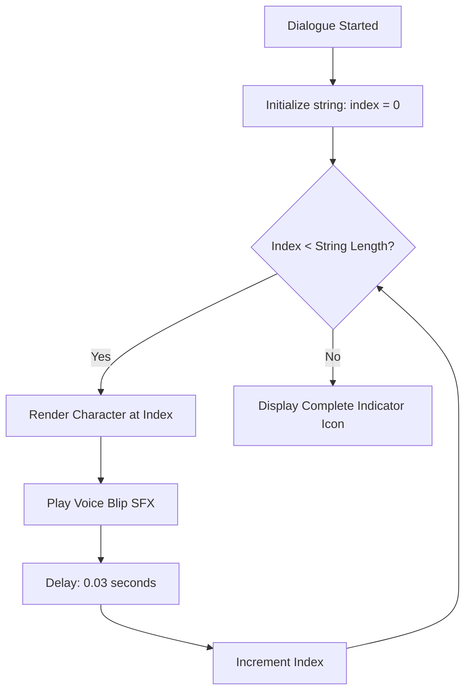
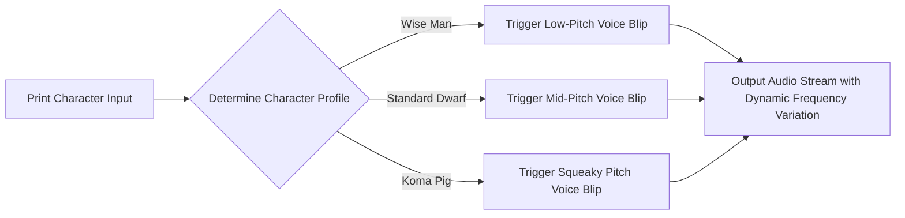

# Dialogue UI & Textbox Design Guide
## Project: The Legacy of Tomba & the Evil Pigs' Curse

---

## 1. Dialogue Interface Layout Specification

The dialogue interface uses a classic retro-adventure layout positioned inside the bottom third of the screen. This ensures that the main action and characters remain visible while text is being read.

```
  +-------------------------------------------------------------+
  |                                                             |
  |                      [ Gameplay Area ]                      |
  |                                                             |
  +-------------------------------------------------------------+
  |  +-------+  +--------------------------------------------+  |
  |  |       |  |  NPC NAME                                  |  |
  |  | PORT- |  |  "Seek the Wise Man on the hill, savior."  |  |
  |  | RAIT  |  |                                            |  |
  |  +-------+  +--------------------------------------------+  |
  +-------------------------------------------------------------+
```

### 1.1 Structural Layout Properties (Normalized $1920 \times 1080$ Grid)

* **Dialogue Canvas Height**: $280 \, \text{pixels}$ from the bottom screen edge.
* **Background Panel Opacity**: Solid black base with a $15\%$ translucent backing strip and a golden-brown wooden border ($5 \, \text{pixels}$ wide).
* **Portrait Box**:
  * *Size*: $220 \times 220 \, \text{pixels}$.
  * *Anchor Position*: $X: 100, Y: 30$ from the bottom-left corner of the canvas.
* **Text Margin Box**:
  * *Position*: Starts $X: 360, Y: 220$ from the bottom-left corner.
  * *Line Height*: $32 \, \text{pixels}$ with support for up to 3 simultaneous lines of text.

---

## 2. Text Typewriter Script Loop (Typesetting)

To give dialogues a dynamic, classic role-playing feel, text is not displayed instantly. It prints character-by-character along a timed sequence loop.



### 2.1 Typewriter Control Override Mechanics
* **Typesetting Speed**: $0.03 \, \text{seconds}$ per character (approximately $33$ characters per second).
* **Text Skipping (Fast-Forward)**: Pressing the *Confirm* button during the typewriter loop instantly renders the entire text string, skipping the delays, and transitions the box state to `Display Complete`.
* **Complete Indicator**: A small bouncing golden arrow sprite appears in the bottom-right corner of the textbox to signify that the conversation is ready to advance.

---

## 3. Portrait & Emotion Framework

The Portrait Box renders pre-rendered 2D sprite sheets of active speakers. The active sprite is swapped dynamically by inserting simple command tags directly into the localization string.

### 3.1 Emotion Command Mapping

| Tag Code | Emotion Target | Animation Frame Loop | Application Context |
| :--- | :--- | :--- | :--- |
| `[mood=neutral]` | Default expression | 3-frame subtle breathing loop | Standard dialogue greeting. |
| `[mood=happy]` | Smiling / Laughing | 4-frame high-frequency bounce | Receiving rewards, completing events. |
| `[mood=sad]` | Crying / Sorrowful | 2-frame slow, trembling loop | Describing region curses or lost items. |
| `[mood=angry]` | Screaming / Menacing | 5-frame aggressive head-shake | Used by Evil Pigs before battles. |

* **Formatting Example**:
  > `"[mood=sad]Oh, savior... [mood=angry]The pigs stole our crops! You must stop them!"`

---

## 4. Voice Blip Systems (Retro Conversational Audio)

Instead of recording full voiceovers for every minor NPC, the game uses a dynamic, chip-tune text-to-voice blip system.



* **Pitch Variation**: To prevent the sound from becoming monotonous, the audio engine randomizes the pitch of each blip trigger within a strict bounds of $\pm 5\%$.
* **Vowel Bias**: To create a simulated speaking cadence, the audio engine only triggers a blip on alphanumeric characters, playing nothing during spaces (` `) or punctuation marks (`,`, `.`, `!`).