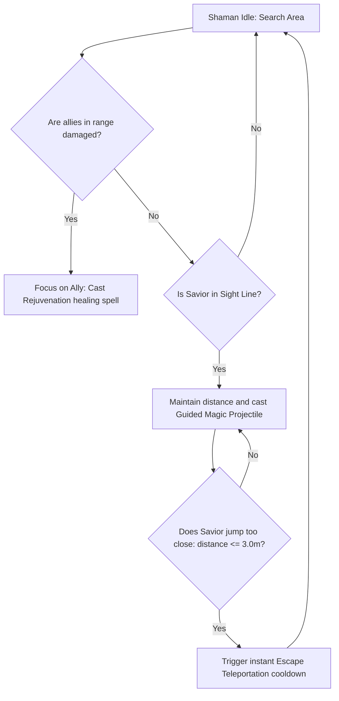
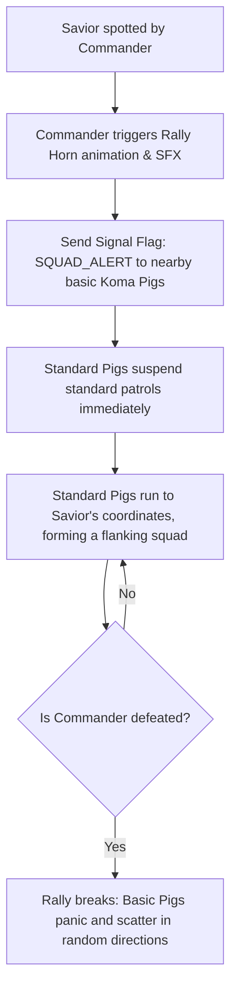

# Elite Enemy AI Specification (Commanders & Spell-Casters)
## Project: The Legacy of Tomba & the Evil Pigs' Curse

---

## 1. Introduction to Elite Enemies (The Tactical Threat Concept)

In action-platformer games, standard enemies (like basic Koma Pigs) have simple, predictable behaviors (such as patrolling back and forth along a single platform).
* **The Role of Elite Classes**: To keep combat challenging and prevent players from easily bypassing obstacles, the game introduces **Elite Enemies**. 
* **The Behavior**: Elites have advanced artificial intelligence. They do not just attack on sight; they defend themselves with heavy shields, heal and support nearby allies with magic, and coordinate groups of basic enemies to attack the Savior together.
* **The Goal**: This document provides the programming logic, behavioral loops, and squad coordination rules for the two primary Elite classes: **The Shaman Spell-Caster** and **The Commander Pig**.

---

## 2. Class A: The Shaman Spell-Caster (Ranged & Support AI)

The Shaman is a fragile but highly dangerous spell-caster. It avoids close combat, using magic projectiles to attack from a distance while supporting nearby minions.

### 2.1 Shaman Spells Parameters
* **Rejuvenation (Healing Aura)**: Triggers when a nearby Koma Pig's health is below $50\%$. The Shaman channels a green aura particle, restoring $1$ health point per second to the target.
* **Guided Magic Projectile**: Shoots a slow, heat-seeking magical orb (`PROJ_PIG_MAGIC`) that tracks the Savior's active coordinates over $4.0 \, \text{seconds}$ before dispersing.
* **Escape Teleportation**: If the Savior steps within a $3.0 \, \text{meter}$ radius of the Shaman, the Shaman immediately disappears in a puff of smoke, respawning at the furthest available platform coordinate within the screen boundaries.

---

## 3. Class B: The Commander Pig (Heavy Melee & Defense AI)

The Commander is a heavily armored infantry unit equipped with a spiked wooden club and a solid copper tower shield.

* **Frontal Invulnerability**: When moving, the Commander holds its shield forward, completely blocking standard attacks (such as Flails and Boomerangs).
* **Shield Break Vulnerability**: The player must perform a fully charged **Blackjack (Mace) Ground Slam** to trigger a shield-shatter event, stunning the Commander for $3.0 \, \text{seconds}$ and opening him up to a physical grab.
* **The Charging Sweep**: If the Savior is at a horizontal distance between $4.0$ and $8.0 \, \text{meters}$ on the same platform, the Commander runs forward with an unstoppable shield charge, knocking back any entity in its path.

---

## 4. The Squad Coordination System (Rally Signals)

The Commander acts as a group tactician, coordinating the behaviors of nearby standard Koma Pigs within a $12.0 \, \text{meter}$ radius.

* **Tactical Panic**: If the Savior successfully grabs and throws the Commander, or defeats him, the active `SQUAD_ALERT` signal breaks. All remaining basic Koma Pigs enter the `Panic State` for $5.0 \, \text{seconds}$ (their running speed increases by $20\%$, but they wander in random, chaotic directions, ignoring the Savior).