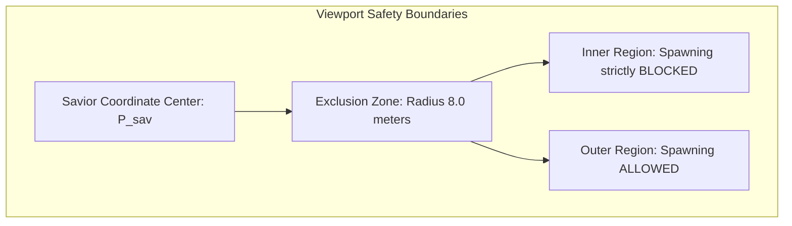
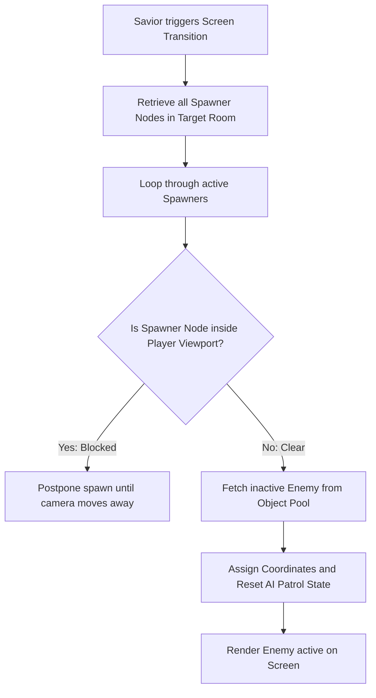

# Enemy Spawning & Level Repopulation Specification
## Project: The Legacy of Tomba & the Evil Pigs' Curse

---

## 1. Introduction to Enemy Spawning (The Repopulation Concept)

In action-platformer games, levels are filled with hazards and enemies to challenge the player's reflexes. 
* **The Problem**: If a player defeats all the enemies in a level and then backtrack through the same area later, the level will feel empty, quiet, and boring. However, if an enemy suddenly appears ("spawns") directly in front of the player's face out of thin air, it looks cheap, breaks immersion, and causes unfair damage.
* **The Solution**: The game implements a **Systemic Spawner Node Network**. Enemies are placed at specific spawn coordinates. When the Savior leaves a screen and returns, the system repopulates the level safely, using a mathematical **Proximity Exclusion Zone** to guarantee enemies only spawn when they are completely out of the player's active line of sight.

---

## 2. The Proximity Safety Ring (Exclusion Zone)

To prevent unfair enemy spawning, the engine draws a virtual, invisible circle around the Savior. No enemy is allowed to instantiate or activate inside this boundary.



### 2.1 Spawning Validation Rules
When the spawner system attempts to re-populate a level node ($N_{\text{spawn}}$), it calculates the distance ($D$) to the Savior ($P_{\text{sav}}$):

$$D = \sqrt{(N_{\text{spawn\_x}} - P_{\text{sav\_x}})^2 + (N_{\text{spawn\_y}} - P_{\text{sav\_y}})^2}$$

* **Condition 1 ($D < 8.0 \, \text{meters}$)**: The node is inside the exclusion zone. Spawning is suspended, and the node waits until the player walks further away.
* **Condition 2 ($D \ge 8.0 \, \text{meters}$)**: The node lies safely in the outer region. The engine queries the active Object Pool (as specified in `asset_loading_and_resource_management.md`), retrieves an inactive Koma Pig sprite, and activates it at the node coordinates.

---

## 3. Spawner Node Architecture (Data Structure)

Every enemy generation point in a level is mapped as an independent, lightweight data block within the scene file:

```json
{
  "spawner_node_id": "SP_DF_KOMA_04",
  "enemy_type_id": "EN_KOMA_PIG_SPEAR",
  "coordinates": { "x": 1420.5, "y": 12.0, "z_plane": 1 },
  "patrol_range": { "left_boundary_x": 1412.0, "right_boundary_x": 1428.0 },
  "respawn_timer_seconds": 30.0,
  "last_death_timestamp": 1718293500
}
```

* **Attributes Explained**:
  * `patrol_range`: Restricts how far the spawned Koma Pig can walk to prevent it from wandering off into other platform traps.
  * `respawn_timer_seconds`: If the player remains in the same screen, defeated enemies can slowly respawn after $30 \, \text{seconds}$, provided their node coordinate is out of the camera's active view frustum.

---

## 4. Screen Transition Repopulation Lifecycle

When the Savior crosses a screen boundary, the global persistence manager tells the spawners to reset.



This dynamic, pool-backed generation cycle guarantees that memory is never wasted on creating duplicate objects, keeping the game's performance locked at $60 \, \text{fps}$ while maintaining a challenging, populated world.