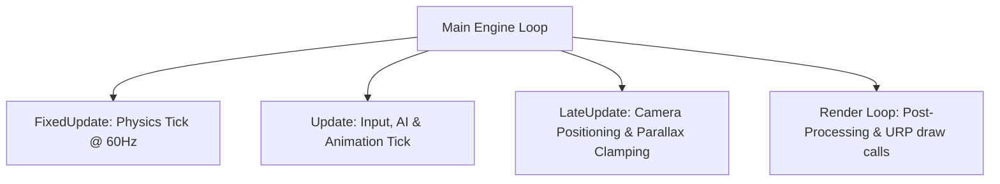

# Engine & Technical Specifications Document
## Project: The Legacy of Tomba & the Evil Pigs' Curse

---

## 1. Development Engine & Architecture Choice

The project is designed to be built using a modern, component-based game engine (such as **Unity (Universal Render Pipeline - URP)** or **Godot Engine**). The architecture must natively support both 2D sprite physics and 3D environment rendering within the same coordinate viewport.

### 1.1 Update Execution Rules
* **Deterministic Physics (`FixedUpdate`)**: All physics calculations, raycasts for ground detection, and momentum transfers must be calculated inside the deterministic update thread running at a locked **60 ticks per second** ($0.0166 \, \text{s}$ interval). This avoids platform-specific disparities in jumping physical heights.
* **Variable Frame Rate (`Update`)**: Visual animation frames, input caching, and non-physical logic run in sync with the player's active monitor refresh rate (supporting up to $120 \, \text{Hz} / 144 \, \text{Hz}$).

---

## 2. Target Platforms & Performance Benchmarks

To reach a wide audience, the game is optimized for both desktop environments and hardware-constrained consoles like the Nintendo Switch.

### 2.1 Platform Performance Targets

| Target Platform | Target Resolution | Target Frame Rate | Render API |
| :--- | :--- | :--- | :--- |
| **PC (Steam / Epic)** | Up to $4\text{K} \, (3840 \times 2160)$ | Locked $144 \, \text{fps}$ | DirectX 12 / Vulkan |
| **PlayStation 5 / Xbox Series X** | Native $4\text{K} \, (3840 \times 2160)$ | Locked $60 \, \text{fps}$ | Native API |
| **Xbox Series S** | $1440\text{p} \, (2560 \times 1440)$ | Locked $60 \, \text{fps}$ | Native API |
| **Nintendo Switch (Docked)** | $1080\text{p} \, (1920 \times 1080)$ | Locked $60 \, \text{fps}$ | Vulkan / NVN |
| **Nintendo Switch (Handheld)**| $720\text{p} \, (1280 \times 720)$ | Locked $60 \, \text{fps}$ | Vulkan / NVN |

---

## 3. Memory Allocation & Budget Allocation

To ensure the game runs smoothly without garbage collector freezes on portable platforms, active memory pools are restricted.

```mermaid
gantt
    title Hardware RAM Allocation Budget (Target: 4.0 GB Max on Low-End Consoles)
    dateFormat  X
    axisFormat %s

    section RAM Budget
    Active Level Geometry & Shaders (1.2 GB) :active, 0, 1200
    Sprite Atlases & UI Textures (1.0 GB)   :crit, 1200, 2200
    Audio Pools & Dynamic Music (0.5 GB)    : 2200, 2700
    Engine Systems & Physics (0.5 GB)       : 2700, 3200
    VRAM Swap Overhead Buffer (0.8 GB)      : 3200, 4000
```

### 3.1 Memory Management Guidelines
* **Sprite Atlasing**: All character, enemy, and item textures must be compressed into $4096 \times 4096$ pixel atlas sheets using **ASTC 6x6 compression** to reduce GPU memory bandwidth.
* **Resource Unloading**: When the player transitions between major regions (e.g., leaving the Dwarf Forest and entering the Haunted Mansion), the engine must trigger an explicit memory garbage collection and unload unused assets to prevent RAM leaks.

---

## 4. Graphics Pipeline & Post-Processing Shaders

The aesthetic "Colorida pero Peligrosa" is achieved by using a 2D-3D lighting fusion inside the render pipeline.

### 4.1 Rendering Techniques
* **Forward Rendering**: Highly efficient draw call execution to run easily on mobile and console hardware.
* **Sprite Lit Shaders**: 2D character sprites are mapped with subtle normal maps to respond dynamically to 3D light sources (e.g., lanterns, fire, and magical portal blooms).
* **Volumetric Fog Shader**: A specialized, low-cost screen-space shader used to simulate the heavy purple haze in the cursed Dwarf Forest, featuring real-time light scatter properties.