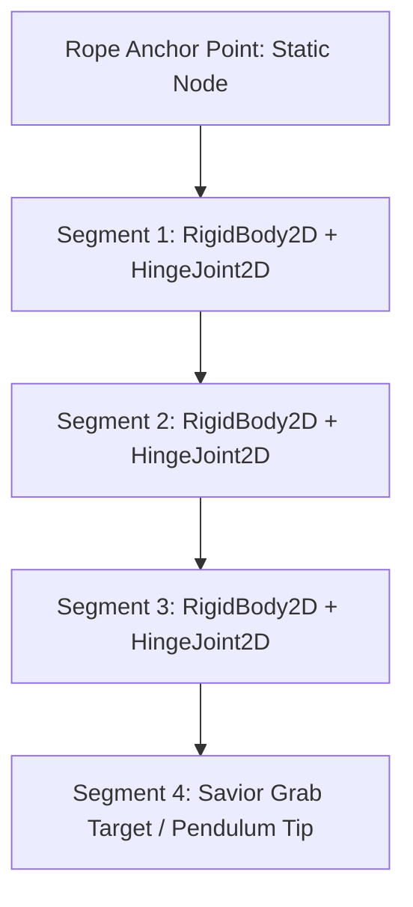
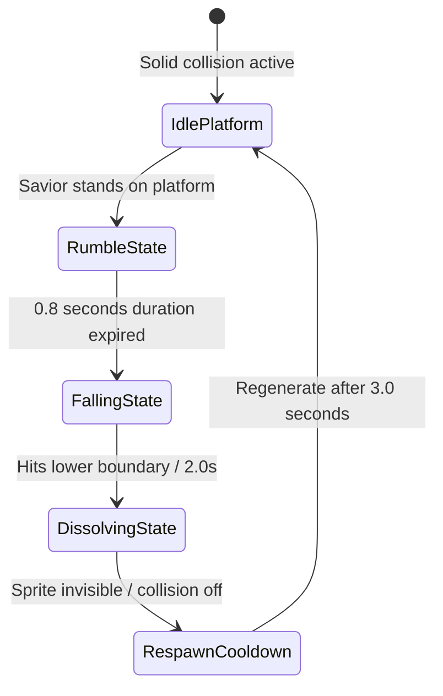

# Environmental Physics & Interactive Hazards Specification
## Project: The Legacy of Tomba & the Evil Pigs' Curse

---

## 1. Introduction to Environmental Physics (The Dynamic Stage Concept)

In early video games, platforms were completely static, immovable blocks. 
* **The Concept**: To make exploration feel tactile and dangerous, our game world behaves like a real physical environment. Trees sway in the wind, ropes swing with gravity, wooden bridges sag and bend when walked on, and loose stones collapse beneath the Savior's feet.
* **Why it matters**: This dynamic response turns simple platforming into an interactive puzzle. The player must calculate their speed, momentum, and jump timings based on how the environment physically reacts to their weight.

---

## 2. Swinging Rope Physics (Joint-Segment Kinematics)

Ropes and vines inside the *Dwarf Forest* or *Jungle Canopy* are not static vertical lines. They are simulated using a chain of connected rigid body segments.



### 2.1 Interactive Swing Kinematics
* **Segment Breakdown**: Ropes are divided into $4$ to $6$ rigid segments linked by virtual **Hinge Joints** (rotational hinges).
* **The Savior's Grip**: When the Savior grabs the rope tip, the engine locks his hands to the lowest segment and transfers his entry momentum directly to the physics simulation, causing the rope to sway like a pendulum.
* **Interactive Propulsion**: The player can press *Left/Right* directional keys to apply minor torque (rotational force) to the joints, accelerating the swing arc to reach distant platforms.

---

## 3. Collapsible Rope Bridges (Spring-Joint sag)

Wooden rope bridges are constructed using a chain of individual plank colliders linked by high-tension spring segments (**Spring Joints**).

```mermaid
graph LR
    subgraph Bridge Physics Sag (Center-Weight)
        A[Left Anchor] <-->|Spring Joint| B[Plank 1]
        B <-->|Spring Joint| C[Plank 2: Savior Weight Applied]
        C <-->|Spring Joint| D[Plank 3]
        D <-->|Spring Joint| E[Right Anchor]
    end
```

### 3.1 Structural Sag Calculation
* **Neutral State**: The bridge hangs suspended along a flat catenary curve under its own mass.
* **Weight Application**: When the Savior stands on Plank $N$, the engine adds his physical mass ($70 \, \text{kg}$ equivalent) to the plank’s downward force.
* **The Sag Elasticity**: The spring joints connected to adjacent planks stretch dynamically. The maximum sag is limited to a displacement offset of $0.8 \, \text{meters}$ to prevent clipping through the floor below, creating a highly satisfying physical bounce as the Savior runs across.

---

## 4. Collapsing Rock Ledges

Collapsing stones are timed platform hazards placed near high cliffs, testing the player's reaction speeds.



### 4.1 Timing and Visual Feedback Parameters
1. **Rumble Phase**: When stepped on, the ledge shakes horizontally ($X$-amplitude: $\pm 0.08 \, \text{m}$) for $0.8 \, \text{seconds}$, accompanied by falling pebble particles to alert the player.
2. **Fall Phase**: The platform’s box collider is disabled, and the stone falls vertically at an accelerated rate of $12.0 \, \text{m/s}^2$.
3. **Respawn Phase**: After $3.0 \, \text{seconds}$ out of sight, the stone platform smoothly fades back in and re-activates its solid colliders, preventing players from being permanently stuck in lower ravines.