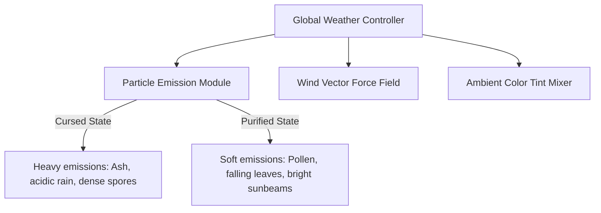
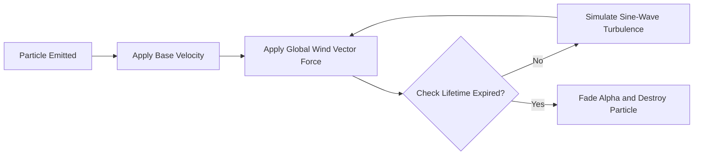

# Environmental Weather & Dynamic Particle Systems
## Project: The Legacy of Tomba & the Evil Pigs' Curse

---

## 1. Global Weather Controller Architecture

The atmosphere of the archipelago is managed by a dynamic, regional Weather System. This system controls particle emitters, ambient wind forces, and lightning triggers to visually reinforce the cursed or purified state of each biome.

### 1.1 Particle Physics Loop
To maintain performance on low-end hardware (such as the Nintendo Switch), all environment particles calculate simplified kinematics without complex rigid-body collisions.

---

## 2. Regional Weather Specifications

Each major zone utilizes customized weather particle presets configured to match its environmental narrative.

### 2.1 The Dwarf Forest (Cursed vs. Purified Particles)
* **Cursed State Particles**:
  * *Haze Spores*: Large, low-speed violet particle sheets with a horizontal sine-wave drift to simulate a choking, heavy mist.
  * *Parameters*: Emission Rate: $45 \, \text{particles/sec}$, Lifetime: $8.0 \, \text{seconds}$, Scale: $1.5 \times$ standard.
* **Purified State Particles**:
  * *Oak Leaves*: Golden and green leaves drifting gently downward.
  * *Parameters*: Gravity Scale: $0.1$, Wind Sensitivity: $1.2$, Spin Velocity: $180^\circ/\text{sec}$.

### 2.2 Phoenix Mountain (Volatile Ashes & Wind)
* **Weather State**: Ash Rain & Lava Sparks.
* **Aesthetic**: Hot, glowing cinder particles rising from the screen bottom, contrasted with diagonal dark gray ash sheets falling from the top-left corner.
* **Wind Interaction**: When wind gusts trigger along the positive X-axis ($+15.0 \, \text{N}$ force), the particle velocity vectors are instantly skewed horizontally by $45^\circ$, creating a visual sandstorm effect.

### 2.3 Wailing & Laughing Forest (Psychoactive Spores)
* **Weather State**: Spore Pollination.
* **Visual Effect**: Two distinct, glowing particle systems:
  * *Blue Spores (Weeping)*: Float slowly downward like teardrops.
  * *Pink Spores (Laughing)*: Bounce erratically along curved bezier trajectories.
* **Player Collision**: If the Savior's central hitbox overlaps a dense cluster of these spore particles, the engine calculates a $15\%$ chance to trigger the corresponding emotional status affliction.

---

## 3. Performance Optimization & Particle Limits

To prevent GPU processing chokes during heavy storm or mist sequences, particle emission limits are managed dynamically based on the active hardware target.

| Hardware Target | Global Active Particle Cap | Max Emission Rate per Screen | Particle Texture Compression |
| :--- | :--- | :--- | :--- |
| **PC (Desktop)** | $5,000$ active particles | $200 \, \text{particles/sec}$ | Uncompressed RGBA |
| **PlayStation 5 / Xbox** | $4,000$ active particles | $150 \, \text{particles/sec}$ | ASTC 4x4 |
| **Nintendo Switch** | $1,200$ active particles | $45 \, \text{particles/sec}$ | ASTC 8x8 (Reduced resolution) |

### 3.1 Culling Methods
* **Viewport Culling**: Particle emitters automatically pause spawning if their coordinate boundaries lie outside the active camera frustum.
* **Fast-Fade Lifetimes**: Particles entering the camera's dead zones have their alpha values faded to $0$ in under $0.25 \, \text{seconds}$ and are immediately recycled back into the system memory pool.