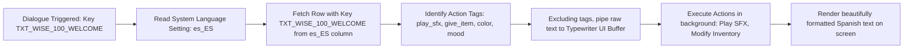
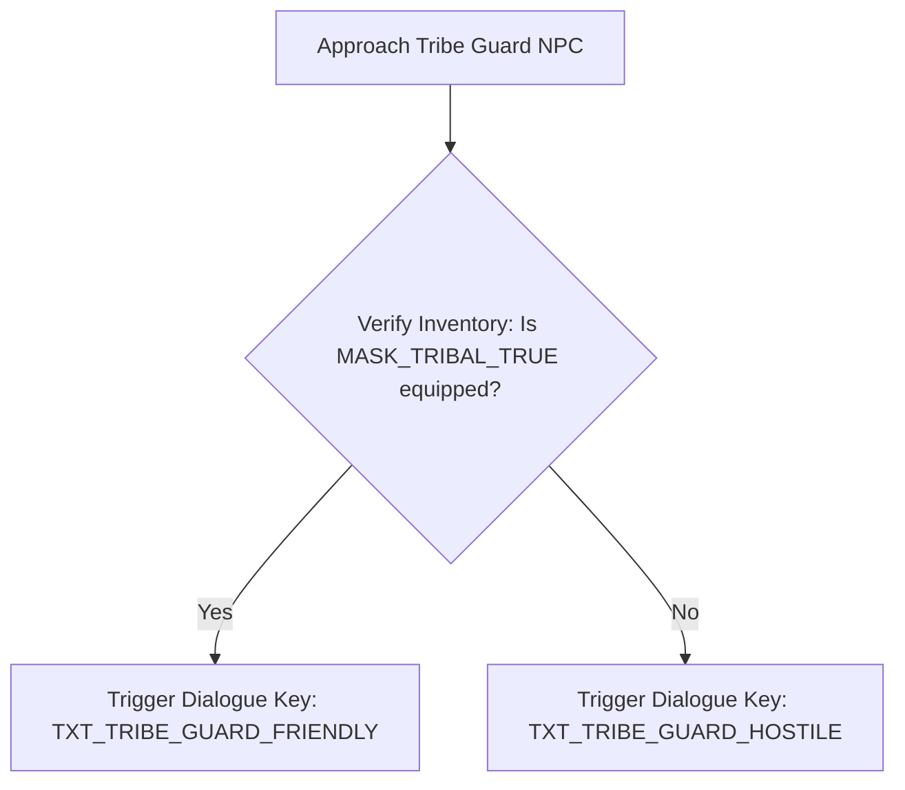

# Expanded Localization & Dialogue Database
## Project: The Legacy of Tomba & the Evil Pigs' Curse

---

## 1. Introduction to Localization Databases (The Writing Concept)

In modern video game production, the script (the dialogues, quest logs, and item names) is never written directly inside the game code. 
* **The Problem**: If a game has $50,000$ lines of text and they are written inside the code, translating the game to Spanish or Japanese would require programmers to manually search and edit thousands of code files, introducing massive amounts of bugs and translation errors.
* **The Solution**: All texts are written inside a structured database spreadsheet (usually a **CSV - Comma Separated Values** file). Every single line of text is assigned a unique tracking identifier (the **Localization Key**, like `TXT_MENU_START`). The game engine simply checks the player's active language and pulls the correct translation column corresponding to that key.

---

## 2. Text Parser Tag Reference (How to Read the Script)

To make dialogues look alive, the writers insert hidden command tags directly inside the text lines. The Dialogue Node Parser (specified in `dialogue_node_parser_spec.md`) reads these tags on the fly to trigger sound effects, change portrait emotions, and alter the player's inventory during the conversation.

* **`[mood=neutral/happy/sad/angry]`**: Changes the active 2D portrait emotion.
* **`[play_sfx=SFX_ID]`**: Plays a specific sound effect at that exact moment in the dialogue.
* **`[give_item=ITEM_ID]`**: Instantly adds a key quest item to the player's inventory.
* **`[take_item=ITEM_ID]`**: Removes a required quest item from the player's inventory.
* **`<color=gold/yellow>text</color>`**: Highlights critical words in specific colors to guide the player's attention.

---

## 3. Localization Key Parser Pipeline

The engine executes a structured string retrieval sequence whenever dialogue window triggers are activated.

---

## 4. The Master Dialogue Script Database (The First Hour)

This is the production-ready spreadsheet script used by the localization and writing teams for the game's opening chapters.

### 4.1 Chapter 1: The Theft & The Forest Blockade

| Key ID | Speaker NPC | English (en_US) | Spanish (es_ES) | Japanese (ja_JP) |
| :--- | :--- | :--- | :--- | :--- |
| `TXT_BEG_ELDER_01` | Village Elder | `[mood=sad][play_sfx=SFX_NPC_GASP]Oh, Savior! The Koma Pigs have profaned the grave! They stole your grandfather's <color=gold>Golden Bracelet</color>!` | `[mood=sad][play_sfx=SFX_NPC_GASP]¡Oh, Salvador! ¡Los Cerdos Koma han profanado la tumba! ¡Se llevaron el <color=gold>Brazalete Dorado</color> de tu abuelo!` | `[mood=sad][play_sfx=SFX_NPC_GASP]おお、救世主よ！コマ豚たちが墓を荒らしてしまった！おじいさんの<color=gold>「金のブレスレット」</color>が盗まれたのだ！` |
| `TXT_BEG_SAV_01` | Savior (Tomba)| `[mood=angry][play_sfx=SFX_PL_GROWL]Grrr... Not the bracelet! I will hunt them to the edge of the world!` | `[mood=angry][play_sfx=SFX_PL_GROWL]Grrr... ¡El brazalete no! ¡Los cazaré hasta el fin del mundo!` | `[mood=angry][play_sfx=SFX_PL_GROWL]ガルルッ…ブレスレットだけは許さない！世界の果てまで追い詰めてやる！` |
| `TXT_DF_ELDER_01` | Dwarf Elder | `[mood=sad]A dark, magical fog has blocked our paths. Only the <color=gold>100-Year Wise Man</color> knows how to break this pig curse. He lives on the hill above us.` | `[mood=sad]Una niebla oscura y mágica bloquea nuestros caminos. Solo el <color=gold>Sabio de los 100 Años</color> sabe cómo romper esta maldición porcina. Vive en la colina.` | `[mood=sad]黒い魔法の霧が道を塞いでしまった。この豚の呪いを解く方法は、丘の上に住む<color=gold>「100才の物知り」</color>だけが知っているのじゃ。` |

### 4.2 Chapter 2: The Sacred Vessels

| Key ID | Speaker NPC | English (en_US) | Spanish (es_ES) | Japanese (ja_JP) |
| :--- | :--- | :--- | :--- | :--- |
| `TXT_WISE_100_GREET` | 100-Year Wise Man | `[mood=neutral][play_sfx=SFX_BELL_CHIME]Welcome, pink-haired savior. The Siete Cerdos Diabólicos have fragmented our reality. Standard weapons cannot harm them.` | `[mood=neutral][play_sfx=SFX_BELL_CHIME]Bienvenido, salvador de cabellos rosados. Los Siete Cerdos Diabólicos han fragmentado nuestra realidad. Las armas comunes no les hacen daño.` | `[mood=neutral][play_sfx=SFX_BELL_CHIME]ようこそ、桃色の髪の救世主よ。「７人の魔ぶた」たちが世界をバラバラにしてしまった。普通武器では彼らを傷つけることはできん。` |
| `TXT_WISE_100_GIVE` | 100-Year Wise Man | `[mood=happy]You must capture them inside these magical vessels. Take this first <color=gold>Blue Pig Bag</color>.[play_sfx=SFX_UI_REWARD][give_item=IT_PIG_BAG_BLUE] Find the blue portal in the forest!` | `[mood=happy]Debes capturarlos dentro de estas vasijas mágicas. Toma esta primera <color=gold>Bolsa de Cerdo Azul</color>.[play_sfx=SFX_UI_REWARD][give_item=IT_PIG_BAG_BLUE] ¡Busca el portal azul en el bosque!` | `[mood=happy]この魔法の袋に彼らを閉じ込めるのじゃ。最初の<color=gold>「青い魔ぶたの袋」</color>を授けよう。[play_sfx=SFX_UI_REWARD][give_item=IT_PIG_BAG_BLUE] 森にある青いポータルを探すのじゃ！` |

### 4.3 Chapter 3: The Jungle Gatekeeper

This dialogue node branches based on whether the Savior is wearing the required mask.

| Key ID | Speaker NPC | English (en_US) | Spanish (es_ES) | Japanese (ja_JP) |
| :--- | :--- | :--- | :--- | :--- |
| `TXT_TRIBE_GUARD_HOSTILE` | Masked Guard | `[mood=angry][play_sfx=SFX_TRIBE_WARN]Stop! You do not wear the mask of our people! Leave now or taste my spear!` | `[mood=angry][play_sfx=SFX_TRIBE_WARN]¡Alto! ¡No llevas la máscara de nuestro pueblo! ¡Vete ahora o probarás mi lanza!` | `[mood=angry][play_sfx=SFX_TRIBE_WARN]止まれ！お前は我らの一族の仮面をつけていない！立ち去れ、さもなくばこの槍のサビにしてくれる！` |
| `TXT_TRIBE_GUARD_FRIENDLY` | Masked Guard | `[mood=happy]Ah! You wear the sacred mask! Enter peacefully, brother. The Chief awaits you inside the village.` | `[mood=happy]¡Ah! ¡Llevas la máscara sagrada! Entra en paz, hermano. El Jefe te espera dentro de la aldea.` | `[mood=happy]おお！聖なる仮面をつけているな！歓迎するぞ、同胞よ。長老が村の奥でお前を待っている。` |