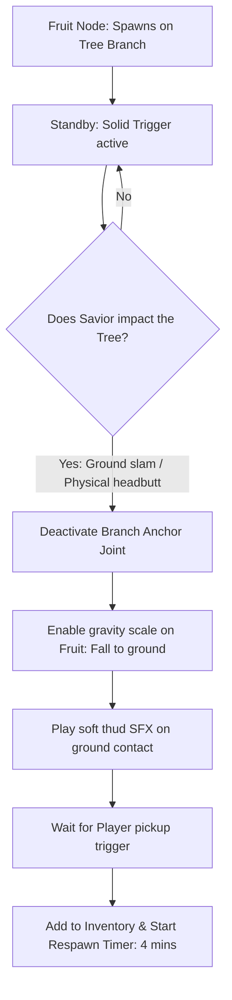
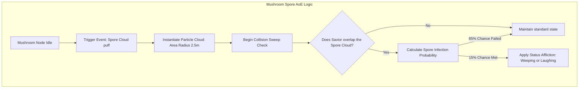

# Flora & Gathering Systems Specification
## Project: The Legacy of Tomba & the Evil Pigs' Curse

---

## 1. Introduction to Resource Gathering (The Gathering Concept)

In the uncharted archipelago, survival and commerce are directly connected to the natural ecosystem. 
* **The Concept**: The environment is not just static visual decoration; it is a resource generator. Trees grow edible fruits, caves contain raw iron ore veins, and forests are filled with magical, reactive flora.
* **Why it matters**: Gathering resources (such as *Blueberries*, *Golden Peaches*, or *Iron Ore*) is the primary engine of the game's economy. Players collect these items to heal the Savior or barter with native merchants for rare armor and weapon upgrades (as specified in `shop_economics_and_barter_system.md`).

---

## 2. Dynamic Fruit Spawning & Drop Physics

Edible fruits (like Blueberries) do not float in the air. They grow naturally hanging from tree branches.

### 2.1 The Branch Impact Trigger
* **Headbutt / Slam Detector**: Trees are assigned a structural column collider (`COL_TREE_TRUNK`).
* **Physics Propagation**: If the Savior executes a **Downward Blackjack Slam** on the ground near the tree, or jumps and collides with the trunk using a physical dash, the engine propagates a physical shockwave vector ($\vec{F}_{\text{shake}}$) upward into the branches:

$$\vec{F}_{\text{shake}} = \text{SlamForce} \times \text{DistanceFactor}$$

If $\vec{F}_{\text{shake}}$ exceeds a threshold of $5.0 \, \text{N}$, all active fruits hanging from the branches detach, enabling their standard rigid-body gravity scales ($9.8 \, \text{m/s}^2$) so they fall naturally to the ground for the player to gather.

---

## 3. Psychoactive Mushroom Node Mechanics (Botanical Hazards)

The *Wailing & Laughing Forest* is filled with emotional spore-emitting mushrooms. These act as stationary Area-of-Effect (AoE) hazard nodes.

### 3.1 Spore Cloud Emission Parameters
* **Cloud Radius**: $2.5 \, \text{meters}$ centered on the mushroom sprite.
* **Interval**: Emitters trigger a puff of particles (`PART_SPORE_CLOUD`) every $6.0 \, \text{seconds}$. The cloud remains active in physical space for $3.0 \, \text{seconds}$ before dispersing.
* **Wind Drift**: If active regional wind currents are present (as specified in `environmental_weather_and_particles_spec.md`), the spore cloud's coordinate center drifts along the wind vector, extending the hazard zone dynamically.

---

## 4. Materials Gathering (Wood & Ore Mining Nodes)

Upgrading weapons requires hard materials that must be physically mined from the environment.

* **Dead Wood Logs**: Fallen, rotten tree trunks can be struck with any weapon to split them open, yielding $1$ to $3$ pieces of **Hardwood Lumber** (`IT_WOOD_LUMBER`).
* **Iron Ore Veins**: Gleaming grey rock deposits located inside dark cavern walls.
  * *Interaction Requirement*: Standard fists or flails bounce off the ore with a high-pitched clink sound, dealing no damage to the node.
  * *Mining Tool*: The player must strike the vein using the **Blackjack (Mace)**. Each heavy impact crackles the rock, releasing $1$ piece of **Raw Iron Ore** (`IT_IRON_ORE`) up to a maximum node capacity of $3$ items.
* **Respawn Cooldowns**:
  * *Standard Fruits*: Respawn after $4.0 \, \text{Real Minutes}$ under sunlight.
  * *Mining Nodes*: Respawn only after a full **Day/Night Cycle** ($24 \, \text{Real Minutes}$) has elapsed.