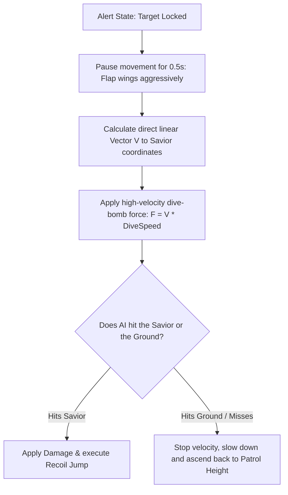

# Flying Predators AI & Navigation Specification
## Project: The Legacy of Tomba & the Evil Pigs' Curse

---

## 1. Introduction to Aerial AI (The Flight Concept)

In platforming adventure games, ground enemies (like the Koma Pigs) are locked to platforms and are stopped by physical walls. 
* **The Concept**: To make high-altitude areas (such as *Phoenix Mountain* and the forest canopies) feel dangerous and vertically open, the game features **Flying Predators** (such as Winged Pigs and aggressive Crows).
* **The Difference**: Flying AI ignores platform colliders entirely. It navigates the air coordinate space freely, using fluid floating paths.
* **Why it matters**: Flying enemies force the player to look upward, calculating jump heights, throwing arcs, and dynamic aerial weapon swings (like using the Flail in mid-air) to defend themselves while navigating high cliffs.

---

## 2. Floating Hover & Sine-Wave Turbulence (The Idle State)

When a flying enemy is patrolling its area, it does not hover in a perfectly rigid position. To simulate wind resistance and natural wing-flapping, the AI executes a continuous **Sine-Wave vertical oscillation**.

```mermaid
graph TD
    A[Flying AI Spawn Coordinates: X, Y] --> B[Calculate vertical Offset using Sine Wave]
    B --> C[Set local target height: Y_offset = sin(Time * Frequency) * Amplitude]
    C --> D[Move smoothly toward target height using Lerp]
    D --> E{Is Player Detected in Sight Cone?}
    E -->|Yes| F[Trigger Alert State & Stop Hover Loop]
    E -->|No| B
```

### 2.1 The Floating Wave Formula
The vertical coordinate offset ($Y_{\text{offset}}$) applied to the patrolling flight path over elapsed time ($t$) is calculated as:

$$Y_{\text{offset}} = \sin(t \times \text{Frequency}) \times \text{Amplitude}$$

Where:
* $\text{Frequency}$ is the wing-flap oscillation speed (Default: $4.0 \, \text{rad/s}$).
* $\text{Amplitude}$ is the vertical travel limit (Default: $0.35 \, \text{meters}$).
* This mathematical offset creates a soft, natural bobbing movement that visually conveys weight and flight struggle.

---

## 3. Target Tracking & Dive-Bomb Attack Vectors

If the Savior enters the visual detection radius ($8.0 \, \text{meters}$ inside a forward $90^\circ$ downward cone), the Flying AI triggers its aggressive attack sequence.



### 3.1 Dive-Bomb Physics Parameters
* **Dive Speed**: $14.0 \, \text{m/s}$ (fast acceleration).
* **Linear Trajectory**: The attack path is a straight vector ($\vec{v}_{\text{attack}}$) pointing from the launch coordinate ($L_{\text{launch}}$) to the Savior’s coordinate position at the moment of the lock ($P_{\text{savior}}$):

$$\vec{v}_{\text{attack}} = \text{Normalize}(P_{\text{savior}} - L_{\text{launch}}) \times \text{DiveSpeed}$$

* **Evasion Window**: Because the vector is locked at the start of the dive, the player can wait for the dive to initiate, jump out of the way, and cause the predator to hit the ground or overshoot, leaving it vulnerable to a rear counter-attack.

---

## 4. Aerial Grabbing & Stepping-Stone Mechanics

Can the Savior grab a flying enemy? Yes. The interaction system allows advanced players to use flying enemies as physical springboards.

* **Aerial Grab Trigger**: If the Savior jumps and lands his feet collider directly onto the upper bounding box of a flying enemy, his state machine enters the `Aerial Grab` state.
* **The Launch Step**: Pressing the *Jump* key while riding a flying predator causes the Savior to jump off their back, killing the predator instantly and launching the Savior upward with a $+30\%$ Jump Height bonus:

$$v_{\text{launch\_y}} = \text{DefaultJumpForce} \times 1.30$$

* **Level Design Utility**: This mechanical integration lets designers create "Air Bridges", where the player must jump from one flying predator to another in sequence to cross massive gaps without falling into volcanic rifts.