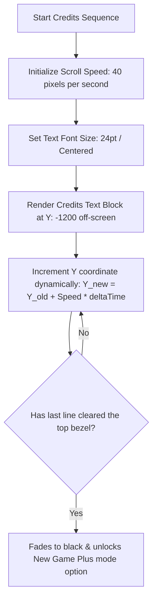
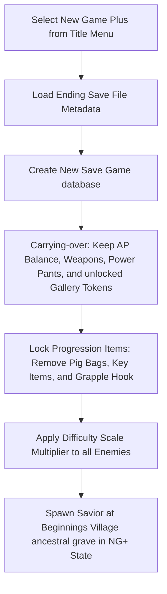

# Game Ending & New Game Plus (NG+) Specification
## Project: The Legacy of Tomba & the Evil Pigs' Curse

---

## 1. Introduction to Game Endings & Replayability (The Life-Cycle Concept)

When a player successfully completes a long, challenging adventure game:
1. **The Sense of Closure**: They expect a rewarding, high-quality final cinematic sequence (the **Ending**) and a beautiful presentation of the creators' names (the **Staff Credits**) to signify the completion of their heroic journey.
2. **Replayability (New Game Plus)**: Instead of the game simply ending forever, players love the opportunity to start the story again from the beginning while keeping their hard-earned upgrades (such as their high AP balance, rare *Power Pants*, or weapons). This mode is called **New Game Plus (NG+)**. It lets players experience the world again with a powerful character while facing scaled-up, harder enemy challenges.

---

## 2. The Climax Ending Sequence (Reunion & Restoration)

The ending sequence triggers immediately after the *Real Evil Pig* is successfully sealed inside the final Tri-Bag Vortex (as specified in `real_evil_pig_boss_spec.md`).

* **Phase 1: The Reunion (Cutscene)**: The Savior lands on the restored ground of the clocktower. Tabby runs from the background plane to the foreground, executing a joyful reunion animation. Warm golden sunlight filters through the clouds.
* **Phase 2: The Restoration**: The Savior returns to the *Beginnings Village*. In a slow-panning cinematic, he places the **Golden Bracelet** back onto his grandfather's grave monument, sealing the first great chronicle.
* **Phase 3: The Banquet**: A festive village banquet loops in the background as the screen transitions to the Staff Credits.

---

## 3. Staff Credits Scroll Specifications

The credits list rolls vertically from the bottom screen border to the top, designed to be highly legible on all display hardware.

* **Scroll Pacing**: The text moves upward at a locked speed of $40 \, \text{pixels/second}$. This guarantees that players can read every developer’s name comfortably without visual motion blur.
* **Bypass Rule**: Players can press and hold the *Confirm* key for $3.0 \, \text{seconds}$ to fast-forward the credits at $5 \times$ speed, but the credits cannot be skipped instantly on the first playthrough to respect the production staff.

---

## 4. New Game Plus (NG+) Mode Parameters

After the credits complete, the game updates the global system registry, creating a new, specialized save slot marked with a golden **"NG+"** icon.

### 4.1 Carry-Over & Sequence Gating Rules
To prevent players from breaking the story progression (e.g., using the Grapple Hook to skip the entire Dwarf Forest directly into the Wailing Forest), the inheritance parameters are strictly filtered:

* **What is Kept (Inherited)**:
  * Total accumulated **Adventure Points (AP)**.
  * Secondary weapons (*Standard Flails*, *Metal Boomerangs*, *Blackjack*).
  * Upgraded *Power Pants* (*Green Forest*, *Red Fire*, *Blue Deep*).
  * Unlocked gallery art tokens.
* **What is Reset (Locked)**:
  * All $130$ and $137$ Event logs (set back to `Inactive`).
  * Critical story keys (*Dwarf Key*, *Mirror Shards*).
  * The *Grapple Hook* tool (locked until re-acquired inside the Wailing Forest event).
  * All collected *Magic Pig Bags*.

### 4.2 Difficulty Scaling Formulas
To keep NG+ challenging for a fully equipped Savior, all enemies receive a passive attribute multiplier:

$$\text{NG+ Enemy Health} = \text{BaseHealth} \times 1.25$$
$$\text{NG+ Enemy Damage} = \text{BaseDamage} \times 1.20$$
$$\text{NG+ Enemy Speed} = \text{BaseSpeed} \times 1.10$$