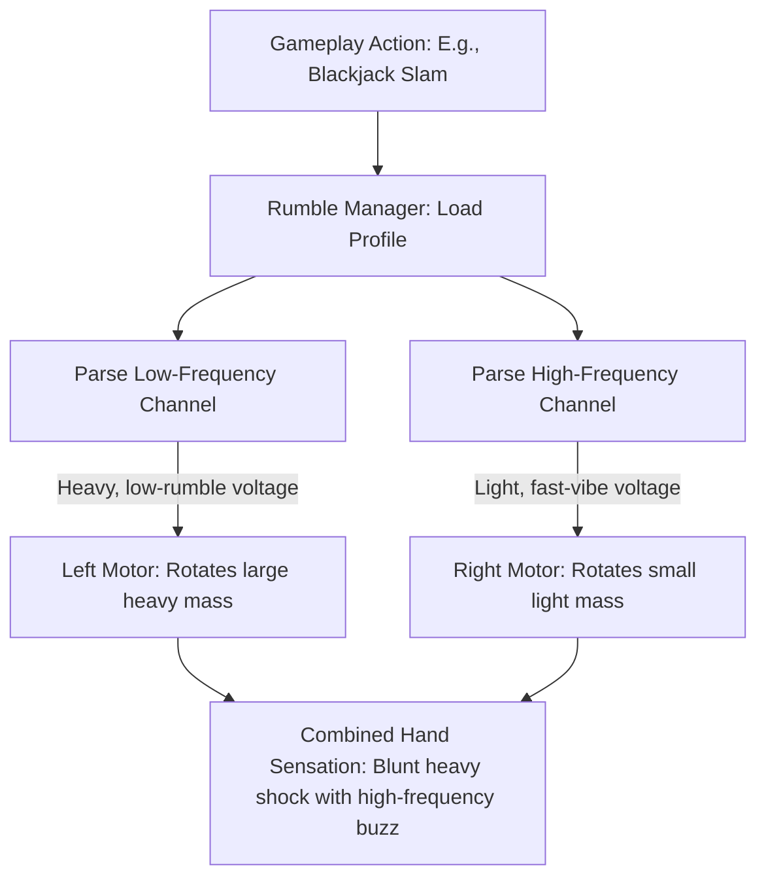

# Haptic Feedback & Controller Rumble Specification
## Project: The Legacy of Tomba & the Evil Pigs' Curse

---

## 1. Introduction to Controller Vibration (The Physical Feedback Concept)

When playing a video game, the player interacts with the virtual world primarily through sight and sound. 
* **The Concept**: To bridge the gap between virtual graphics and the player’s physical hands, games utilize **Haptic Feedback** (also known as controller vibration or rumble).
* **How it works**: Inside modern controllers (such as Xbox, PlayStation DualSense, or Nintendo Switch Joy-Cons), there are small electrical motors with off-balance weights or advanced vibrating actuators (**LRAs - Linear Resonant Actuators**). By spinning or vibrating these actuators at different speeds, the controller can simulate physical sensations.
* **Why it matters**: If the Savior falls from a high ledge and lands hard on the ground, the controller should give a heavy, blunt thud. If he is swimming against a light current, the controller should give a soft, continuous, wave-like hum. This tactile feedback makes the game feel incredibly physical and responsive.

---

## 2. Dual-Motor Rumble Architecture

The standard gaming controller splits rumble outputs between two independent motors: the Left Motor and the Right Motor.



### 2.1 Motor Roles
* **Left Motor (Low-Frequency)**: Rotates a large, heavy off-balance weight. It generates deep, coarse, and violent vibrations used for heavy hits, volcanic explosions, physical damage, and falling rocks.
* **Right Motor (High-Frequency)**: Rotates a small, light off-balance weight. It generates high-pitched, fine, and sharp vibrations used for splashing water, sword swings, menu navigation clicks, and light wind rustling.

---

## 3. Dynamic Rumble Envelope (The Wave Shape)

Vibrations must not simply switch on and off instantly, or they will feel cheap and unnatural. Every vibration profile is sculpted along a timed **Vibration Envelope** consisting of **Attack**, **Sustain**, and **Decay** phases.

```mermaid
gantt
    title Vibration Envelope Profile (Duration: 0.40 seconds)
    dateFormat  X
    axisFormat %s

    section Phase
    Attack: Rise to Max Strength (0.05s) :crit, active, 0, 5
    Sustain: Maintain Intensity (0.15s)   :active, 5, 20
    Decay: Smooth Fade Out (0.20s)         : 20, 40
```

* **Attack**: How fast the motor spins up to its maximum target speed.
* **Sustain**: How long the vibration remains locked at maximum target speed.
* **Decay**: How smoothly the motor slows down to a complete stop once the trigger finishes.

---

## 4. Master Haptic Profiles Database

To ensure consistent physical feedback, the game engine references a library of pre-configured haptic profiles mapped directly to core gameplay triggers.

| Gameplay Trigger Event | Left Motor (LF) Strength | Right Motor (HF) Strength | Duration | Envelope Curve Profile |
| :--- | :--- | :--- | :--- | :--- |
| **Bite / Enemy Grab** | $0.0$ (Off) | $0.45$ (Moderate) | $0.12 \, \text{s}$ | **Fast Strike**: Instant attack, $0.1 \, \text{s}$ decay. Simulates a tight snap jaw-grip. |
| **Standard Jump** | $0.10$ (Low) | $0.20$ (Low) | $0.08 \, \text{s}$ | **Soft Pop**: Mimics the spring compression of feet launching off the ground. |
| **Blackjack Ground Slam**| $0.95$ (Max) | $0.50$ (Moderate) | $0.45 \, \text{s}$ | **Seismic Decay**: High attack, $0.15 \, \text{s}$ sustain, slow $0.30 \, \text{s}$ decay. |
| **Water Splash Landing** | $0.20$ (Low) | $0.70$ (High) | $0.25 \, \text{s}$ | **Fluid Ripple**: Gradual attack, fast decay. Simulates the texture of water displacement. |
| **Taking Damage** | $0.80$ (High) | $0.80$ (High) | $0.30 \, \text{s}$ | **Adrenaline Jolt**: Instant $100\%$ attack, flat sustain, abrupt decay. Emphasizes threat. |
| **Swimming Current** | $0.05$ (Min) | $0.15$ (Low) | Loop (Continuous)| **Continuous Wave**: Loops constantly as long as Savior is overlapping current triggers. |