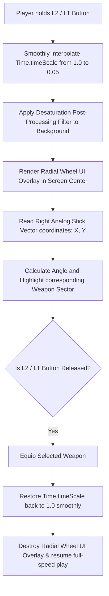

# Inventory & Weapon Quick-Select Wheel Specification
## Project: The Legacy of Tomba & the Evil Pigs' Curse

---

## 1. Introduction to Quick-Selection (The Radial Wheel Concept)

In fast-paced action-platformers, players frequently need to swap their active tools (such as switching from a *Flail* to clear enemies, to a *Boomerang* to hit a distant switch, or a *Grapple Hook* to catch a branch).
* **The Problem**: Opening a full-screen pause menu every time a weapon swap is needed interrupts the game's flow, ruins the player's momentum, and breaks the immersive experience.
* **The Solution**: The game implements a **Weapon Quick-Select Radial Wheel**. By holding down the designated shoulder button (`L2` / `LT`), a semi-translucent circular menu overlays the screen. Time dilates into ultra-slow motion, and the player simply tilts the controller’s analog stick toward the target weapon to equip it instantly.

---

## 2. Quick-Select State Flow & Time Dilation

To keep weapon swapping tactical and fluid, holding the quick-select button does not freeze the game. Instead, it triggers a **Time Dilation (Slow-Motion)** effect.



### 2.1 Time Dilation Parameters
* **Target Scale**: Time scale factor drops to $0.05$ (meaning the game runs at $5\%$ of standard speed). This allows the player to perform tactical swaps even while airborne or mid-jump.
* **Time Scale Restoration**: Once the selection shoulder button is released, the time scale is interpolated (*Lerped*) back to $1.0$ over $0.15 \, \text{seconds}$ to prevent abrupt, jarring physical jumps in velocity.

---

## 3. Radial Coordinate Angle Selection Mathematics

The radial wheel is divided into equivalent circular slices (Sectors). The system translates the $360^\circ$ coordinate vectors of the analog stick to determine which sector is being highlighted.

```mermaid
grid-layout
    {"title": "Radial Sector Map (4-Slot Default Setup)", "cols": 3, "rows": 3}
    ["", "Sector 0: Flail (45° - 135°)", ""]
    ["Sector 3: Blackjack (135° - 225°)", "Stick Center Pivot (0.0, 0.0)", "Sector 1: Boomerang (315° - 45°)"]
    ["", "Sector 2: Grapple Hook (225° - 315°)", ""]
```

### 3.1 Angle Target Formula
The input controller registers the horizontal ($X$) and vertical ($Y$) axes of the analog stick. The absolute angle ($\theta$) in degrees is calculated using the arctangent function:

$$\theta = \text{atan2}(Y, X) \times \frac{180}{\pi}$$

If the analog stick's displacement magnitude is $\ge 0.5$ (preventing accidental central clicks), the system maps the resulting angle to its corresponding sector window:

* **Sector 0 (Flail)**: Angle between $45^\circ$ and $135^\circ$.
* **Sector 1 (Boomerang)**: Angle between $-45^\circ$ and $45^\circ$ (or $315^\circ$ to $45^\circ$).
* **Sector 2 (Grapple Hook)**: Angle between $-135^\circ$ and $-45^\circ$ (or $225^\circ$ to $315^\circ$).
* **Sector 3 (Blackjack)**: Angle between $135^\circ$ and $225^\circ$ (or $-225^\circ$ to $-135^\circ$).

---

## 4. UI Visual Selection & Audio Cues

* **Sector Highlight**: When the stick points toward a sector, the weapon icon scales up by $20\%$, glows with a golden aura particle, and displays its localized name at the bottom of the wheel.
* **Selection Confirmation**: Releasing the button plays a metallic clank sound (`SFX_UI_SWAP_CONFIRM`) and triggers a subtle screen-space particle burst to confirm the equip action.