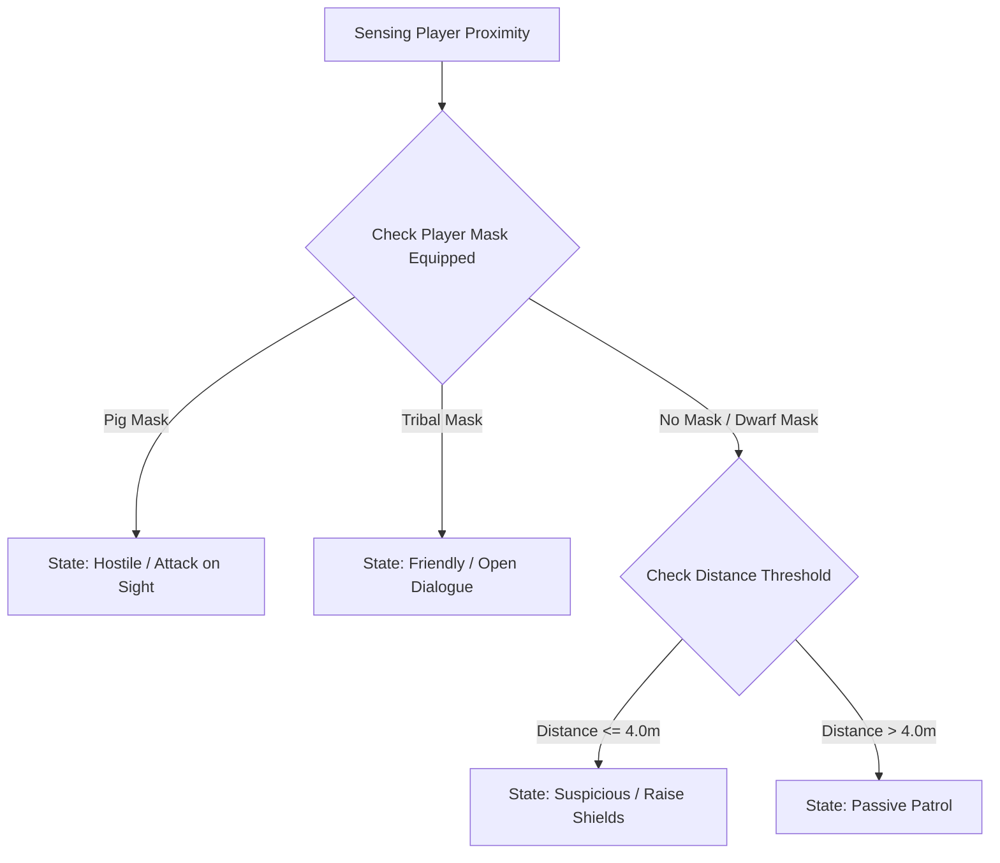
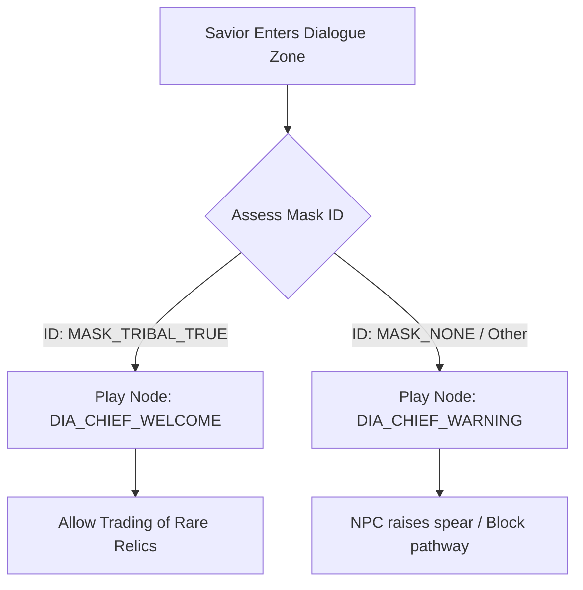

# Jungle Tribes Enemy & NPC AI Specification
## Project: The Legacy of Tomba & the Evil Pigs' Curse

---

## 1. Tribal AI Behavioral Hierarchy

The Masked Jungle Tribes represent a unique faction within the archipelago. Unlike the purely hostile Koma Pigs, the Tribes are sovereign inhabitants whose aggression and trust values depend on environmental triggers, proximity rules, and equipped items.

---

## 2. Mask Trust Assessment Loop

The Savior can find and equip decorative masks. The Tribal AI constantly evaluates the Savior's headwear slot to determine active conversation, trade, or combat protocols.

### 2.1 Mask Trust Reaction Database

| Equipped Mask ID | Reaction Class | Movement Modification | Dialogue Access |
| :--- | :--- | :--- | :--- |
| **`MASK_TRIBAL_TRUE`** | **Ally / Friendly** | AI drops weapons, remains stationary. | Unlocks trading & main questlines. |
| **`MASK_NONE`** | **Suspicious** | AI tracks player position with eyes, raises shields. | Gives generic warning dialogues. |
| **`MASK_PIG_KOMA`** | **Hostile** | AI charges toward player with spear-jab attacks. | Dialogue blocked; immediate combat. |
| **`MASK_DWARF`** | **Amused / Neutral**| AI giggles, walking speed reduced by $20\%$. | Plays comical flavor text dialogues. |

---

## 3. Patrol & Combat Patterns (The Masked Guard)

The Tribal Guard is a agile, highly defensive combatant designed to test the player's weapon switching proficiency.

### 3.1 Defensive Shield Block
* **Mechanics**: When the Savior attacks from the front while the Guard is in a `Suspicious` or `Hostile` state, the Guard automatically blocks the strike using an wooden shield.
* **Vulnerability**: The Savior must jump over the Guard to attack from the back, or use the charged **Blackjack (Mace)** to shatter the shield, leaving the Guard in a `Stunned` state for $2.5 \, \text{seconds}$.

### 3.2 Spear-Throwing Trajectory
* **Trigger**: If the Savior is on an adjacent platform at a horizontal distance between $5.0$ and $10.0 \, \text{meters}$, the Guard initiates a spear-throw.
* **Physics Arc**: The spear travels along a standard parabolic gravity curve:

$$y = x \cdot \tan(\theta) - \frac{g \cdot x^2}{2 \cdot v^2 \cdot \cos^2(\theta)}$$

Where:
* $v$ = initial launch velocity of $12.0 \, \text{m/s}$.
* $\theta$ = launch angle calculated toward the Savior's active coordinate center.