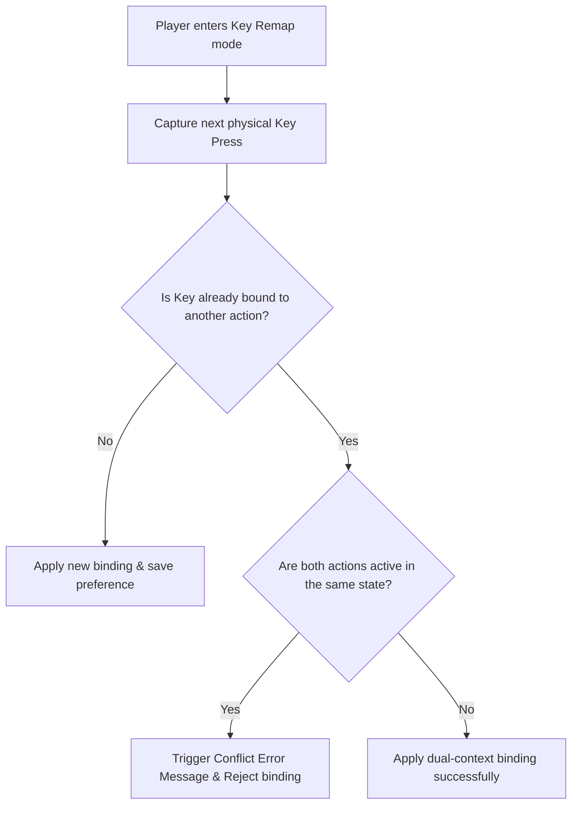
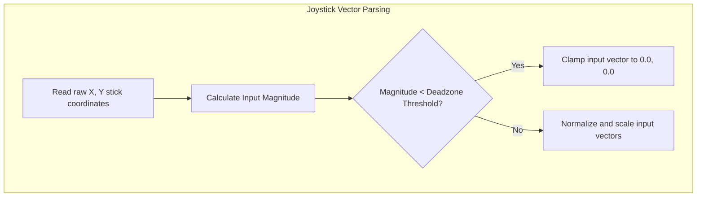

# Keyboard Bindings & Input Remapping Specification
## Project: The Legacy of Tomba & the Evil Pigs' Curse

---

## 1. Input Remapping System Overview

To provide an accessible and fully customizable experience, particularly for PC players and users utilizing adaptive controllers, the game architecture allows complete manual remapping of action keys. These custom bindings are saved directly to the local persistent directory as part of the system preferences config.

---

## 2. Default Keyboard & Mouse Bindings (PC Target)

For players not utilizing a gamepad controller, the default keyboard layout maps the action buttons as follows:

| Action Identifier | Default Key | Secondary Key | Action Category |
| :--- | :--- | :--- | :--- |
| **Move Left** | `A` | `Left Arrow` | Physics Traversal |
| **Move Right** | `D` | `Right Arrow` | Physics Traversal |
| **Move Up / Climb** | `W` | `Up Arrow` | Physics Traversal / Z-Axis |
| **Move Down / Descend**| `S` | `Down Arrow` | Physics Traversal / Z-Axis |
| **Jump / Latch** | `Space` | None | Traversal & Grab |
| **Use Weapon** | `Left Click` | `J` | Combat |
| **Execute Throw** | `Right Click` | `K` | Combat / Grab Interaction |
| **Animal Dash** | `Left Shift` | None | Sprint Traversal |
| **Map Overlay** | `M` | `Tab` | UI |
| **Pause Menu** | `Escape` | `P` | UI |

---

## 3. Conflict Detection & Double-Binding Prevention Logic

The remapping interface must prevent players from assigning the same physical key to two conflicting actions inside the same state context (e.g., mapping `Space` to both *Jump* and *Use Weapon*).

### 3.1 Resolvable Conflicts vs. Non-Resolvable Conflicts
* **Resolvable (Allowed)**: Mapping `Space` to "Confirm Menu" and "Jump" is allowed. These actions occur in different State Contexts (`Menu State` vs. `Exploration State`), meaning they can never execute simultaneously.
* **Non-Resolvable (Blocked)**: Mapping `Space` to "Jump" and "Use Weapon" is blocked because both are active in the `Exploration State`. Attempting to do so prompts the player with a confirmation dialog: *"This key is already bound to [Action]. Do you want to swap them?"*

---

## 4. Analog Joystick Deadzone Calibration

To counteract mechanical controller wear and drift (Stick Drift), the engine filters analog inputs using a dynamic radial deadzone formula.

### 4.1 Radial Deadzone Mathematics
Standard cross-shaped deadzones cause sudden horizontal/vertical snapping. To prevent this, the engine calculates the input coordinates using a normalized circular vector:

$$\text{Magnitude} = \sqrt{\text{Stick}_x^2 + \text{Stick}_y^2}$$

If the calculated $\text{Magnitude}$ is below the customizable **Deadzone Threshold** (default: $0.18$), the system ignores the input completely. If it exceeds the threshold, the input is mapped smoothly to a linear scale:

$$\text{Normalized Output} = \frac{\text{Magnitude} - \text{Deadzone}}{\text{MaxMagnitude} - \text{Deadzone}}$$

This ensures that the Savior moves gracefully in all $360^\circ$ directions, ignoring minor joystick drift without losing movement sensitivity.