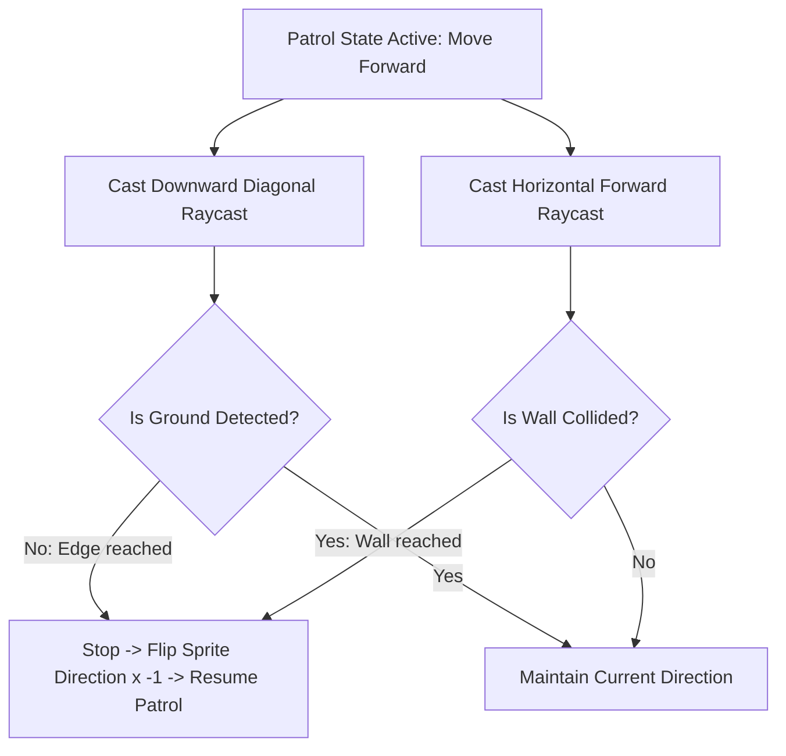
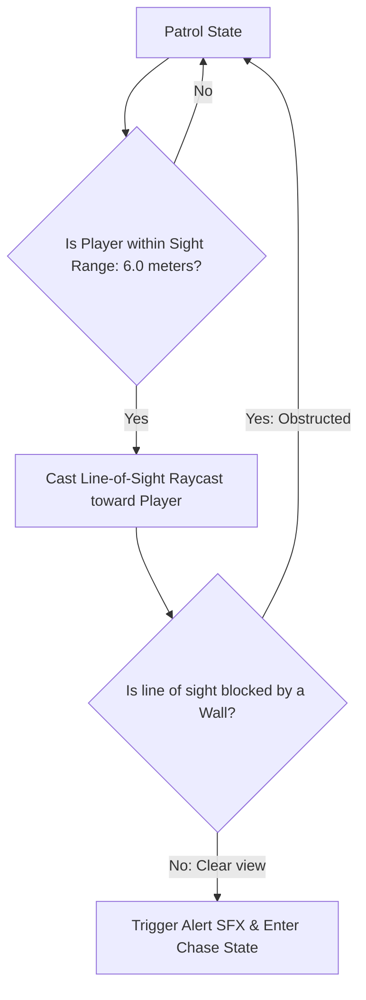

# Koma Pig Enemy AI & Patrol Mechanics Specification
## Project: The Legacy of Tomba & the Evil Pigs' Curse

---

## 1. Introduction to Patrol AI (The Basic Enemy Concept)

In platforming video games, standard enemies cannot wander randomly, or they would quickly fall off platforms, get stuck in corners, or ignore the player completely.
* **The Goal**: The **Koma Pig** (the primary enemy minion) must navigate its designated platform autonomously. It needs to walk back and forth cleanly, turn around before walking off a ledge, and dynamically transition into an aggressive chase state if it spots the Savior.
* **The Technology**: To achieve this without heavy processing costs, the AI uses **Raycasting** (casting invisible laser lines to measure distances and detect colliders) to scan both the floor ahead and the air in front of its eyes.

---

## 2. Platform Edge & Wall Detection (Anti-Fall Raycasting)

To stay on its platform, the Koma Pig casts two continuous raycasts: one pointing diagonally downward to check for the ledge edge, and one pointing horizontally forward to check for walls.

### 2.1 Raycast Parameter Specifications

* **Downward Edge Raycast (`Ray_Edge`)**:
  * *Origin Coordinate*: Located $0.5 \, \text{meters}$ in front of the pig's feet.
  * *Direction Angle*: $45^\circ$ diagonally downward.
  * *Length (Max Distance)*: $1.0 \, \text{meter}$.
  * *Logic*: If the raycast does not hit a solid platform layer collider, the AI knows it has reached an edge and instantly reverses its direction.
* **Horizontal Wall Raycast (`Ray_Wall`)**:
  * *Origin Coordinate*: Located at the pig's waist center.
  * *Direction*: Horizontal, matching the pig's active facing vector.
  * *Length*: $0.6 \, \text{meters}$.
  * *Logic*: If this ray hits a wall collider, the AI triggers a direction flip.

---

## 3. Player Detection (Line-of-Sight Raycasting)

The Koma Pig's alert state is triggered if the Savior enters its active visual cone.

### 3.1 Chase State Parameters
Once the `Chase State` is active, the Koma Pig's movement properties shift to emphasize aggression:
* **Patrol Speed**: $3.0 \, \text{m/s}$ (calm walk).
* **Chase Speed**: $6.0 \, \text{m/s}$ (angry run).
* **Turn Delay**: If the Savior jumps over the Koma Pig during a chase, the pig requires a $0.25 \, \text{second}$ deceleration delay before turning around, giving the player a tactical window to perform a back-grab.

---

## 4. Knockback & Stun Physics

When the Savior strikes a Koma Pig with a weapon (like a Flail) or throws another enemy into it, the pig enters a temporary non-controlled physics state.

* **Knockback Vector**: Upon impact, standard horizontal control is disabled, and an explosive physical impulse is applied:

$$\vec{v}_{\text{knockback}} = (\text{Direction}_{\text{hit}} \times 8.0 \, \text{m/s}) + (\text{UpwardVector} \times 4.0 \, \text{m/s})$$

* **Stun Recovery**: The Koma Pig lands and remains flat on its back inside the `Stunned` state for $3.0 \, \text{seconds}$. During this window, the pig is completely vulnerable to a guaranteed physical grab. If the player does not grab the pig before the $3.0 \, \text{second}$ timer expires, the pig performs a quick recovery animation and returns to the standard `Patrol State`.