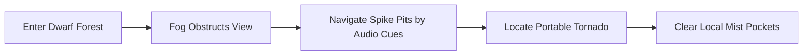

# Level Design Part 1: Beginnings Village & Dwarf Forest
## Project: The Legacy of Tomba & the Evil Pigs' Curse

---

## 1. World Introduction & Key Art

The game experience opens with a cinematic visual introduction establishing the core conflict of the archipelago: the peaceful nature of the islands colliding with the corrupt industrial alchemy of the Evil Pigs.

### Visual Reference: Game Key Art
Below is the master visual used for the title screen and transition sequences:

*Figure 1: Title screen illustration. Notice the stark visual contrast between the natural, vibrant green of the left side and the polluted purple factory smoke of the pig-controlled right side.*

---

## 2. Zone 1: The Beginnings Village

The starting zone serves as the interactive tutorial. The Savior begins his journey here, interacting with basic environmental layers before the core systems are fully introduced.

### 2.1 Savior Character Integration
The player starts near the ancestral grave. The character sprite is scaled to fit the 2.5D layer dimensions, responding directly to physical inputs.

### Visual Reference: Character Scale & Proportions
The Savior's in-game model utilizes the following hand-drawn proportions:

*Figure 2: Production model sheet. These clean linework poses are imported into the animation engine for walking, running, and climbing transitions.*

### 2.2 First Combat Encounter (The Koma Pig Invasion)
As the Savior moves past the village gates, the first hostile entity is introduced. Players must perform their first dynamic "Grab and Throw" to bypass this obstacle.

### Visual Reference: Enemy Placement Design
The basic patrol minion encountered at the village borders:

*Figure 3: Basic Koma Pig concept. Its high-contrast pink skin and leather armor make it highly visible against the green forest background layers.*

---

## 3. Zone 2: The Dwarf Forest

Upon leaving the village, the path transitions into the Dwarf Forest. This area introduces the dual environmental state system (Cursed vs. Purified).

### 3.1 The Cursed State (Fog Navigation)
The forest has been cursed by the Blue Evil Pig. A thick, magical fog reduces the player's view distance, creating blind jumps and hiding dangerous spiked gaps.

### Visual Reference: Cursed Forest Atmosphere
The initial visual layout when entering the Dwarf Forest under the pig's curse:

*Figure 4: Concept of the cursed environment. The purple haze acts as a mid-ground sprite layer, masking collision dangers and creating a tense atmosphere.*

### 3.2 The Purified State (Restored Eco-system)
Once the Savior defeats the Blue Evil Pig and seals him inside the Blue Pig Bag, the forest transforms instantly. The purple toxic gas dissolves, exposing the full beauty of the native dwarf biome.

### Visual Reference: Purified Forest Ecosystem
The same region after the alchemical purification event is cleared:

*Figure 5: Post-purification design. Sunlight beams create vertical climbing guide markers, and the dwarf houses become fully accessible, allowing players to activate new side quests.*