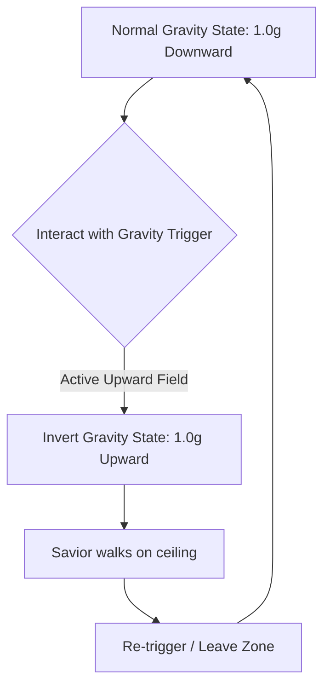
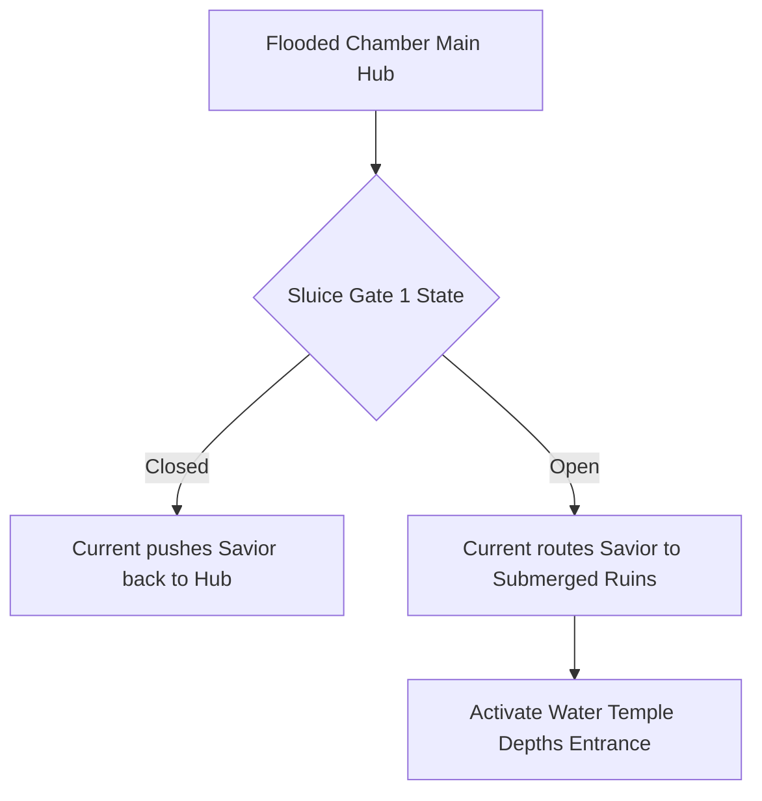

# Level Design Part 2: Haunted Mansion, Phoenix Mountain & Water Temple
## Project: The Legacy of Tomba & the Evil Pigs' Curse

---

## 1. Zone 3: The Haunted Mansion

The Haunted Mansion is a puzzle-centric zone designed around spatial anomalies, gravity manipulation, and optical illusions under the curse of the Pink Evil Pig.

### 1.1 Gravity-Shifting Mechanics
Specific rooms inside the mansion feature localized gravitational anomalies. These zones are marked by floating furniture and distorted atmospheric dust.

### 1.2 Mirror Reconstruction & Spatial Portals
The main progression block in this zone is the Mirror Reconstruction system. Reconstructing broken mirrors using the grab-and-throw mechanic aligns disjointed physical layers.

### Visual Reference: Haunted Mansion Interior
Below is the visual layout of the gravity-distorted hallways within the mansion:

*Figure 1: Hallway concept showing floating artifacts, asymmetrical geometry, and broken mirror gateways. Reconstructing the mirrors is necessary to open paths on alternative Z-planes.*

---

## 2. Zone 4: Phoenix Mountain

Phoenix Mountain is a vertical, wind-swept platforming biome. The design focuses on physical momentum, wind resistance calculations, and precise jump timing.

### 2.1 Wind Current Mechanics
The mountain features continuous lateral wind forces that modify the Savior’s horizontal velocity:

| Wind Direction | Velocity Shift ($v_{\text{wind}}$) | Gameplay Impact |
| :--- | :--- | :--- |
| **Headwind (Facing Wind)**| $-4.5 \, \text{m/s}$ to horizontal run | Slows movement; reduces jump distance. Savior must crouch to minimize drag. |
| **Tailwind (With Wind)** | $+6.0 \, \text{m/s}$ to horizontal run | Accelerates movement; increases jump distances. Can cause overshooting platforms. |
| **Thermal Drafts** | $+8.0 \, \text{m/s}$ vertical force | Allows high-altitude gliding when using the *Flying Squirrel Suit*. |

### 2.2 The Phoenix Nest Reconstruction
The peak of the mountain contains the sacred nest of the Phoenix, which is trapped under corrupted black brambles. To clear this event, the Savior must use the *Red Fire Pants* to walk through the hot ash zones surrounding the nest and deploy a fire-based strike to clear the decay.

---

## 3. Zone 5: The Water Temple

The Water Temple introduces fluid simulation, sub-aquatic collision handling, and swimming/diving physical controllers.

### 3.1 Water Current Routing & Gates
The temple is divided into dry and flooded chambers. Flow currents push the player along specific vector lines, forcing careful navigation around submerged spike hazards.

### 3.2 Deep Diving Physics
Once submerged, the standard platforming physics model is replaced by a fluid dynamics controller:
* **Vertical Ascent (Floating)**: Gravity is reduced to $1.2 \, \text{m/s}^2$ upward when not inputting direction.
* **Oxygen Depletion**: The Savior can remain underwater for up to $45.0 \, \text{seconds}$ (extended to $90.0 \, \text{seconds}$ with the *Blue Deep Pants*). Exceeding this limit causes a slow depletion of $1$ vitality bar every $5.0 \, \text{seconds}$.

### Visual Reference: Submerged Temple Depths
Below is the layout of the deep temple ruins where the Navy Pig Bag is utilized:

*Figure 2: Submerged ruins showing flooded columns and turquoise water filtration. Swimming precision is highly affected by current pathways generated by active background pumps.*