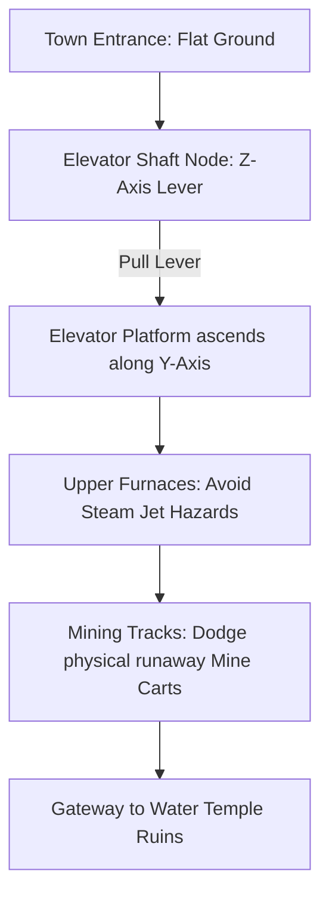
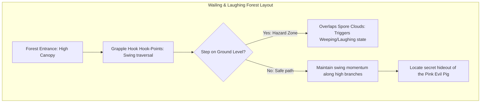

# Level Design Part 3: Coal Mining Town & Wailing/Laughing Forest
## Project: The Legacy of Tomba & the Evil Pigs' Curse

---

## 1. Introduction to the Second Era Regions (The World Expansion)

In the second era of the chronicle (The Rescue of Tabby), the Savior must venture beyond the natural forests into highly industrialized and emotionally unstable biomes.
* **Coal Mining Town**: A vertical, mechanical maze built of steel pipes, burning furnaces, and heavy machinery controlled by the Koma Pigs.
* **Wailing & Laughing Forest**: A botanical canopy where the vegetation and physical platforms react to the emotional state of the active screen, requiring rapid grappling traversal to avoid hazardous forest floors.
* **The Goal**: This document provides the layout blueprints, hazard specifications, and coordinates for these two critical zones.

---

## 2. Zone 6: Coal Mining Town (Industrial Mechanics)

The Coal Mining Town focuses on vertical navigation using mechanical elevators and avoiding high-temperature steam pipes and fast-moving mining carts.

### 2.1 Environmental Hazards Spec

#### A. Pressurized Steam Jets (`HAZ_STEAM_JET`)
* **Visual**: White steam particles shooting horizontally from broken copper pipes.
* **Trigger Interval**: Active for $2.0 \, \text{seconds}$, inactive for $2.0 \, \text{seconds}$.
* **Damage**: Contact without the **Red Fire Pants** inflicts $1$ Vitality Bar of damage and applies a heavy horizontal knockback force ($6.0 \, \text{m/s}$ backward).

#### B. Runaway Mine Carts (`HAZ_MINE_CART`)
* **Behavior**: Heavy iron carts rolling along horizontal track splines.
* **Physics Interaction**: Carts move at a locked speed of $10.0 \, \text{m/s}$. They act as solid, unstoppable dynamic colliders.
* **Player Counter**: The Savior must jump over the carts, or hang from overhead metal pipes (using the Z-axis grab) to let the cart pass safely beneath his feet.

---

## 3. Zone 7: The Wailing & Laughing Forest (Emotional Canopy)

The Wailing & Laughing Forest is a highly vertical forest where the tree canopy is safe, but the ground is flooded with toxic emotional spores.

### 3.1 Traverse Mechanics (The Canopy Grapple)
* **Hook-Points (`NODE_GRAPPLE_RING`)**: Gold-glowing copper rings embedded in the ancient branches.
* **Interaction**: While airborne, pressing the *Use Weapon* key when a grapple ring is in range ($8.0 \, \text{meters}$ radius) launches the Savior's **Grapple Hook**.
* **Centrifugal Swing**: The Savior locks into a swing orbit. The player must time their release button press at the lowest point of the swing arc to gain maximum horizontal launch velocity, sailing safely to the next distant platform canopy.

### 3.2 Spore Flood Zone
The lowest coordinate layer of this level ($Y \le 5.0$) is covered in a permanent dense fog of mixed red and blue spores.
* **Design Intent**: Falling to the forest floor does not instantly kill the player, but it immediately inflicts either the *Weeping State* or *Laughing State* (as specified in `mushroom_affliction_system.md`), making it extremely difficult to climb back up to the safe platforms, forcing players to prioritize precise grapple swings.