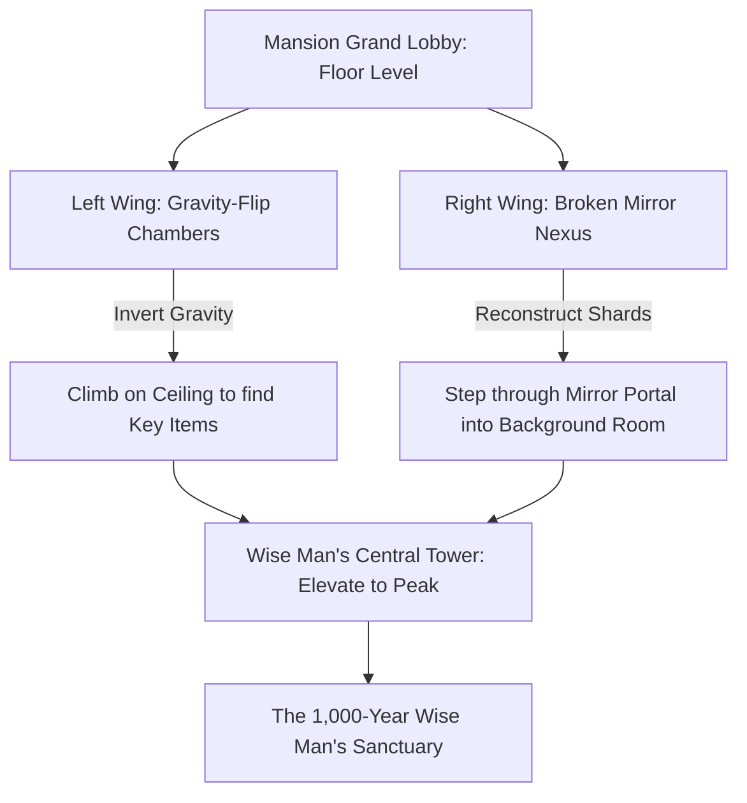
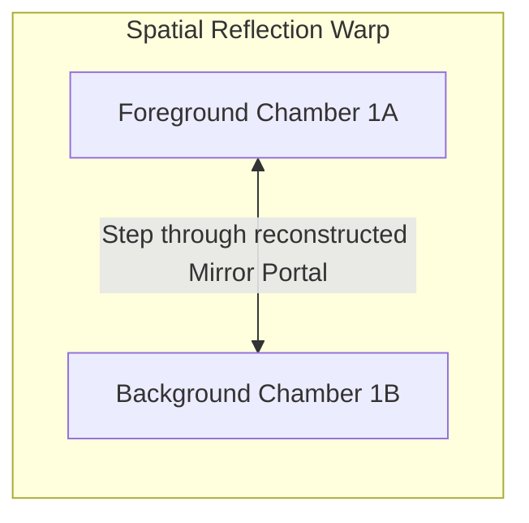
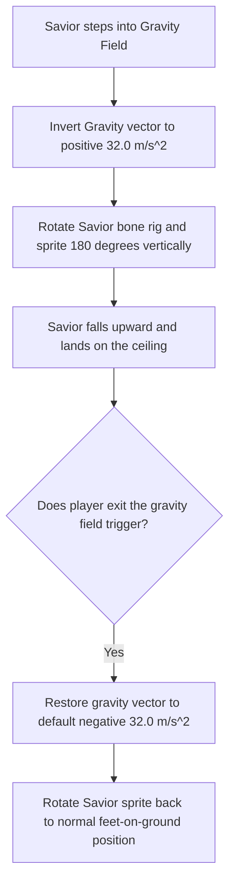

# Level Design Part 4: Haunted Mansion of Mirrors & Wise Man's Hill
## Project: The Legacy of Tomba & the Evil Pigs' Curse

---

## 1. Introduction to optical and Gravity Puzzles (The Mansion Concept)

The **Haunted Mansion of Mirrors** is a gothic, labyrinthine indoor level designed around optical illusions, spatial distortions, and gravity manipulation under the curse of the Pink Evil Pig.
* **The Illusion Mechanic**: The level is split into mirrored halves. What looks like a dead-end wall in the Foreground Room might be an open doorway inside the Mirror Portal in the Background Room.
* **The Gravity Mechanic**: To reach keys and platforms located on high ceilings, the player must locate and trigger gravitational inversion fields, flipping their relationship with the floor.
* **Why it matters**: This zone tests the player's spatial awareness and three-dimensional problem-solving, combining perspective warping with precise mechanical platforming.

---

## 2. The Mansion of Mirrors Layout & Navigation

The interior of the Mansion is divided into modular chambers connected by mirror frames and vertical staircases.

---

## 3. The Mirror Portal System (Z-Axis Reflection Warp)

Mirror frames act as specialized, reflective Z-axis portal triggers. 

### 3.1 Mirror Portal Interaction Guidelines
* **Reconstruction**: When the Savior finds an empty mirror frame (`NODE_MIRROR_FRAME`), it cannot be entered. The player must find and throw **Mirror Shards** (`IT_MIRROR_SHARD`) into the frame to restore the glass.
* **Perspective Warping**: Stepping into the active mirror flips the Savior's sprite horizontally (simulating reflection) and teleports his physical coordinates along the Z-axis to the background parallel room:

$$P_{\text{new}} = (P_{\text{old\_x}} \times -1, P_{\text{old\_y}}, P_{\text{target\_z}})$$

* **The Visual Trick**: Rooms in the background are exact mirrored duplicates of the foreground rooms, but with slight structural differences (e.g., a chest that is locked in the foreground is already open and accessible in the background).

---

## 4. Gravity Inversion Chambers

Gravity-Flip Trigger Zones (`VOL_GRAVITY_FLIP`) manipulate the direction of the global physics vector applied to the Savior.

### 4.1 Ceiling Navigation Rules
* **Friction and Controls**: While walking on the ceiling, standard running and jumping controls remain active, but the camera performs a smooth, localized vertical offset to ensure the ceiling remains fully visible within the upper margin of the display.
* **Ceiling Hazards**: Spiked chandeliers and cursed painting traps are attached to the ceiling, requiring careful jumping calculations under inverted physics.

---

## 5. Wise Man's Hill (The Peak Sanctuary)

The highest tower of the mansion can only be accessed once the Savior has normalized the gravitational fields in the lower wings.

* **The Wise Man's Chamber**: A circular, quiet room filled with hanging clocks and floating books.
* **Narrative Integration**: Here resides the **1,000-Year Wise Man**. He validates the player's mirror collection events and provides clues on how to reach the volatile peaks of *Phoenix Mountain* to secure the final air transport.