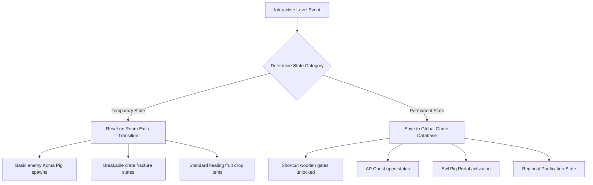
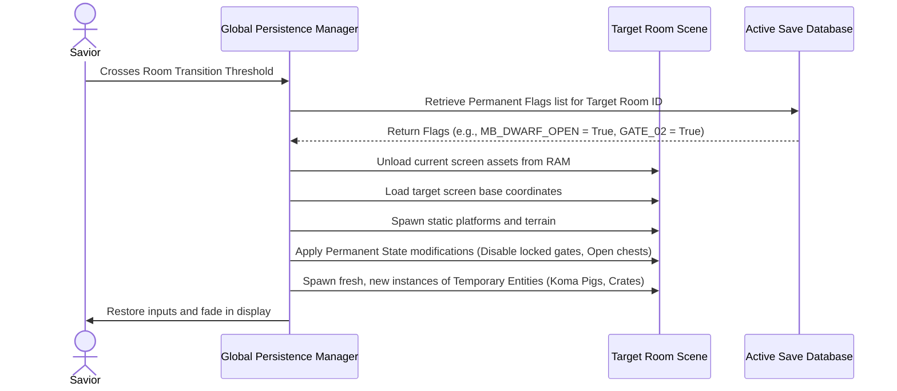

# World & Level State Persistence Specification
## Project: The Legacy of Tomba & the Evil Pigs' Curse

---

## 1. Introduction to Level Persistence (The Living World Concept)

In expansive adventure games, the player constantly interacts with the environment: they unlock locked shortcut gates, open valuable treasure chests, break wooden crates, and defeat patrolling enemies.
* **The Problem**: If the player unlocks a shortcut gate, leaves the room, and returns $5 \, \text{seconds}$ later only to find the gate locked again, the progression loop breaks completely, causing intense frustration. However, if broken wooden crates never respawn, the player could run out of vital healing fruits.
* **The Solution**: The game classifies environmental changes into two distinct categories: **Temporary States** (reset on room exit) and **Permanent States** (saved forever in the database).

---

## 2. State Classification Matrix

The persistence manager filters all interactive level assets into one of two operational pipelines.



### 2.1 State Operational Definitions
* **Temporary States**: These exist to maintain game balance. When the Savior leaves the room, the database discards the current states of basic enemies and crates. Re-entering the room spawns them fresh, allowing the player to farm AP and health if needed.
* **Permanent States**: These are assigned a unique identification string (**GUID - Globally Unique Identifier**). When altered, their active boolean flag is flipped to `True` in the primary save file, modifying their collision and render meshes permanently.

---

## 3. Room Transition & Reload Lifecycle

When the Savior crosses a screen transition boundary to enter a new level section, the engine executes a structured reload sequence inside the memory.



---

## 4. Database Schema for Persistent Keys

Permanent states are stored as simple key-value pairs within the global save dictionary, ensuring minimal disk write footprint:

```json
{
  "level_persistence_database": {
    "Dwarf_Forest_Zone": {
      "unlocked_shortcuts": {
        "GATE_DWARF_FOREST_MAIN_BRIDGE": true,
        "GATE_DWARF_CAVE_UNDERGROUND_SHORTCUT": false
      },
      "opened_ap_chests": {
        "CH_DWARF_VILLAGE_10K_AP": true,
        "CH_DWARF_CANOPY_50K_AP": false
      },
      "purified_regional_state": true
    }
  }
}
```

* **Integration Rule**: When a level scene loads, scripts attached to persistent objects (e.g., `ShortcutGate.cs`) query this JSON node. If their corresponding key is marked `true`, they instantly execute their open/unlocked state during the initial frame calculation (`Start` lifecycle), bypassing the locked state completely.