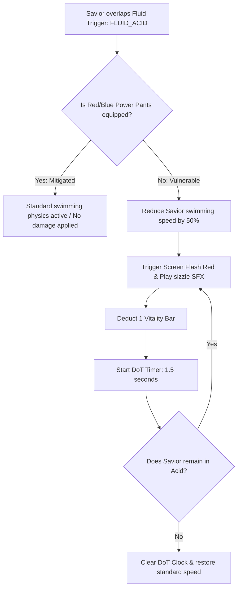
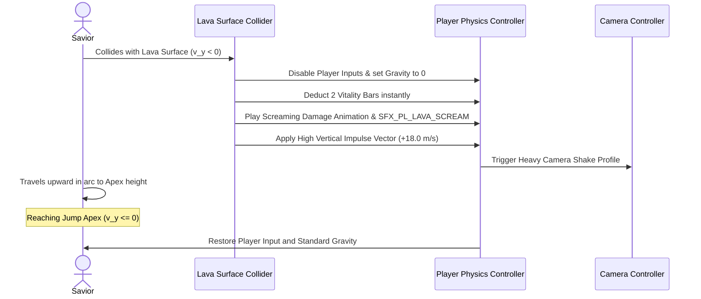

# Liquid Hazards & Corrosion Physics Specification
## Project: The Legacy of Tomba & the Evil Pigs' Curse

---

## 1. Introduction to Hazardous Fluids (The Corrosive Concept)

In our 2.5D world, liquids are not always safe swimming areas. Under the influence of the Evil Pigs' alchemy, several water bodies have been corrupted into toxic and volcanic hazard zones.
* **The Types**: The game features three primary fluid categories: **Clean Water** (safe for swimming), **Acidic Sludge/Mud** (inflicts gradual corrosion damage), and **Molten Lava** (extremely hot, inflicts massive instant damage and launches the player).
* **Why it matters**: These fluids act as environmental gates and hazards. To cross them safely, the player must equip specialized gear (such as the *Blue Deep Pants* for acid resistance, or the *Red Fire Pants* for lava heat mitigation).

---

## 2. Acid Corrosion & Damage-Over-Time (DoT)

Acidic sludge represents high-density, toxic pollution. When the Savior overlaps an acid trigger without protection, the engine activates a **Damage-Over-Time (DoT) Clock**.

### 2.1 Viscosity & Friction Settings
Cursed mud and acid have higher density coefficients than clean water, modifying the Savior's buoyancy parameters:
* **Water Viscosity**: $1.0$ (Standard swim physics).
* **Acid Sludge Viscosity**: $2.2$ (Forces slow, heavy movements; jump forces inside sludge are reduced by $50\%$).

---

## 3. The Volcanic Lava Bounce (Arcade Recoil Physics)

Molten lava is too dense and hot to swim in. To prevent the player from sinking and instantly dying with no feedback, the engine implements the classic **Arcade Lava Bounce**.

### 3.1 The Escape Jump Equation
Upon contacting the lava, the Savior is launched upward along a rigid, vertical vector to give the player a mechanical opportunity to steer toward a safe stone platform:

$$\vec{v}_{\text{lava\_bounce}} = (\text{Direction}_{\text{escape}} \times 4.0 \, \text{m/s}) + (\text{UpwardVector} \times 18.0 \, \text{m/s})$$

This high-velocity propulsion ensures that touching lava is highly punishing but gives the player a thrilling, split-second chance to recover and survive if they steer their landing trajectory successfully.