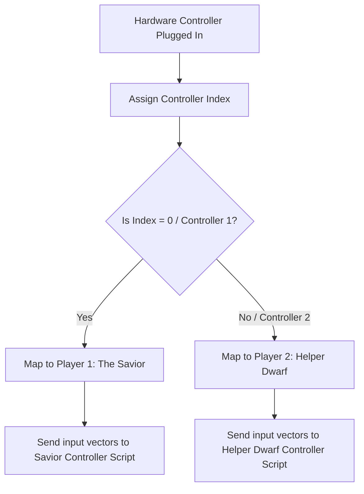
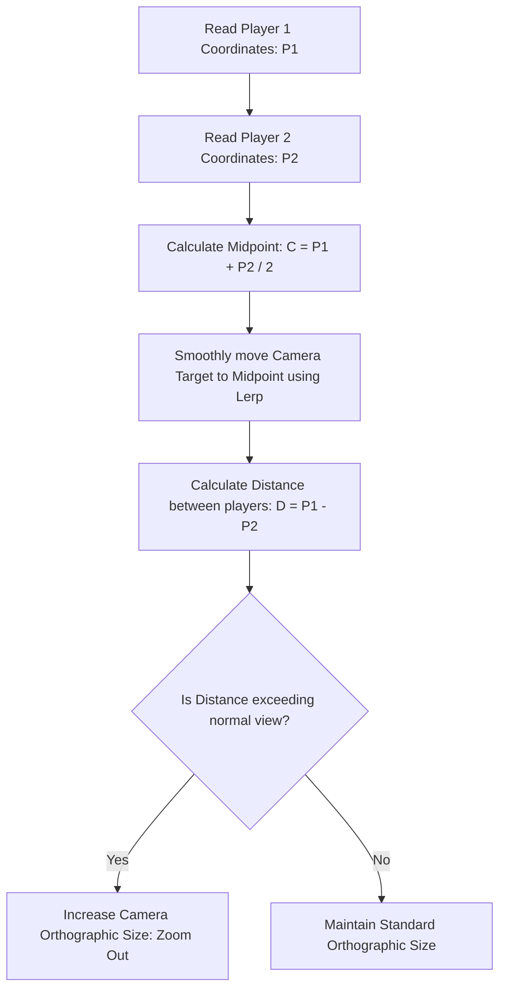
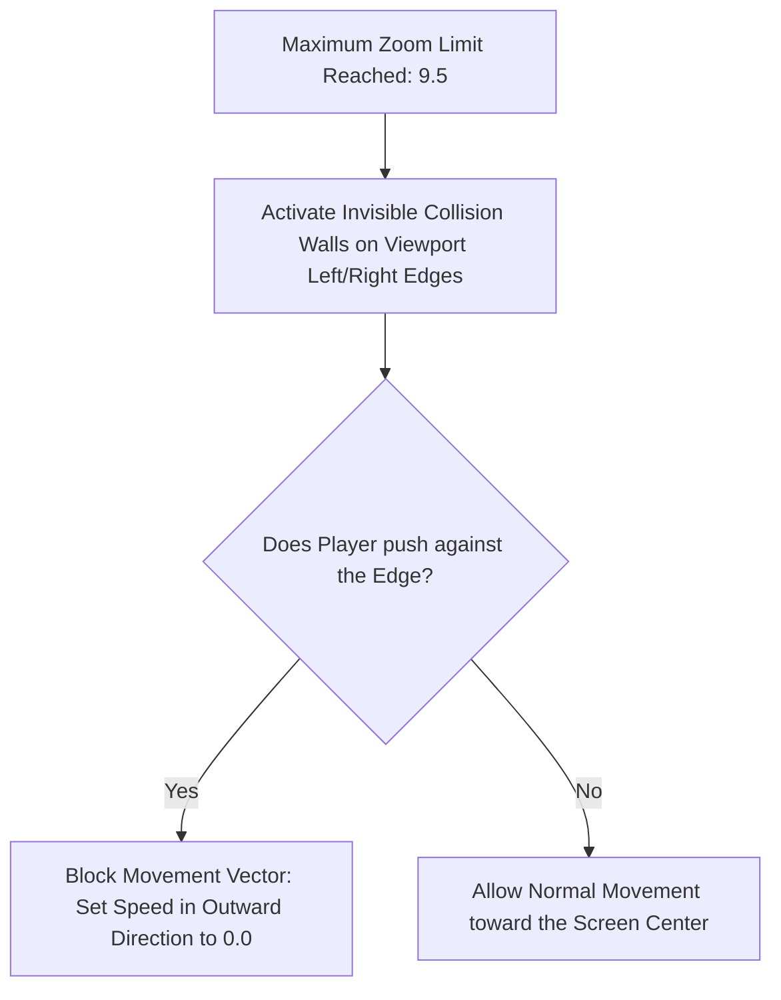

# Local Co-op & Shared Camera Bounds Specification
## Project: The Legacy of Tomba & the Evil Pigs' Curse

---

## 1. Introduction to Local Cooperative Play (The Cooperative Concept)

**Local Cooperative Play (Co-op)** allows two human players to play the game together in the same physical room, sharing the same television/monitor screen and console/PC hardware.
* **Player 1**: Controls the Savior (Tomba, with pink hair).
* **Player 2**: Controls a friendly **Helper Dwarf** who has a unique set of supporting mechanics (such as digging up hidden fruits or stunning enemies using a small wooden hammer).
* **The Challenge**: Since both players share a single camera screen, the game must implement smart camera tracking. If Player 1 runs to the far left and Player 2 runs to the far right, the camera must handle the distance without letting either player fall off the visible screen into black voids.

---

## 2. Multi-Controller Hardware Assignment

The game's input manager registers and separates incoming signals from multiple physical gamepads plugged into the system.

### 2.1 Gamepad Input Routing Rules
* **Controller Indexing**: Player 1 is locked to Gamepad `0`. Player 2 is assigned to Gamepad `1`.
* **Hot-Plugging Support**: If Gamepad `1` is disconnected mid-game, the Helper Dwarf enters a safe, automated AI follow state, tracking the Savior's position until the gamepad is reconnected and the *Start* button is pressed.

---

## 3. Shared Camera tracking & Dynamic Zoom

The camera does not focus solely on the Savior when Co-op is active. Instead, it calculates the geometric center point between both players and dynamically zooms out to keep both visible.

### 3.1 Mathematical Distance Calculations
To determine the camera's zoom scale, the engine constantly tracks the absolute distance ($D$) between Player 1 ($P_1$) and Player 2 ($P_2$):

$$D = \sqrt{(P_{1x} - P_{2x})^2 + (P_{1y} - P_{2y})^2}$$

* **Zoom Range**:
  * If $D \le 6.0 \, \text{meters}$: Camera remains at its default Orthographic Size ($6.5$).
  * If $D > 6.0 \, \text{meters}$: The camera dynamically scales up its size proportionally to $D$, up to a maximum safety zoom cap of $9.5$ (to prevent players from looking too small).

---

## 4. Screen-Border Safety Boundaries (Invisible Walls)

What happens if players reach the maximum camera zoom ($9.5$) and continue running in opposite directions? The engine implements **Dynamic Screen-Border Colliders**.

These invisible walls move dynamically in sync with the camera's left and right viewport frustum edges. This prevents players from wandering off-screen, forcing them to coordinate their exploration and move together as a unified team.