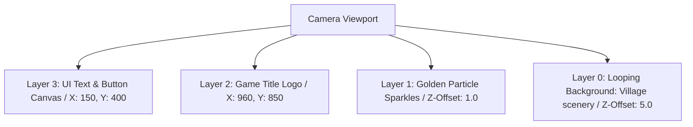

# Main Menu & Title Screen Specification
## Project: The Legacy of Tomba & the Evil Pigs' Curse

---

## 1. Introduction to the Title Screen (The First Impression)

The **Title Screen** is the first active graphical interface a player sees when they boot up the game software.
* **Why it matters**: It is much more than a simple gate to start playing. It establishes the artistic, musical, and thematic tone of the entire experience. 
* **The Design**: To capture the classic retro charm of the original franchise, the screen features an animated, looping background of the *Beginnings Village* swaying in the wind, a hand-drawn game logo with floating golden particle sparkles, and a nostalgic vocal shout-out announcing the game's title when the player presses the confirm button.

---

## 2. Layer-by-Layer Title Screen Layout (Z-Depth Stack)

To create a rich sense of depth before active gameplay even begins, the title screen elements are distributed across a virtual 2.5D layer stack:



### 2.1 Layer Component Specifications
* **Layer 0 (Background Loop)**: Renders a slow, looping horizontal translation of the *Beginnings Village* hills under warm sunlight. Foliage and clouds are simulated using simple, repetitive sine-wave winds.
* **Layer 1 (The Particles)**: Emits small, circular golden sparkles (`PART_TITLE_GOLD`) rising slowly from the bottom of the screen to simulate the presence of magical gold.
* **Layer 2 (The Logo)**: Displays the master game logo in high resolution. Every $10.0 \, \text{seconds}$, a bright reflection glint shader (`SH_LOGO_GLINT`) sweeps diagonally across the logo letters.
* **Layer 3 (Button Canvas)**: A left-aligned vertical list containing: *Start Game*, *Options*, *Credits*, and *Exit*.

---

## 3. Boot-up to Active Gameplay Sequence Flow

The technical transition from launching the game executable to steering the Savior inside the world is governed by a precise, un-interruptible sequence:

```mermaid
sequenceDiagram
    actor Player as User
    participant App as Game Application
    participant Title as Title Screen UI
    participant Save as Save Slot UI
    participant World as Active Game Scene

    Player->>App: Launch Executable
    App->>App: Load local configuration and settings.json
    App->>Title: Display Title Screen & Loop BGM
    Player->>Title: Presses 'Start / Confirm'
    Title->>Title: Play Voice Announcement: "TOMBA!" (SFX_SYS_TITLE_SHOUT)
    Title->>Title: Apply Zoom-Fade Transition (0.8s)
    Title->>Save: Open Save Slot Selection Menu
    Player->>Save: Selects Slot 1
    Save->>World: Asynchronously load Dwarf Forest scene
    World-->>Player: Fade in HUD / Restore Savior inputs
```

---

## 4. Title Screen Sound Effects (SFX) Playlist

To ensure that navigating the main menu feels responsive and satisfying, every menu action is accompanied by high-quality chip-tune sound effects:

| Sound Identifier | Playback Volume | Target Audio Bus | Description of Sound Profile |
| :--- | :--- | :--- | :--- |
| **`SFX_SYS_TITLE_SHOUT`**| $100\%$ ($0.0 \, \text{dB}$) | `Dialogue Bus` | High-energy, nostalgic vocal shout-out of the title ("*TOMBA!*") by a child's voice. Triggers on pressing *Start*. |
| **`SFX_UI_HOVER`** | $70\%$ ($-3.0 \, \text{dB}$) | `UI/System Bus` | Quick, high-frequency wooden click, mimicking a cursor sliding over a physical slot. |
| **`SFX_UI_CONFIRM`** | $85\%$ ($-1.2 \, \text{dB}$) | `UI/System Bus` | Satisfying, bright metallic coin ring combined with a magic chime. Triggers on option selection. |
| **`SFX_UI_CANCEL`** | $75\%$ ($-2.4 \, \text{dB}$) | `UI/System Bus` | Low-frequency wooden hollow knock, signifying a step backward or closing a menu. |