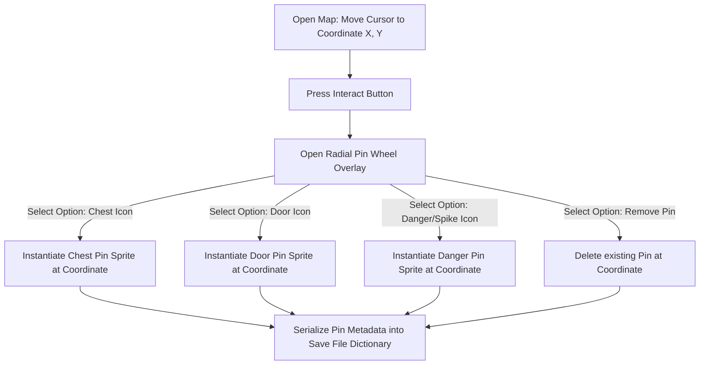
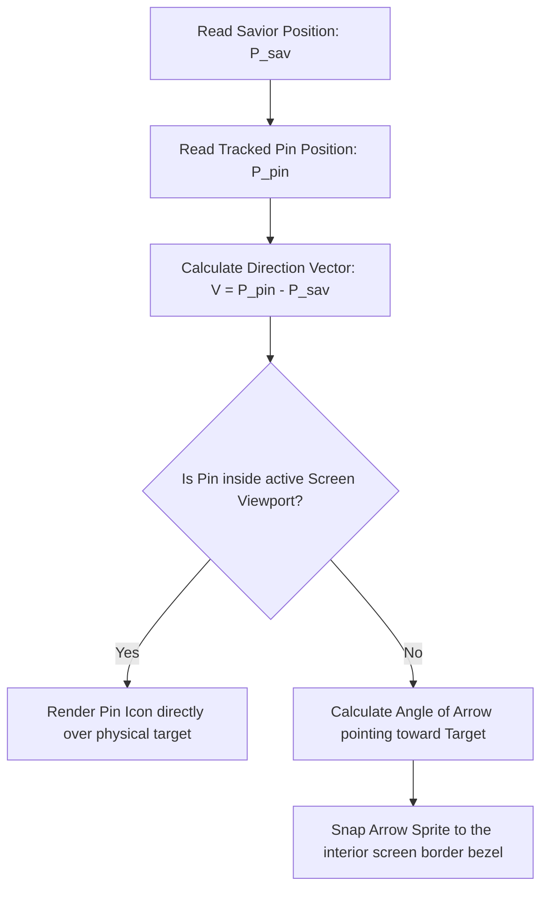

# Map Navigation, Custom Pins & HUD Waypoint Tracking
## Project: The Legacy of Tomba & the Evil Pigs' Curse

---

## 1. Introduction to Interactive Maps (The Navigation Concept)

In expansive, non-linear adventure games, players discover dozens of secrets, locked gates, and closed AP chests that they cannot immediately open.
* **The Problem**: A player might find a locked door in Hour 1, but only find the key in Hour 10. By then, they have likely forgotten exactly where that door was located on the map.
* **The Solution**: The game implements an **Interactive Pin Placement System**. When viewing the map screen, the player can manually place custom marker icons (**Pins**) directly onto the map grid.
* **HUD Integration**: The player can set a pin as "Tracked", which instantiates an off-screen pointing arrow on their active HUD, guiding them back to the target coordinates during active gameplay.

---

## 2. Custom Map Pin Placement Logic

When the player selects a cell on the map grid and presses the *Action* button, the engine halts map panning and opens a circular selection wheel (the **Pin Wheel**).



---

## 3. HUD Waypoint Tracking (Off-Screen Pointers)

If a pin is marked as "Active Tracker", the HUD renders a dynamic guiding pointer arrow along the screen bezel when the target coordinate lies off-screen.



### 3.1 Angle Calculation Mathematics
To determine the rotation angle ($\theta$) of the HUD guide arrow, the engine calculates the arctangent of the direction vector between the Savior and the tracked target coordinates:

$$\theta = \text{atan2}(V_y, V_x) \times \frac{180}{\pi}$$

* **Bezel Snapping**: The arrow sprite is snapped directly to the inner margin of the screen bezel ($5\%$ Safe-Zone margin). This prevents the arrow from wandering into the center of the display, keeping it as a clean, peripheral guide element.

---

## 4. Save File Pin Database Schema

Manually placed map pins must persist across play sessions. They are serialized within the player’s save file database:

```json
{
  "player_placed_map_pins": [
    {
      "pin_id": "PIN_001",
      "zone_id": "Dwarf_Forest",
      "grid_coordinates": { "cell_x": 4, "cell_y": 2 },
      "pin_type_icon": "UI_PIN_CHEST_LOCKED",
      "is_currently_tracked": true
    },
    {
      "pin_id": "PIN_002",
      "zone_id": "Haunted_Mansion",
      "grid_coordinates": { "cell_x": 12, "cell_y": 8 },
      "pin_type_icon": "UI_PIN_DOOR_LOCKED",
      "is_currently_tracked": false
    }
  ]
}
```

* **Data Preservation**: Upon loading a scene, the map manager parses this list. If the active `zone_id` matches, it renders the custom sprites onto the map interface, preserving the player's personal navigation notes.